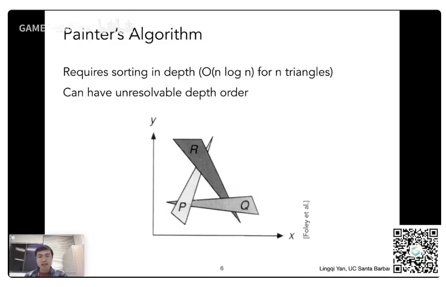
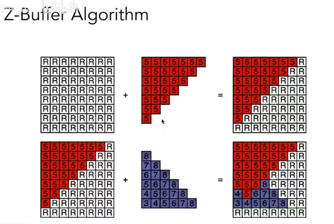
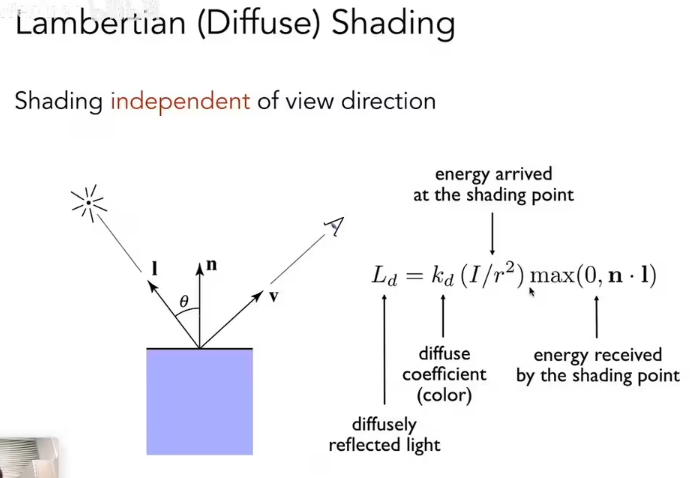
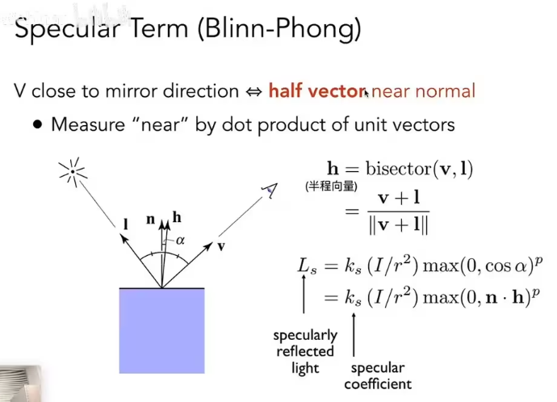

# 画家算法

先画最远的物体，逐渐画近的物体，让近的物体覆盖远的物体。看起来是没问题的。但不是总生效的。

这张图三个三角形互相遮挡，没办法定义深度关系，就不能采用画家算法

# Z-Buffer

既然没办法判断三角形整体的深度，那么就判断每个像素的深度，像素内记录像素深度最浅的几何，对于深度来说，越小越近，越大越远，在渲染时不光要存渲染的图，也要存一张深度的图。

对单个像素来说，逐步记录深度。如先画地板，先记录地板深度，物品来了后，比对物品的深度和记录的深度，发现物品深度小于记录的地板深度，说明物品要遮挡住地板。

暂时假设不存在深度相同的像素。在浮点数的表示中，两个浮点数完全相同的概率很小。（实际上会有相同深度的，但本课中暂不考虑）（透明物体 Z-Buffer 也处理不了，需要其他方法处理，暂不考虑）

注意！如果你使用了 MSAA 超采样了，深度图其实是对应采样点的深度信息，也就是那四个采样点的深度分别计算！

# 着色

对不同的物体应用不同材质的过程叫做着色

# Blinn-Phong 模型

镜面反射 + 漫反射 + 全局常亮光照

# 局部着色

着色不考虑其他物体的存在，其考虑的只是当下要渲染的那一个点，以及围绕这个点所产生的 单位法向量，单位光照方向向量，单位观测方向向量  以及这个计算中产生的 Blinn-Phong 模型。这叫局部着色，这一步不会考虑阴影，也就是不会考虑其他物体遮挡光照投射到物体身上的过程。

# 光的能量

同样的光，以不同角度照上去，明暗不一样

物体表面法向量n，和光源方向l，的夹角θ，决定了明暗强度

可以把光当成能量，吸收的越多越亮

# 能量守恒

光的能量都集中在一个球壳上，一开始球壳的表面积很小，考虑到能量守恒的话，那么单位面积上光的能量就很多，光越向外扩散，单位面积的能量就越小

通过球面公式可以计算出，距离光源为r的球壳上，单位面积上能量为I/r²

## 疑问

目前来说似乎能量守恒没有考虑观察点到物体表面的距离产生的影响，这一部分涉及到辐射度，之后再说

# 漫反射公式

I/r² 表示有多少光到达了ShadingPoint（因为光会随着传播距离而衰减）

Kd表示了该点颜色的反射率

- 如果Kd=0，那么该点完全没有反射光出去，该点吸收了所有光，那么该点表现黑色
- 如果Kd=1，那么该点反射了所有光，那么该点表现为白色
- 如果用RGB三个通道表示Kd，那么Kd就是Color

Max（0，n·l）表示反射角度，nl都是单位向量，n·l = cosθ，当入射光从表面下面照入，θ>90°，cos<0，这种情况没有意义，因为我们只考虑反射光，不考虑折射等光线穿透，所以需要和0比，取最大值

漫反射和观测方向无关

# 着色点

着色是在某一个 shading point 上，在对应一张图，大概就是这么一个点，在这个点上来计算它，然后要想得到一整张图，那我们势必要应用这个着色很多次。

着色的频率是个问题

# 高光

当观察方向接近镜面反射方向的时候  <=>  法线方向 n 接近于 半程向量 h

Phong 模型求 R 和 V 的接近程度

Blinn-Phong 模型 巧妙地把 R 和 V 的接近程度 转换为 n 和 h 的接近程度

知道两个单位向量l和v，求他俩的角平分线向量很简单，将两个向量相加，并求归一化

## NH 项的指数容忍度

向量之间的夹角余弦确实可以衡量两向量是否接近，但容忍度太大了

在一次幂的cos曲线下可看到，当夹角很大时，仍然有很大的值，这样生成的高光就会很大

正常情况下，我们认为高光都是很小很亮的

随着指数增加，能看到在大约0~30°之内才可以看到高光，这样就算一个合理的模型

在布林冯模型下，一般来说，指数选在100~200之间，高光角度大约在3~5°之间，算是比较真实的

## KP

纵向来看，反射系数Ks越大，高光越亮

横向来看，指数p越大，高光越小

# 环境光

一个茶杯，在光源并没有直接照射的方向上也有一定的亮度，因为一个光线可以弹射很多次，从四面八方打到任何一个点，这些光照就算是环境光照

由于环境光照非常复杂，这里我们假设一个点受到的环境光照永远都是相同的，强度称为Ⅰa

任何一个点都有自己的颜色，Ka相当于环境光的系数

可以近似的得到一个环境光La = KaⅠa

# 布林冯反射模型公式

# 缺点

如果有一个凹进去的点，按理来说其不应该有那么强的环境光照射，但是按照这个公式来看，就是会导致有光。

