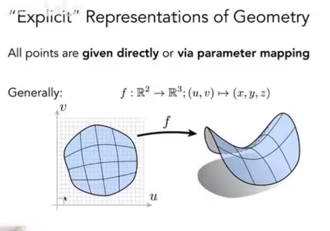
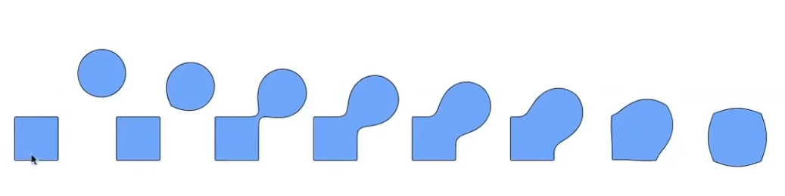
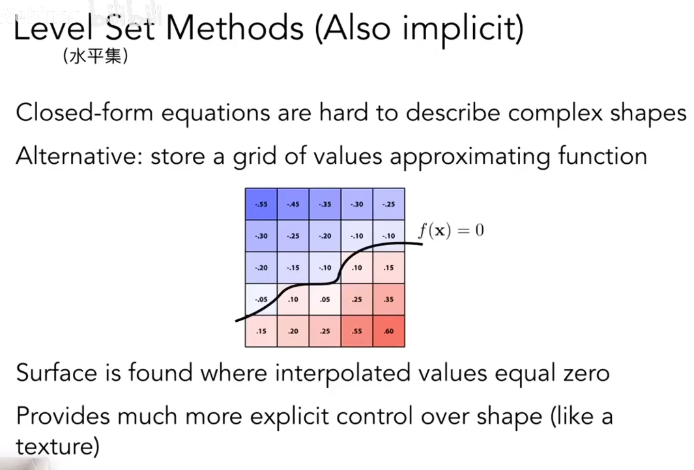
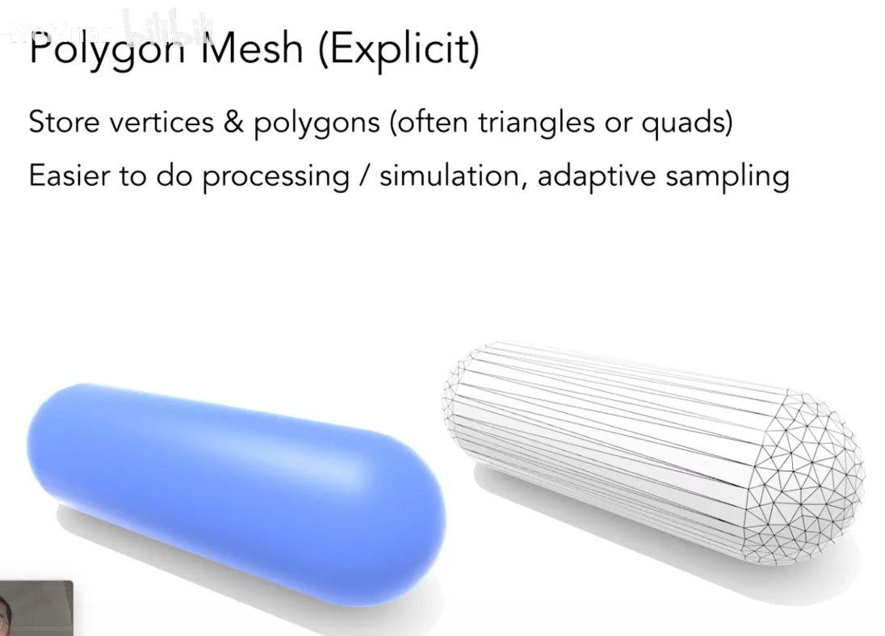
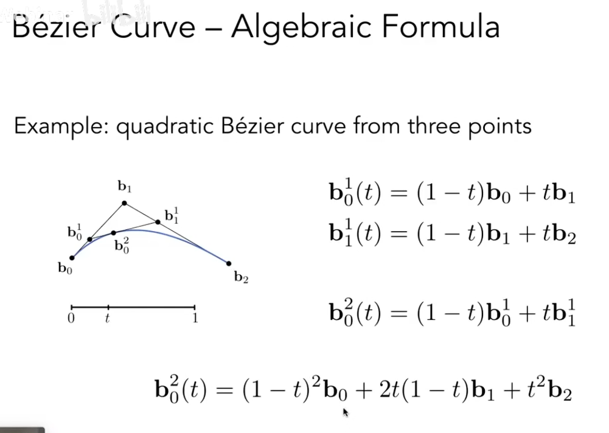
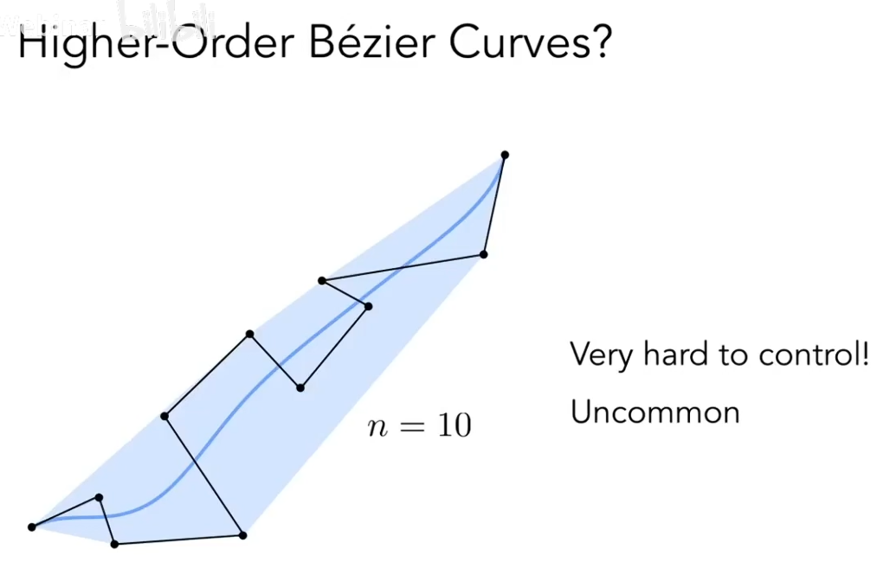
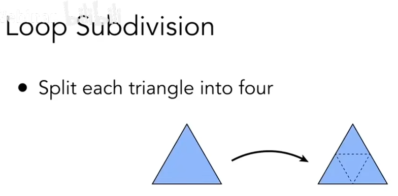
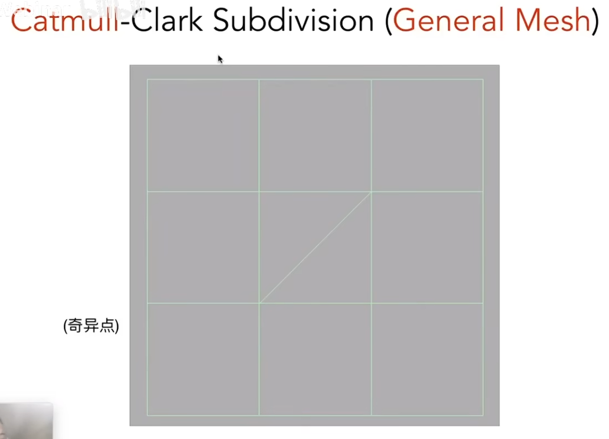
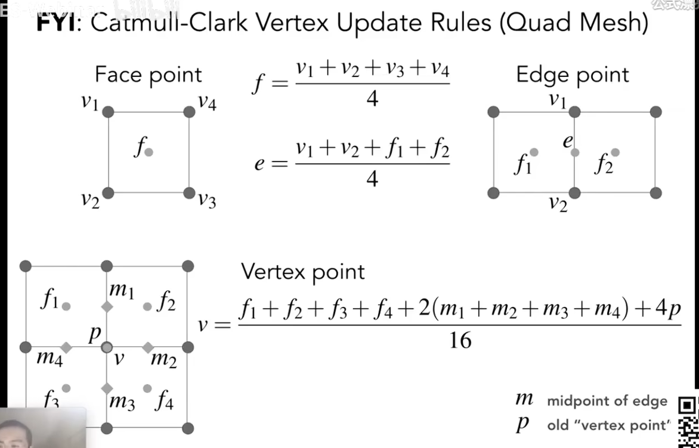
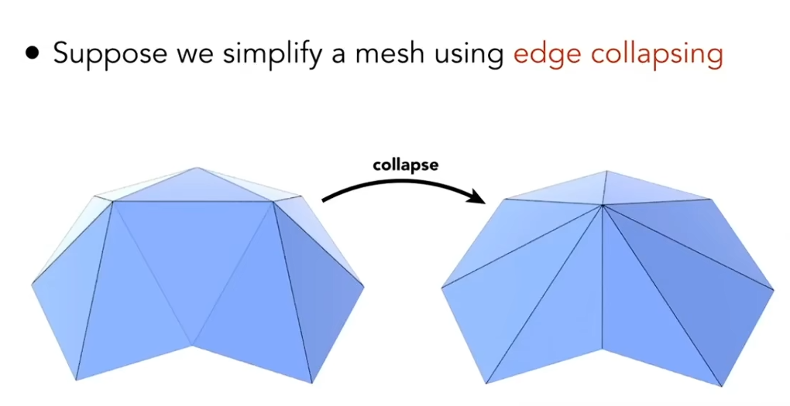

# 庞大几何群

- 如何存储
- 如何高效渲染

# 隐式几何

隐式几何用来表达该几何点之间的关系

隐式表达的函数f（x,y,z）很难从函数看出函数形成的面是什么形状的

但可以轻松的知道某一点是否在这个平面上,或物体内外

# 显式表达

给定:点的空间坐标uv,遍历所有点就可以在空间中画出该物体

用平面中的uv去映射到空间中，表示空间上的面

优点就是可以看出函数形成的面是什么形状的

但无法轻松的知道某一点是否在这个平面上

两种表达各有各的用途，没有好坏之分，根据需要选择

# Constructive Solid Geometry - CSG

可以利用隐式表达组合来取得复杂图形

# 距离函数

描述几何的一种方式：不去描述表面，而是去描述任何一个点到这个表面的最近距离。

这个距离可以是正的或者负的，我认为有一个点在这个物体表面外，那这个点它的这个最小距离算出来之后，加个正号

如果有一个点在这个物体内部，那同样也可以算出这个内部的一个点，它到这个物体的这个表面或者边界上的最小距离，并且我认为这个距离是负的

然后这个可以做物体融合，我们先求出两个物体的距离函数，然后将这两个距离函数融合，再拿着融合后的函数恢复两个物体，逐次执行，就会得到如下变换

## 水平集

距离函数难以求解复杂图形，引入水平集

# 分形

# 点云

传统是使用三角形来表示模型，还有一种使用一个点列表表示模型。

用一堆点去表示模型。点越多越密集，那么模型越精细，理论上来讲可以用点云来表示任何模型。但是这个量想达到效果是需要很多点的，比如图中下面部分，点稀疏的效果就不好。所以大家考虑到性能一般不使用点云，而是将点云还原为三角形面。比如三维空间的扫描，输出的一般都是点云。如何将点云还原成三角形面是一大研究方向。

# 多边形表示

## obj

顶点 纹理 法线 

最后 f 指三角形分别要用第几个 顶点 纹理 法线 

# Curve

## 应用

- 相机轨迹
- 制作字体

## 贝塞尔曲线

给定一系列任意多个的控制点，怎么把一条贝塞尔曲线画出来

### 二次贝塞尔曲线

三个点生成贝塞尔曲线

### 四个点

任意一个时刻，贝塞尔曲线上的任意一个点，当然得由这几个控制点的坐标来决定，当然还得跟 t 有关系对吧

### 属于显示表示

途中的连线是由各个不同的 t 遍历取值得到的

### 性质

- 贝塞尔曲线规定了它必须过起点和终点，所以他在t等于零的时候一定在起点，然后在这个t等于一的时候一定在终点
- 起始位置的切线一定是三倍的 b1 - b0（三倍是因为四个控制点）
- 仿射变换控制点不影响生成的贝塞尔曲线
- 凸包性质：一定在控制点范围之内（比如所有控制点在一条线上，那生成的贝塞尔也在这条线上）

### 很多控制点的贝塞尔曲线

不直观，也不好操作

## 分段式贝塞尔曲线

如果是很多点不好控制，那我可不可以先用少一点的点，然后把他们连起来，这样去控制呢？

人们习惯使用3次贝塞尔分段控制

需要注意，只有在直线延伸阶段方向大小都一直的时候才被认为是完美连续的

当然，第一段终点和第二段起点重合那就是普遍意义上的几何连续。命名为C0连续

而大小方向一致的连续，我们叫C1连续，其实就是1介导数的连续

还有C2连续，二阶导数连续

## 样条

由控制点控制的曲线叫样条，其实贝塞尔曲线就是一种样条。

### B 样条

局部性很好，但是非常复杂

#### NURBS

## 贝塞尔曲面

其实就是说水平方向做一下，然后这个得到了四个点，再把它们当做控制点，然后在竖直方向再做一下

这个曲面是显示的表示，因为UV参数映射贝塞尔曲线能得到每一个点，组成面

# 处理几何

细分，简化，正规化

## 细分三角形

第一，分出更多的三角形。

第二，让这些三角形的位置发生一点变化，使得我的原来的模型变得更光滑一些

### Loop 细分

一个三角形给你一个三角形，你连接它们的这个三条边的中点，可以做出一个中间的一个三角形，而且这个中间三角形，把原本三角形又分成四个三角形。一拆四。

接着，把这个三角形的顶点区分开：区分成新的顶点和老的顶点。

对于这两种不同类型的顶点，我们分来改变他们的位置，让模型更加光滑

如何做？

- 新的顶点：加权平均一下

- 老的顶点：n 是度，图中连着 6 个边所以是 6 

似乎图片有错误，u 在 n ≥ 3 的时候是 3/8n；n = 2 的时候是 1/8 ；n = 0 的时候是 0； 

1. 相信自己原本所表现的位置
2. 也要相信相邻的老的顶点的位置的平均

如果这个点的度越大，那么说明这个点越不重要（蒙圈了 这里到底要怎样，感觉公式错了）

#### 限制

大前提：模型是由三角形组成

如何模型有四边形有三角形，这种细分不适用了

### CatMull-Clark Subdivision 细分

解决普通模型（有四边形和三角形）

先引入几个概念
- Non-quad face ： 非四边形面
- Extraordinary vertex ( degree != 4 ) 奇异点 ： 只要度不为 4 的都是奇异点。

比如下面的例子

其中中间的两个三角形，就是 Non-quad face

其作为矩形对角线的两个点度为 5，也就是 奇异点

细分时我们 每一个边 和 每一个面都取中点连接起来

最后结果我们会发现：我们正好增加了非四边形面数的奇异点，且之后的细分再也不会增加奇异点（因为模型已经不存在非四边形面了）

对于点的位置

细分结果

## 简化三角形

确实使用更少的三角形表达会差，但是其实3000个的效果也是可以接受的

并且如果游戏中离我们非常远的物体，他确实可以不需要那么多的面去表示，可以看到这个时候 300 个三角形也是可以的

- Mipmap : 多远的时候我们去做这个切换，做切换的时候如何做过渡才不突兀，不穿帮（我们之前说过的贴图 mipmap 可以三项插值 这里几何的层次结构不好做了就）

### 边坍缩法

edge collapse ： 找到一条边，这条边连着两个顶点，把这两个顶点往中间捏成一个点，使得这条边不再存在

- 我要坍缩哪些边：哪些重要，哪些不重要

最小化二次误差

希望把这个点放置在一个位置，使得这个点到和它相关联的面的距离的平方和达到最小

对于整个一个模型有那么多条边，假设如果坍缩这条边，并且我把这个坍缩了之后的点，放在一个最佳的位置上，会得到一个多大的二次度量误差。

也就是说每一条变我都假设，如果我坍缩它会有多大的误差。

对于一个模型，我想通过边坍缩的方式简化它，那我肯定选择二次度量误差最低的
最小的边开始坍缩。然后再坍缩第二小的，第三小的。

但是会有一个问题，坍缩完第一小的，和他相关的边，它们的二次度量误差会有变化，需要重新计算。

所以需要这样的一种数据结构，能让我取到最小值，而且能让我以最小的代价去更新受影响的数据。

优先队列/堆

取最小 - 更新 - 取最小 - 更新

我们这么做对不对？我们是不断地在做一个局部最优，然后试图去寻找一个全局的最优，这是个典型的贪心算法。

其实这么做最后得到的结果性质大概率不是最优的，但是可以接受！

可以看到本来就接近一个平面的部分他坍缩的就会多一些，而对于一些变化多复杂的地方，保留的也会多。