- [三种渲染方式](#三种渲染方式)
  - [光栅化](#光栅化)
  - [光线步进](#光线步进)
    - [为什么要有](#为什么要有)
    - [实现原理和优化](#实现原理和优化)
    - [如何走？](#如何走)
    - [导盲犬](#导盲犬)
    - [其他应用](#其他应用)
  - [光线追踪](#光线追踪)
- [重要的RT](#重要的rt)
  - [DepthRT](#depthrt)
- [优化](#优化)
  - [前向渲染](#前向渲染)
    - [优缺点](#优缺点)
  - [early-z](#early-z)
    - [失效原因](#失效原因)
    - [Z-Prepass：软件技术](#z-prepass软件技术)
    - [Hi-Z](#hi-z)
- [延迟渲染](#延迟渲染)
  - [如果效果不只有 PBR 想要其他的光照模型怎么办](#如果效果不只有-pbr-想要其他的光照模型怎么办)


# 三种渲染方式

光栅化，光线步进，光线追踪

## 光栅化

1980 第一个 CPU 光线追踪 软光追

1992 第一个 3D 游戏，德军司令部 软光栅

1999 GPU 发明 硬光栅

2018 RTX GPU 硬光追

## 光线步进

### 为什么要有

射线无法与场景求交（不知道场景的几何数据），无法得知颜色

通过深度图一步一步走，在限制内达到相交点，求出对应的颜色。

### 实现原理和优化

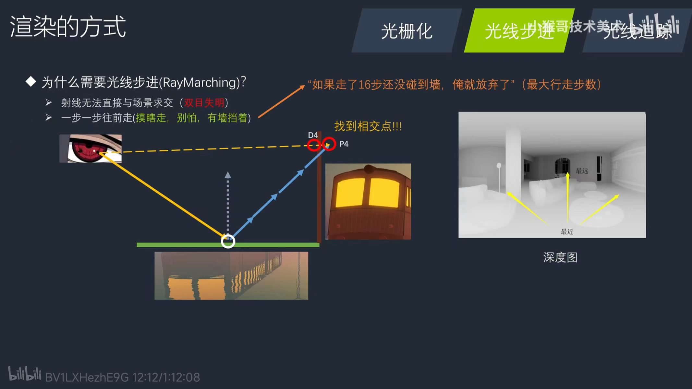

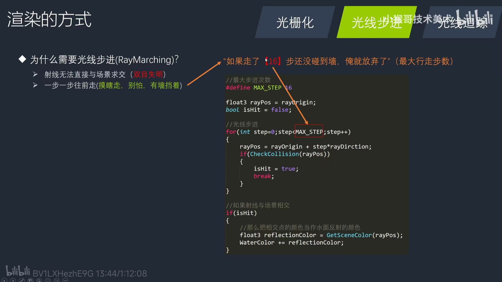

### 如何走？

SDF 有向距离场

- 解析式标示：
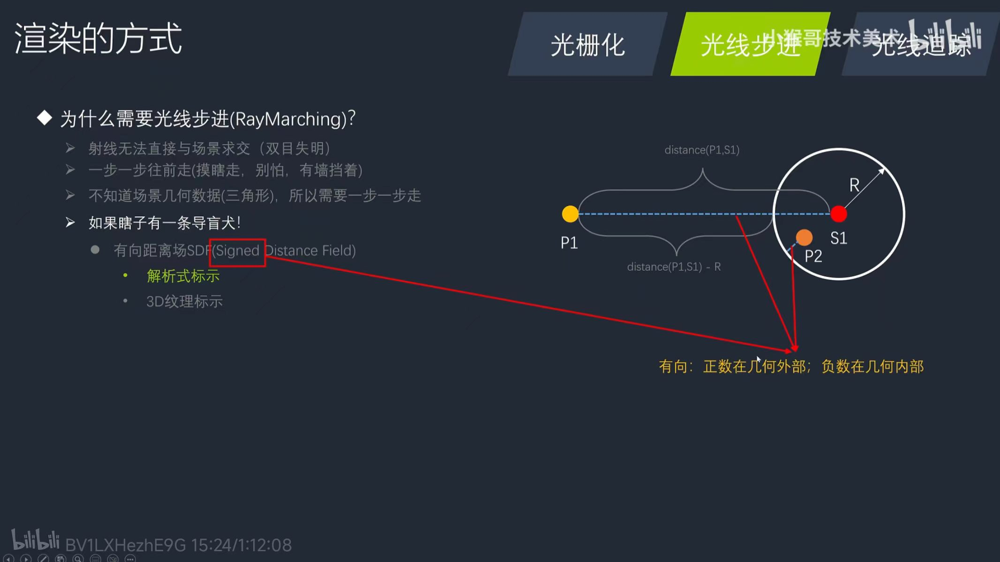
```HLSL
//Sphere xyz:坐标 w:半径
float sdfsphre(float3 Point,float4 sphere)
    return distance(Point,Sphere.xyz)-sphere.w;
float sdf = sdfSphere(P1,S1)
```
- 纹理标示：
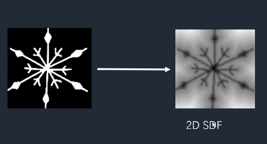

0 - 0.5 内部

0.5 - 1 外部

### 导盲犬

```HLSL

//最大步进次数
#define MAX STEP 16
//最近距离
#define NEAR DISTANCE 0.05

float3 rayPos = rayOrigin;
bool isHit = false;

//光线步进
for(int step=0;step<MAX STEP;step++)
{
    //SDF加速相交检测
    float sdf =GetscenesDF(rayPos);
    rayPos += sdf*rayDirction;
    if(abs(sdf)<= NEAR DISTANCE)
    isHit = true;
    break;
}

//如果射线与场景相交
if(isHit)
{
    //那么把相交点的颜色当作水面反射的颜色
    float3 reflectioncolor=Getscenecolor(rayPos)
    WaterColor +=reflectionColor;
}

```

### 其他应用

体积云，体积雾，体积光，体渲染

## 光线追踪

从摄像机发出射线打到物体之后然后进行弹射，如果弹到了光照的方向，意味着这一点是着色的，如果没有弹到光照的方向，那么这个点就在阴影中。

它与光线步进的区别就是，光线步进是没有场景的几何信息的，而光线追踪是能拿到场景的几何信息的，从而求出相交点。

不过如果场景中有上百万个三角形，我们依次对它进行一个光线追踪的话，效率会很慢，所以一开始的时候，这个方案只能用在离线渲染中。但是现在 GPU 也能实时地去跑了，但是它的限制会比较多，首先最大的限制就是你的光线不能太多

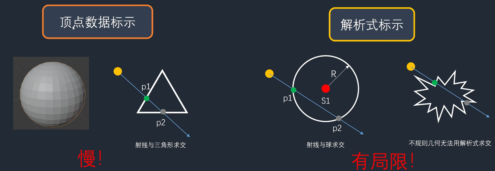


# 重要的RT

Color RT 和 DepthRT

## DepthRT

遮挡问题 + 实现各种效果要用

深度图用来加速绘制物体，如果每一件物体从后往前画的话，那么重叠的部分就会被重复绘制，如果有深度图的话，就可以知道遮挡关系，可以从前往后画，后面被遮挡的内容就不会被绘制进来。

一个简单的渲染流程第一步就是绘制深度图，然后绘制实心物体，然后画天空球，然后绘制半透明物体，最后进行后处理。

# 优化

时间，空间，能量。

我们优化，主要就考虑这三方面的内容：第一个时间，如果我们渲染每一帧所耗费的时间都比较长的话，那么这个游戏就卡成 PPT 了。第二个呢，是空间，如果我们这个游戏资源占用了非常多的内存的话，内存就爆掉了。第三个呢，是能量，这个在 PC 端或者主机端不太常见，但是在手机上会特别明显，就是我们做一项效果，它消耗了多少电量也是我们需要优化注意的，包括发热。

## 前向渲染

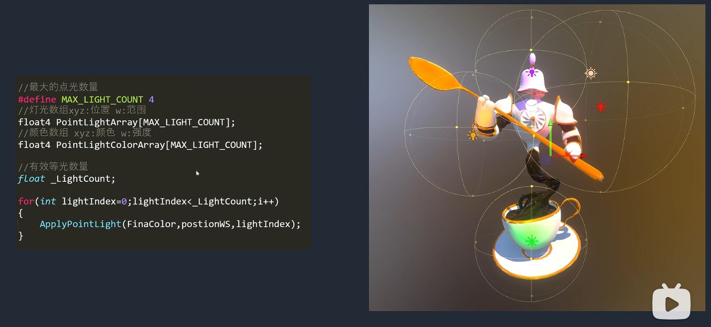

假设我有一百个物体，一百个灯光，那么我的复杂度就是 100 乘以 100，N的平方就是一万次，这个算法是非常的不友好的。

前向渲染是直接画在 Color RT 上的，这意味着它可以支持的光照模型非常的灵活，想用什么光照模型随意。

### 优缺点

对多光源的支持不是很好，因为他的时间复杂度太高了

对带宽的要求很低，因为它直接操作 Color RT

光照模型灵活，可以支持很多光照模型

后处理仅有深度图，如果你需要其他的图，还要额外的进行绘制，也就是说全屏幕额外进行一次 Draw Call

## early-z

这个是 GPU 上的功能，也就是说这个功能必须要有硬件支持才行，不过基本上我们的 GPU 都会支持这个功能的。

将深度测试放到 pixel shader 前面，如果通过了深度测试，才会进行渲染，否则的话就会把它丢弃掉。

### 失效原因

- 手动修改了深度图的数值：这种情况一般比较少，应该不会有人去手动给深度图赋值。
- 不要丢弃像素的效果：因为效果执行之后还要显示后面的内容，那这个物体肯定就没办法使用 early Z，比如战甲溶解隐身。
- 半透明的本身需要混合的像素效果：比如全息投影。
- 优化不稳定情况
  - 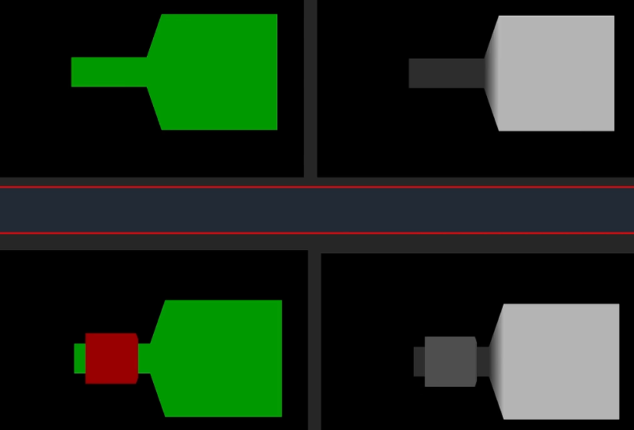

### Z-Prepass：软件技术

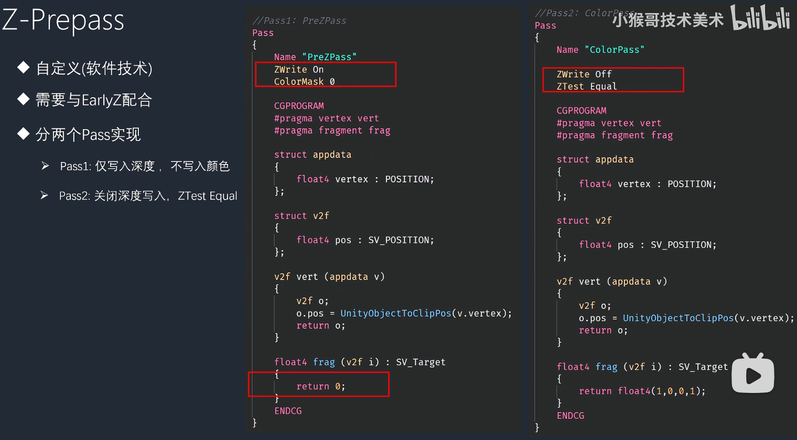
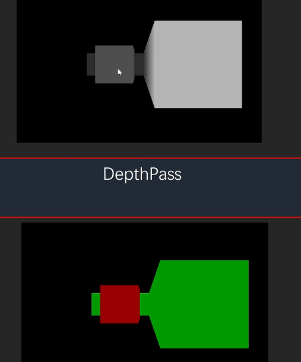

第一次仅仅画深度图，把 color mask 设置为零。

第二次不用画深度图了，而是打开深度比较。如果要着色的像素的深度和深度图中的深度相等，说明要画的就是他。如果说大于深度图中的深度，那说明有其他东西遮挡住。从效果图我们可以看出。第一遍，我们画出了一张深度图。第二遍，我们直接就进行了正确的上色。

### Hi-Z

Hierarchy Z Culling

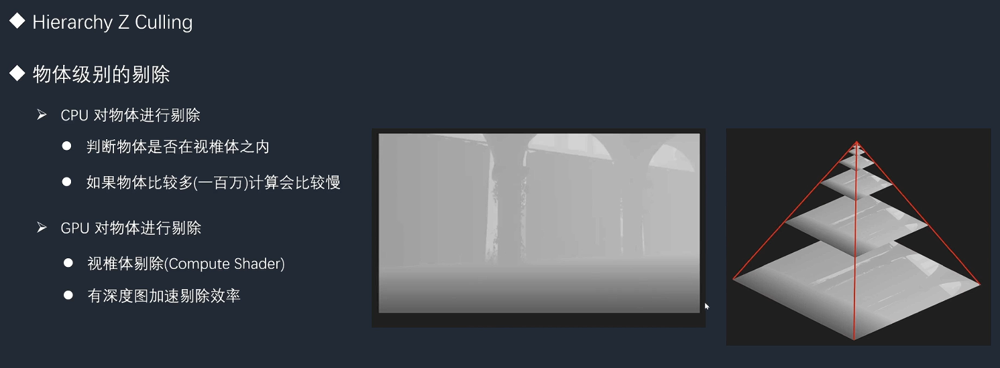

# 延迟渲染

后处理阶段进行光照处理。

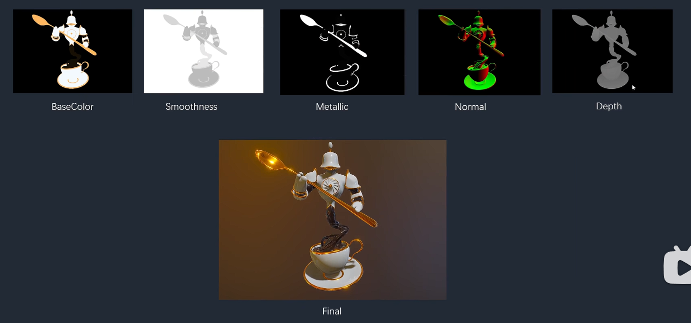

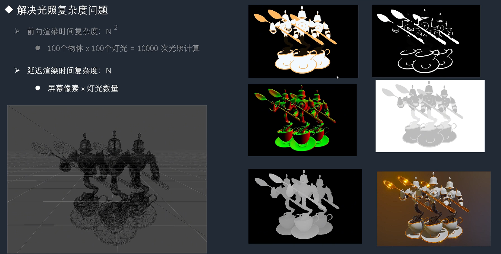

代价是带宽需求高，要这么多张图哦。

技术需求：MRT muti render target 一次渲染多张 RT

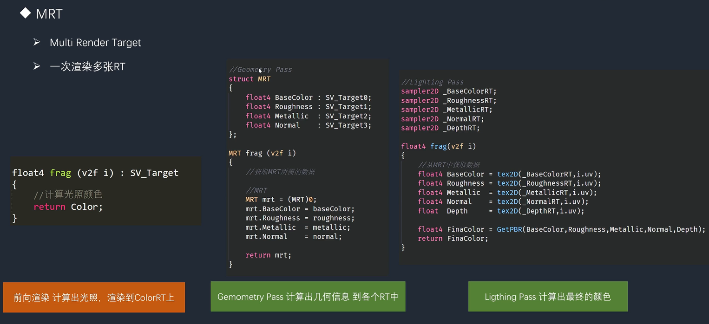

## 如果效果不只有 PBR 想要其他的光照模型怎么办

使用 mID

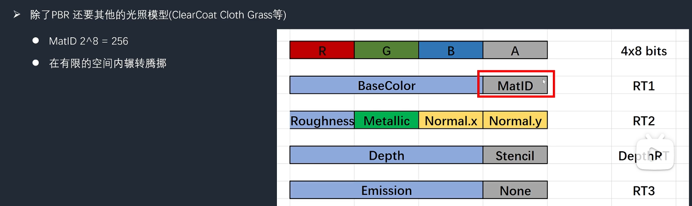

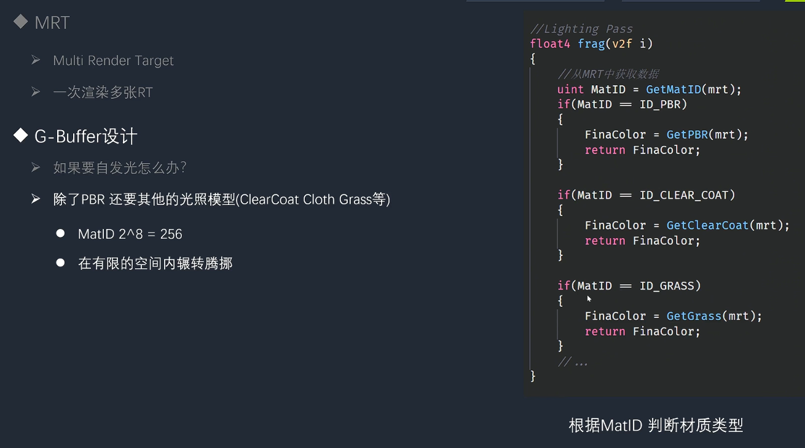

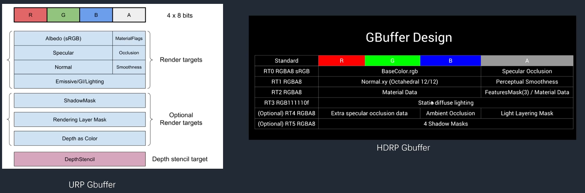

这个 ID 就是材质类型
