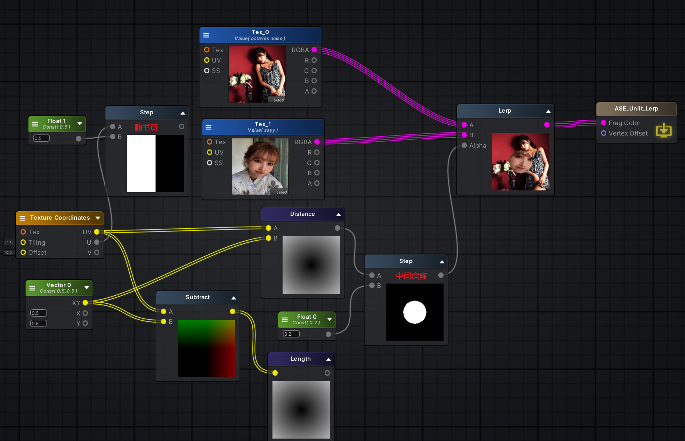
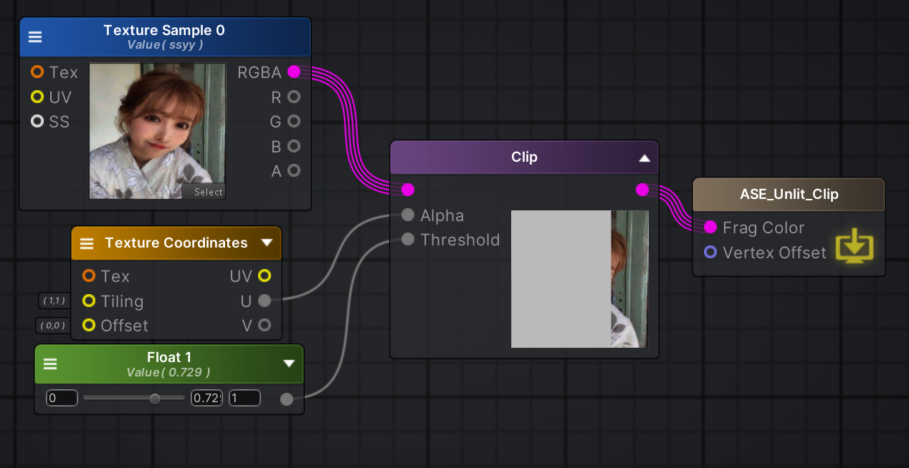
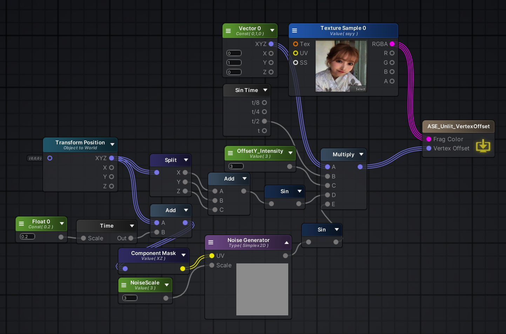
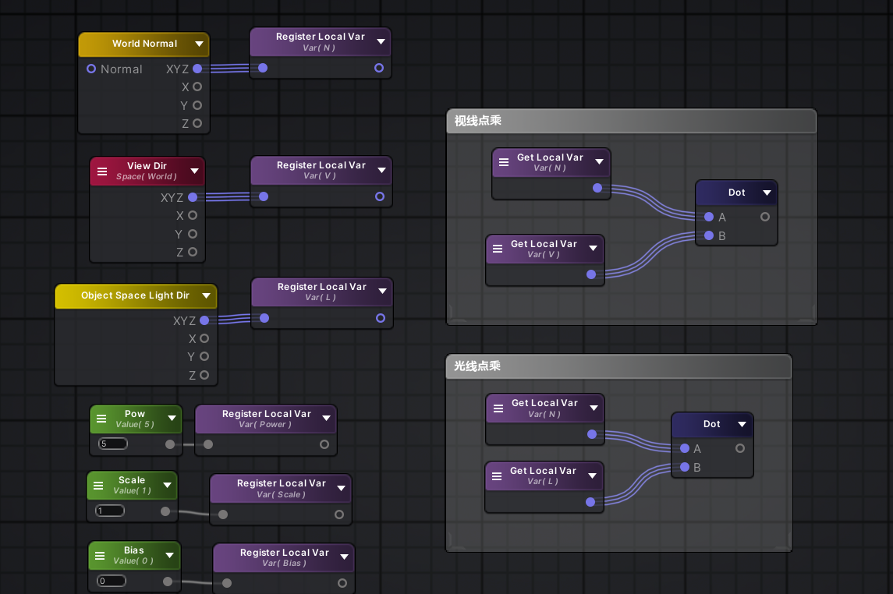
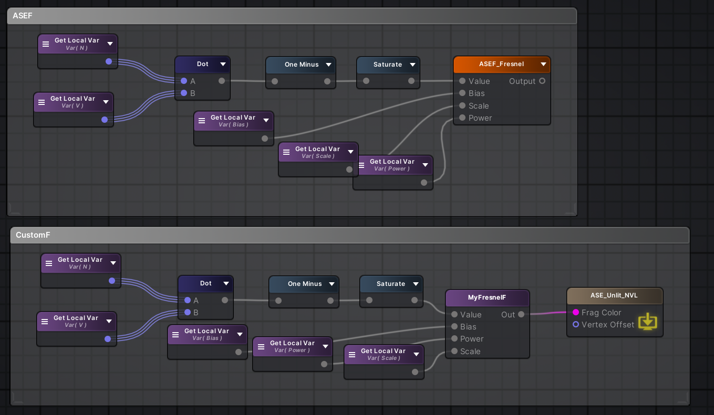

- [1排列](#1排列)
- [2斑马线](#2斑马线)
- [3河流扰动](#3河流扰动)
- [4法线输出](#4法线输出)
- [5POS](#5pos)
- [6花式渐变](#6花式渐变)
- [7IF 做三角形](#7if-做三角形)
- [8Clip 丢弃](#8clip-丢弃)
- [9噪音顶点随机](#9噪音顶点随机)
- [10法视光之菲涅尔](#10法视光之菲涅尔)
- [11顶点颜色 VertexColor](#11顶点颜色-vertexcolor)
- [12 shader text](#12-shader-text)
- [14 全息投影](#14-全息投影)


# 1排列


# 2斑马线


# 3河流扰动


未解之谜：为什么 UV 是向着右上角移动？

因为呀本质上还是 UV 的 XY 乘了一个数值

# 4法线输出


# 5POS

位置也可以作为UV输出


# 6花式渐变



# 7IF 做三角形


# 8Clip 丢弃



# 9噪音顶点随机



# 10法视光之菲涅尔

ASE 里，World Normal 是法线，View Dir 是视线，Object Space Light Dir 是光线。这几项参数都设置为归一化。

法线和光线点乘，其结果就是光线直射的地方显示为白色，与光线成角度显示颜色越黑转动光线可以实时看到效果变化。



法线和视线点乘，其结果就是 cos 夹角，当摄像机视线重合于三角形法线，此时夹角为零，数值为一，得到的颜色是白色，而三角形法线垂直于摄像机视线的位置，夹角为九十度，数值为零，得到的颜色是黑色。将最终结果反转并保护，就会得到类似于菲涅尔的效果。

ASE 节点自带菲涅尔效果，注意这个节点也需要归一化和安全保护。


可以新建 ASE function，整理菲涅尔公式。

也可以使用自定义节点用代码的形式书写公式。



# 11顶点颜色 VertexColor

此节点记录了顶点的颜色，有些模型其顶点自带颜色，无需额外的材质、shader 代码即可显示颜色，一般是手绘风。

不过有些颜色所处在的颜色空间可能有错，需要手动 power(2.2) 之类的操作

# 12 shader text

制作着色器

```hlsl

```


# 14 全息投影

1. 透明材质
2. 菲涅尔边缘光
3. HSV 彩虹色自定义控制
4. Y 阶梯流光