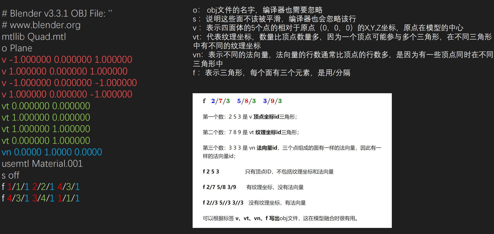
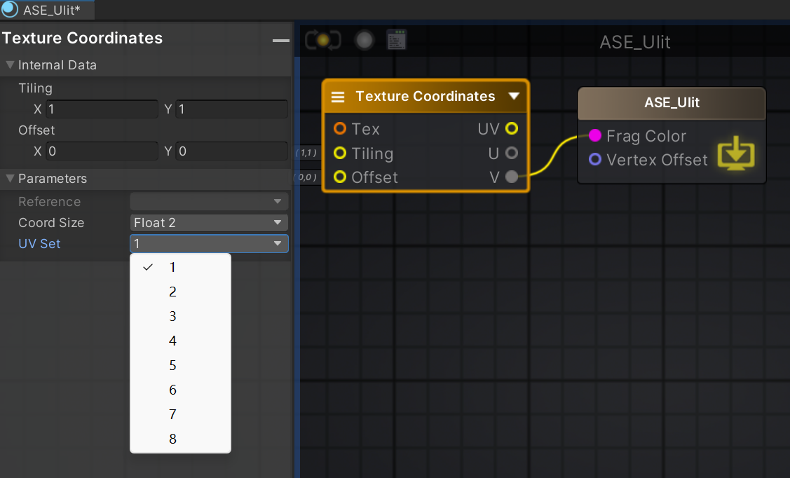

- [Obj](#obj)
- [贴图](#贴图)
  - [PPM](#ppm)
- [作业题](#作业题)
- [Unity新知识](#unity新知识)
  - [时间流动](#时间流动)
  - [看效果背景](#看效果背景)
  - [Linear](#linear)
- [UV 对应](#uv-对应)
- [贴图 RGB 拆分](#贴图-rgb-拆分)
- [Mips](#mips)

# Obj

blender 四边形 obj

# 贴图

贴图是颜色（像素）的合集。颜色一般是 8 位，也有 16 位。

## PPM

这里 3 * 3 其实就是 3 个像素 * 3 个像素的意思了啦。

没有正确对齐的就是 0

# 作业题

# Unity新知识

## 时间流动

可以在scene里进行时间流动查看效果

## 看效果背景

相机固定颜色 22，22，22 老师使用的。

## Linear

不知道为啥使用线性空间

# UV 对应

模型资源最多有 8 套 UV，可以通过这里切换查看，不同种 UV 有不同的用法

# 贴图 RGB 拆分

# Mips

图片勾选上之后，就会自动出现几层的mip

