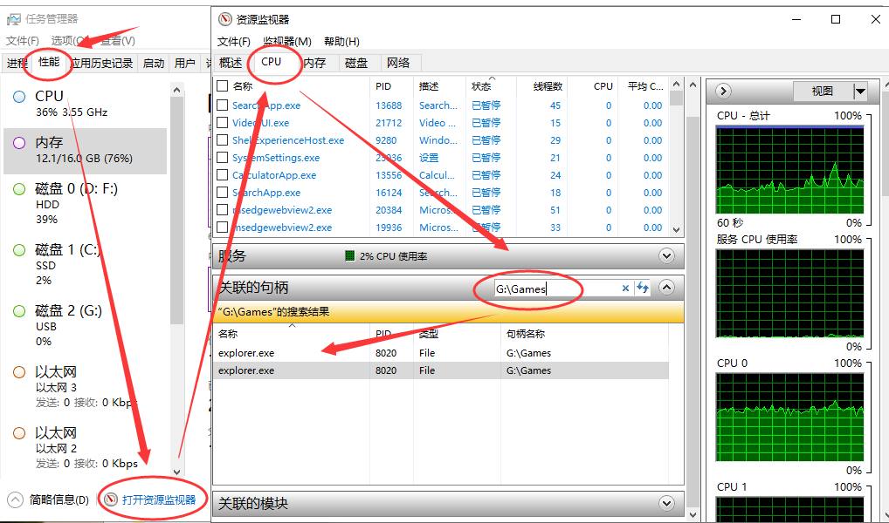

## cmd
在文件资源管理器界面，在文件路径里敲击cmd，然后输入，会打开在当前路径下的cmd。

## bat
```bat
md d:\mp4       #在 D:\ 建立 mp4 文件夹
cd /d d:\mp4    #更改当前目录为 d:\mp4
pushd c:\mp3    #保存当前目录，并切换当前目录为 c:\mp3
popd            #恢复当前目录为刚才保存的 d:\mp4
```

### 绝对路径
- ~           是扩展的意思，变量扩充(下面详细介绍)，相当于把一个相对路径转换绝对路径
- %0          代指批处理文件自身（绝对路径 "D:\test\bat\test.bat"，注意有双引号）
- %~d0        是指批处理所在的盘符，其中d代表drive。(扩充到盘符 D: )
- %~p0        是指批处理所在的目录，其中p代表path。(扩充到路径 \test\bat\ ）
- %~dp0       是批处理所在的盘符加路径。（扩充到盘符和路径 ：D:\test\bat\）


## 资源监视器
可以用句柄搜索某个路径下运行的文件  


## B站视频自定义倍速
document.querySelector('video').playbackRate=5