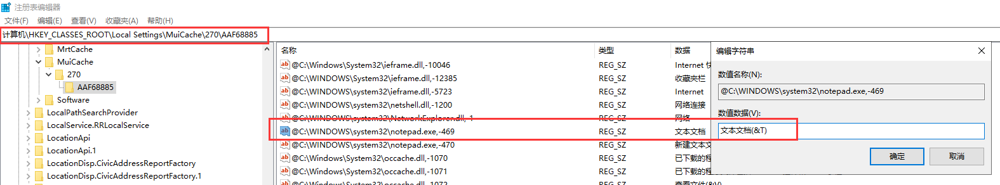

windows下的一些技巧

[cmd](#cmd)
[bat](#bat)
[资源监视器](#资源监视器)
[B站视频自定义倍速](#B站视频自定义倍速)
[快捷键](#快捷键)
## cmd
在文件资源管理器界面，在文件路径里敲击cmd，然后输入，会打开在当前路径下的cmd。

## bat

```bat
md d:\mp4       #在 D:\ 建立 mp4 文件夹
cd /d d:\mp4    #更改当前目录为 d:\mp4
pushd c:\mp3    #保存当前目录，并切换当前目录为 c:\mp3
popd            #恢复当前目录为刚才保存的 d:\mp4
pause           #暂停
echo.           #用于输出一个空行。在批处理文件中，echo. 是一种常用的方式来插入空行。
rem             #用于添加注释的命令
```

### 复制

```bat
setlocal  

set sourceDir=.\GenCsharp\GenCsharp

set targetDir=..\Assets\NetWork\com.sofunny.network-utils\Runtime\GenCsharp

if not exist "%targetDir%" (  
    mkdir "%targetDir%"  
)

xcopy "%sourceDir%\*.cs" "%targetDir%\" /s /y  

endlocal  
```

### 注释

*代表注释内容
%*%  本身不是指令，故是不回显的，可以单独成行注释，也可以行末注释
REM * 本身是指令，会回显的，只能单独成行注释
::  * 来源于：定义标签，只能单独成行注释

%感觉不好使，::这个体验最好

### 绝对路径

- ~           是扩展的意思，变量扩充(下面详细介绍)，相当于把一个相对路径转换绝对路径
- %0          代指批处理文件自身（绝对路径 "D:\test\bat\test.bat"，注意有双引号）
- %~d0        是指批处理所在的盘符，其中d代表drive。(扩充到盘符 D: )
- %~p0        是指批处理所在的目录，其中p代表path。(扩充到路径 \test\bat\ ）
- %~dp0       是批处理所在的盘符加路径。（扩充到盘符和路径 ：D:\test\bat\）

### mgit 读取 tmp 调用 sync

```Cpp
@echo off

setlocal enabledelayedexpansion 

set userDir=%USERPROFILE%

echo --------------------------
echo get tmp dir
echo --------------------------
echo.

for %%f in ("%userDir%\.mgit\tmp\*") do (
	echo filename %%f 
	if not exist "%%f\" (
		for /f "delims=" %%a in ('findstr "project" "%%f"') do (	
			set  "targetstr=%%a"
			goto :endLoop
		)
	)
)

:endLoop 
echo !targetstr!

for /f "tokens=2 delims==" %%b in ("!targetstr!") do (
	set  "targetdir=%%b"
)

echo !targetdir!
echo.
echo.
echo.
echo.
echo --------------------------
echo update version
echo --------------------------
echo.
git pull
echo.
echo.
echo.
echo.
echo --------------------------
echo update main
echo --------------------------
echo.
mgit sync --hard !targetdir!  --config .\develop.toml
pause
```


## 资源监视器
可以用句柄搜索某个路径下运行的文件，这通常被用来查询占用文件的程序。如果你想移动一个文件夹，发现被占用，可以尝试此方法。  


## B站视频自定义倍速
document.querySelector('video').playbackRate=5

## 快捷键
新建文件夹：Ctrl+Shift+N
我的电脑：Win+E
显示桌面：Win+D
AI工具：Win+C
搜索：Win+Q
运行：Win+R

### 自定义右键快捷键
自定义新建文本文档
其实就是将右键菜单新建中的文本文档加了一个快捷按键T，之后就通过 右键 + w + t 的方式伪快捷键

Win+R输入regedit 打开注册表，然后寻找上图位置

## 小技巧
### 开机自启
C:\ProgramData\Microsoft\Windows\Start Menu\Programs\Startup
这个目录下的快捷方式会开机自启

### win10 win11


### 永不更新


services.msc

gpedit.msc