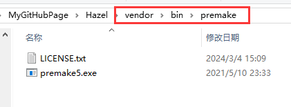
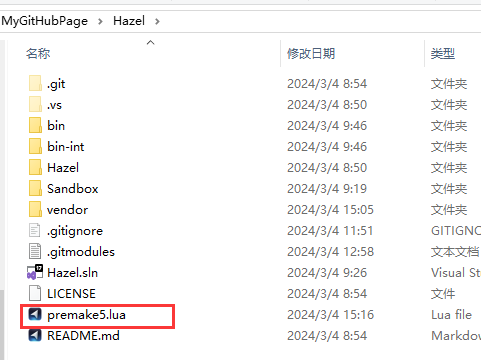

## 简介
Premake 是一个命令行实用程序，用于读取软件项目的脚本定义，最常见的是使用它为 Visual Studio、Xcode 或 GNU Make 等工具集生成项目文件。即使用命令行跨平台为IDE生成项目文件。  
Premake 是一个开源的github项目，其中的wiki有着详细的教程，这里仅仅是使用过程中用到的一些实例解释。

## 如何导入
在github中找到release的premake，并下载对应的文件。  
这里以windows为例。Windows需要下载一个exe，将其放在需要生成的项目中（合适的路径下）。请把许可证也一并导入到同一目录。 

这里放到了解决方案的vendor文件夹中的bin目录下，意味着第三方生成文件。   


## 命令行代码
premake使用lua语言。  
请在项目根目录创建premake.lua来书写生成项目的代码。



这里给出VS的意思不太明显的语句例子  

| 语句                          | 释义                                                                                                                                                    |
| ----------------------------- | ------------------------------------------------------------------------------------------------------------------------------------------------------- |
| workspace "Hazel"             | 解决方案名称 Hazel                                                                                                                                      |
| configurations {"XXXX"}       | 自定义的、应用于生成的 设置集合，是解决方案的必填属性。里面可以填写自己喜欢的名称，其意义取决于它在下面的设置                                           |
| architecture("x64")           | 指定系统架构 这个值不能随便填                                                                                                                           |
| project "XXX"                 | 项目名称                                                                                                                                                |
| location ("path")             | 设置生成的工作区或项目文件的目标目录。                                                                                                                  |
| kind("kind")                  | 设置由项目或配置创建的二进制对象的类型，例如控制台或窗口化应用程序，或者共享库或静态库。                                                                |
| files{"%{prj.name}/src/**.h"} | 将指定文件添加到项目中。这个就是vs的包含和排除文件。                                                                                                    |
| filter { "prefix:keywords" }  | 脚本中此函数之后出现的任何设置将仅应用于与所有列出的关键字匹配的上下文。                                                                                |
| pchheader                     | 预编译头，只需要填写文件名称                                                                                                                            |
| pchsource                     | 需要填写创建预编译头的cpp文件路径                                                                                                                       |
| include("path")               | 查找并执行另一个脚本文件（path 是脚本文件或目录的文件系统路径。如果指定了目录，Premake 将查找该目录中命名 premake5.lua 的文件，并在找到时运行该文件。） |


## VS解决方案
其常用的premake生成需要处理的项有：

解决方案项：解决方案名称、系统架构、自定义设置集合。
```lua
workspace "Hazel"
    architecture "x64"
    
    configurations
    {
        "Debug",
        "Release",
        "Dist"
    }
```

项目项：
- 项目名称、工作区目标目录、二进制对象类型、编程语言
- 生成目标目录、中间目录
- 文件目录、包含文件目录、引用文件目录
- 过滤器平台：cpp版本、静态运行时、系统版本、预处理定义、生成项目后的命令
- 对应解决方案自定义设置的过滤器
```lua
project "Hazel"
    location "Hazel"
    kind "SharedLib"
    language "C++"
    
    targetdir ("")
    objdir ("")
    
    files
    {
        "",
        ""
    }
    
    include
    {
        ""
    }
    
    filter ""
        cppdialect "C++17"
        staticruntime "On"
        systemversion ""
        
        defines
        {
            "",
            ""
        }
        
        postbuildcommands
        {
            ("")
        }
    
    filter ""
        defines ""
        symbols ""
```
 
## Tokens
值令牌提供将计算值替换到配置设置中的功能。代替宏，其实跟VS的宏是一样的。  

值令牌是包装在 %{} 序列中的表达式。令牌可以访问一个或多个上下文对象，具体取决于它们在项目中的范围： wks 、 prj 、 cfg 和 file （工作区、项目、配置和文件配置）。您可以在令牌中访问这些上下文对象的所有字段。

| 语句                | 释义                                                         |
| ------------------- | ------------------------------------------------------------ |
| %{cfg.buildcfg}     | 生成配置（Debug还是Release还是Dist，即上面的configurations） |
| %{cfg.system}       | 系统（比如windows）                                          |
| %{cfg.architecture} | 系统架构（就是上面的architecture）                           |

## 语法
### 声明和使用变量
```lua
outputdir = "%{cfg.buildcfg}-%{cfg.system}-%{cfg.architecture}"

targetdir ("bin/" .. outputdir .. "/%{prj.name}")
```