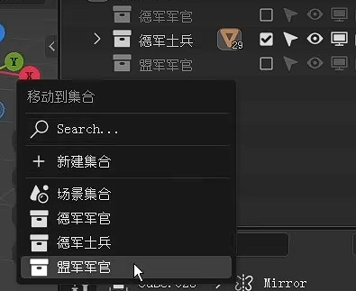

- Ctrl + P ：设置父子关系
在移动的时候注意 Y 啊，Y 默认是拆分，如果不小心拆分了，可以使用网格里的按距离合并，就可以把不小心拆分出来的点合并
小心 O 衰减 按了之后可能你就只能连带着所有东西一起移动了，不过对一些需要周围一起移动的情况下非常有用
遇到膨胀了发现不太对，可能是面朝向有问题
h 隐藏 alt h 取消隐藏
对那些线间隔均匀化，松弛。倒角、空间均匀化和松弛真得很常用

边 边偏移 挤出 

CTRL + , 偏好设置

多选之后 在预览界面 M键 可以呼出快捷移动到集合的功能

