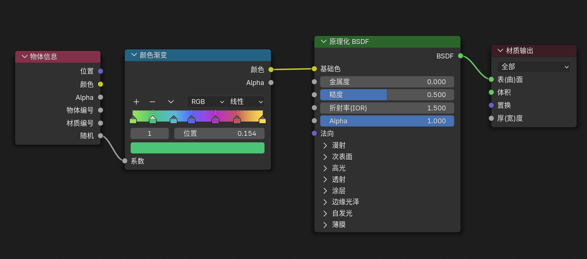
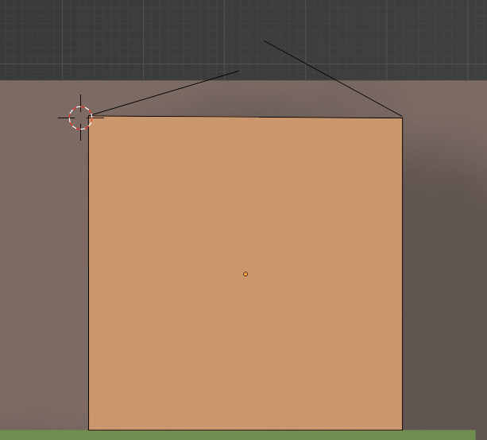

- [视图](#视图)
  - [游标](#游标)
- [物体模式](#物体模式)
  - [选中物体](#选中物体)
    - [右键菜单](#右键菜单)
    - [多选物体](#多选物体)
    - [复制物体](#复制物体)
    - [独立显示物体](#独立显示物体)
  - [创建物体](#创建物体)
    - [平面](#平面)
  - [物体变换轴向](#物体变换轴向)
    - [轴向方向 \<](#轴向方向-)
    - [轴向位置 \>](#轴向位置-)
    - [变换到活动物体](#变换到活动物体)
- [编辑模式](#编辑模式)
  - [面选择模式：3](#面选择模式3)
  - [边选择模式：2](#边选择模式2)
    - [桥接](#桥接)
  - [点选择模式：1](#点选择模式1)
  - [通用操作](#通用操作)
    - [Alt 循环选择](#alt-循环选择)
    - [Alt + Ctrl 环形选择](#alt--ctrl-环形选择)
    - [L：快速选择整个模型](#l快速选择整个模型)
    - [右键细分：可以细分面和边](#右键细分可以细分面和边)
    - [模型部分的分离合并](#模型部分的分离合并)
    - [填充成面](#填充成面)
- [物体属性栏](#物体属性栏)
  - [物体数据属性](#物体数据属性)
- [吸附](#吸附)
- [模型预览](#模型预览)
  - [移动影响](#移动影响)
- [材质](#材质)
  - [同一个物体可以使用不同材质](#同一个物体可以使用不同材质)
  - [不同物体使用同一种材质](#不同物体使用同一种材质)
  - [随机颜色](#随机颜色)
- [网格](#网格)
  - [拆分 - 沿边拆面](#拆分---沿边拆面)
  - [球形化](#球形化)
- [法线](#法线)
- [刻在脑子里的注意事项](#刻在脑子里的注意事项)
  - [缩放对于很多操作都有影响](#缩放对于很多操作都有影响)
  - [Shift + R](#shift--r)
  - [Ctrl + +](#ctrl--)
  - [Shift + 7](#shift--7)
- [样条曲线](#样条曲线)

# 视图

alt + ctrl + q ：直接 4 视图

alt + shift + z ：隐藏gizmo

可以方便拖动分割视图，然后拖动小角一拉（合并窗口）就可以关闭

正面    小键盘 1  
侧视图  小键盘 3  
顶视图  小键盘 7  
底视图  小键盘 9  
透视图正焦视图切换  小键盘 5

按住 Alt 滑动，可以切换视图。

T ：打开关闭左侧工具栏

小键盘小数点，视图转到选中模型中心。

## 游标

shift 加 右键：移动游标，可以把游标放到任何位置

游标在哪里，新建物体默认就在哪里。

shift + c ：还原游标到世界中心

shift + s ：可以将游标放置到选中项原点处

# 物体模式

旋转视图：鼠标中键（MMB）拖动
平移视图：Shift + 鼠标中键 拖动
缩放视图：鼠标滚轮 或 Ctrl + 鼠标中键 拖动
最大化当前窗口：Ctrl + 空格（再次按恢复）

按一下小键盘 0 键回归到摄像机视角

默认保存打开 blender 之后的世界状态：把当前场景处理好之后，使用 文件 > 默认 > 保存启动文件

N 物体布局下的设置

S 缩放选中物体

缩放罩体：在左侧缩放按钮上可以进行左键长按，按照罩体进行缩放。

ALT + S 法向缩放

R 旋转选中物体

G 移动物体跟随鼠标，在这个模式下按住 X Y Z 分别在不同轴向移动物体

这些变换操作过程中按住 Ctrl 可以固定整数移动，然后可以鼠标指向吸附

X 删除物体

shift + A ：添加模型

添加立方体提供了一种沿平面生成的模型的方法

右键可以设置原点到几何中心，这一点对于在编辑模式下进行编辑的物体尤为重要。

## 选中物体

### 右键菜单

- 平滑着色：直接把所有边角变糊

### 多选物体

- Ctrl + P ：组合物体，一般使用组合变换，这样就一起移动了
- Ctrl + - ：先A后B，在B中扣除A的形状（需要插件 Bool Tool）

### 复制物体

- shift + D：复制，并且复制的时候可以使用 X Y Z 沿面复制

### 独立显示物体

按下 / 可以独立显示

## 创建物体

### 平面

可以选择按照世界创建，也可以按照视图创建。

## 物体变换轴向

### 轴向方向 <

全局坐标轴(世界空间)
局部坐标轴(对象自身)
法向(面的朝向)

### 轴向位置 >

选择中心(公共中心)
游标
各自原点(自身轴点)

### 变换到活动物体

先选中 A 然后选中 B ，然后点击物体 - 变换 - 变换到活动物体

# 编辑模式 

TAB 进入编辑模式

## 面选择模式：3

- Ctrl + F 面命令组
- I ：按住来插入面
- E ：挤出。挤出也是有好几种的，alt + E 可选择各种模式。
  - 沿着法线进行挤出：可以选择均等偏移，防止环面挤出时的角度问题。如果有存在两个面有角度，想让这两个面平齐，可以选中这两个，然后使用缩放工具，按小键盘数字 0 解决。
  - 流形挤出：不会残留面或者生成面。
  - 挤出的时候可以按 X Y Z 沿着某个方向挤出
- S ：缩放，可以用来让挤出面片的四个角相连的直线变斜线
- Alt + S：沿着法向缩放
- Ctrl + D ：设置为细分快捷键。多次按下，会多次细分。
- Ctrl + R ：环切，增加一个分割环。创建的分割环切默认是在中心位置，此时果想创建对称的分割环切，请确认中心环切，此时不要动，此时默认选中的就是这环切线，在此基础上进行倒角操作，会出现对称环切。
  - Ctrl + Shift + R : 环切偏移。这个可以直接创建对称环切
- K ：手工切线。划分好之后按下 Enter 确认。
  - 切透：这里还有一个切透功能，先按 A 全选，然后可以一刀下去切透。或者选中多少面，就切多少面的。
  - 最好都弄成四边面，就是连接成两个三角形
- 面三角化

## 边选择模式：2

- Ctrl + E ：边命令组
- Ctrl + X ：删除线（融并边）
- Ctrl + B ：创建边倒角，在此情况下，按 V 会切换到 点的倒角。

### 桥接

- 选中一个面使用桥接，就会把这个面弄空
- 选中两个面使用桥接，似乎会根据法线方向进行连接

## 点选择模式：1

- Ctrl + V 点命令组
- J：连接两个顶点
- V：选中一个点，断开顶点
- M：焊接

- Ctrl + Shift + B ：创建点倒角

## 通用操作

### Alt 循环选择

选择的时候可以按住 Alt 键，进行循环选择，比如选择一横排或者一竖排。

### Alt + Ctrl 环形选择

选择的时候可以按住 Alt + Ctrl 键，进行环形选择，这部分几乎只有线有用，点和面这部分没啥意义。

### L：快速选择整个模型

### 右键细分：可以细分面和边

### 模型部分的分离合并

可以选择几个单位，然后复制，然后按下 P 分离。

也可以在外面进行合并，Ctrl + J

### 填充成面

- F：使用这些点或者线连接成面
- 随机填充 Alt + F：用随机三角形填充成面
- 栅格化填充：按照曲率进行栅格化填充面

# 物体属性栏

## 物体数据属性

- 法向
  - 自动光滑：小于这个度数的角度才进行自动光滑，经常用在平滑着色之后，去除不必要的平滑着色

# 吸附

shift + tab ：开启关闭吸附模式

可以选择吸附不同模式

# 模型预览

模型预览方式 Z

窗口右上角 四个小球
- 线框模式
  - 快速切换线框 Shift + Z
- 实体模式
- 材质预览
- 渲染预览

四个小球左边有一个切换透视模式
- 透选：可以选到背面面。正常我们框选只能选择表面，这个可以选择背面

再左边有一个叠加信息显示，比较实用的是线框显示。

## 移动影响

在四个小球下面的选项里，可以选择你移动影响的对象，比如原点，位置，父级。

# 材质

右侧属性面板可以添加

## 同一个物体可以使用不同材质

新建材质，然后指定

## 不同物体使用同一种材质

Ctrl + L 关联材质 会使用同一种

## 随机颜色

# 网格

## 拆分 - 沿边拆面

## 球形化

# 法线

面是有正反之分的，外面为蓝，内面为红，我们一般要让外面颜色都正确，这样法线切角之类的才不会错。（需要开启面朝向显示才行）

编辑模式下，快捷键，shift + N 可以快速重新计算面朝向。

# 刻在脑子里的注意事项

## 缩放对于很多操作都有影响

如果你的物体缩放不是 1：1：1 那很多操作会有问题

比如倒角会形变，弯曲操作（修改器中的简易形变）

Ctrl + A 可以清空缩放，让已经修改的缩放变成 1：1：1 代表着将其当前状态视为原始状态

## Shift + R

重复之前的操作

## Ctrl + +

扩大选取

## Shift + 7 

可以让旋转跟着视图，即不会出现扭曲旋转。

# 样条曲线

