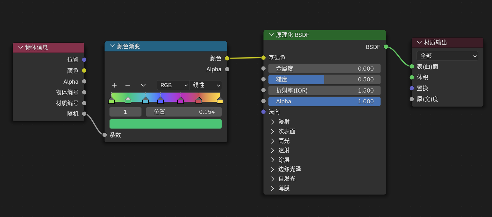
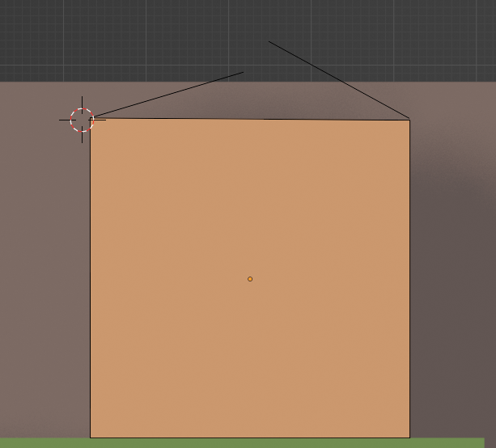
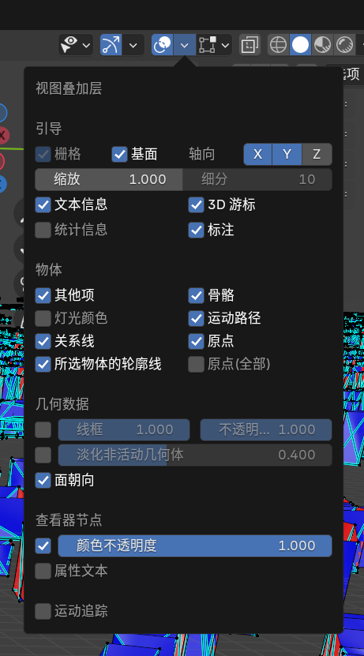

- [物体模式](#物体模式)
  - [选中物体](#选中物体)
    - [多选物体](#多选物体)
  - [物体变换轴向](#物体变换轴向)
    - [轴向方向 \<](#轴向方向-)
    - [轴向位置 \>](#轴向位置-)
    - [变换到活动物体](#变换到活动物体)
- [编辑模式](#编辑模式)
  - [面选择模式：3](#面选择模式3)
    - [桥接](#桥接)
  - [点选择模式：1](#点选择模式1)
  - [通用操作](#通用操作)
    - [L：快速选择整个模型](#l快速选择整个模型)
    - [右键细分：可以细分面和边](#右键细分可以细分面和边)
- [物体属性栏](#物体属性栏)
  - [物体数据属性](#物体数据属性)
- [吸附](#吸附)
  - [移动影响](#移动影响)
- [材质](#材质)
  - [同一个物体可以使用不同材质](#同一个物体可以使用不同材质)
  - [不同物体使用同一种材质](#不同物体使用同一种材质)
  - [随机颜色](#随机颜色)
- [网格](#网格)
  - [拆分 - 沿边拆面](#拆分---沿边拆面)
  - [球形化](#球形化)
- [法线](#法线)
- [刻在脑子里的注意事项](#刻在脑子里的注意事项)
  - [Shift + R](#shift--r)
  - [Ctrl + +](#ctrl--)
  - [Shift + 7](#shift--7)
- [样条曲线](#样条曲线)
- [视图常用快捷键](#视图常用快捷键)
- [视图显示](#视图显示)
  - [视图着色方式](#视图着色方式)
  - [视图叠加层](#视图叠加层)
  - [视图操控器](#视图操控器)
  - [工具栏](#工具栏)
    - [框选](#框选)
    - [游标](#游标)
    - [操作物体](#操作物体)
      - [移动](#移动)
      - [旋转](#旋转)
      - [缩放](#缩放)
      - [变换](#变换)
    - [标注](#标注)
    - [测量](#测量)
    - [新建](#新建)
- [模型合并和分离](#模型合并和分离)
  - [合并](#合并)
  - [分离](#分离)

# 物体模式

这些变换操作过程中按住 Ctrl 可以固定整数移动，然后可以鼠标指向吸附

添加立方体提供了一种沿平面生成的模型的方法

右键可以设置原点到几何中心，这一点对于在编辑模式下进行编辑的物体尤为重要。

## 选中物体

### 多选物体

- Ctrl + P ：组合物体，一般使用组合变换，这样就一起移动了
- Ctrl + - ：先A后B，在B中扣除A的形状（需要插件 Bool Tool）

## 物体变换轴向

### 轴向方向 <

全局坐标轴(世界空间)
局部坐标轴(对象自身)
法向(面的朝向)

### 轴向位置 >

选择中心(公共中心)
游标
各自原点(自身轴点)

### 变换到活动物体

先选中 A 然后选中 B ，然后点击物体 - 变换 - 变换到活动物体

# 编辑模式 

## 面选择模式：3

- Ctrl + D ：设置为细分快捷键。多次按下，会多次细分。
- K ：手工切线。划分好之后按下 Enter 确认。
  - 切透：这里还有一个切透功能，先按 A 全选，然后可以一刀下去切透。或者选中多少面，就切多少面的。
  - 最好都弄成四边面，就是连接成两个三角形
- 面三角化

### 桥接

在边命令组里（Ctrl + E）

- 选中一个面使用桥接，就会把这个面弄空
- 选中两个面使用桥接，似乎会根据法线方向进行连接

## 点选择模式：1

- V：选中一个点，断开顶点
- Ctrl + Shift + B ：创建点倒角

## 通用操作

### L：快速选择整个模型

### 右键细分：可以细分面和边

# 物体属性栏

## 物体数据属性

- 法向
  - 自动光滑：小于这个度数的角度才进行自动光滑，经常用在平滑着色之后，去除不必要的平滑着色

# 吸附

shift + tab ：开启关闭吸附模式

可以选择吸附不同模式

## 移动影响

在四个小球下面的选项里，可以选择你移动影响的对象，比如原点，位置，父级。

# 材质

右侧属性面板可以添加

## 同一个物体可以使用不同材质

新建材质，然后指定

## 不同物体使用同一种材质

Ctrl + L 关联材质 会使用同一种

## 随机颜色

# 网格

## 拆分 - 沿边拆面

## 球形化

# 法线

先打开 Blender 右上角 “叠加层” 菜单中的面朝向（Face Orientation）选项

面是有正反之分的，外面为蓝，内面为红，我们一般要让外面颜色都正确，这样法线切角之类的才不会错。（需要开启面朝向显示才行）

编辑模式下，快捷键，shift + N 可以快速重新计算面朝向。

# 刻在脑子里的注意事项

## Shift + R

重复之前的操作

## Ctrl + +

扩大选取

## Shift + 7 

可以让旋转跟着视图，即不会出现扭曲旋转。

# 样条曲线

# 视图常用快捷键

Ctrl + N ：新建文件

Shift + A ：添加 常用面向视图
Shift + D ：复制 可以沿着 X/Y/Z 进行沿轴复制

旋转视图：鼠标中键（MMB）拖动
平移视图：Shift + 鼠标中键 拖动
缩放视图：鼠标滚轮 或 Ctrl + 鼠标中键 拖动
最大化当前窗口：Ctrl + 空格（再次按恢复）
飞行模式：shift + ~
. ：视图聚焦到选中物体
/ ：屏蔽其他物体，对当前物体进行局部显示

正面    小键盘 1  
侧视图  小键盘 3  
顶视图  小键盘 7  
底视图  小键盘 9  
透视图正交视图切换  小键盘 5
回归到摄像机视角 小键盘 0 
按住 Alt 拖动鼠标中键，可以切换视图。或者说在你鼠标中键旋转的时候想要对齐到某一视图，可以按下 Alt 会自动贴合到某一视图上。
~ 选择视图窗口
Alt + Ctrl + Q ：直接 4 视图

N 物体布局下的设置栏隐藏和显示

# 视图显示

默认保存打开 blender 之后的世界状态：把当前场景处理好之后，使用 文件 > 默认 > 保存启动文件

## 视图着色方式

- Z ：选择预览模式（线框、实体、材质、渲染）（对应那四个小球）
- Shift + Z ：从任何模式下切换到线框模式
- 透选：可以选到背面面。正常我们框选只能选择表面，这个可以选择背面（如果你的线框模式下奇怪不透明，应该就是这个选项的问题了）（四个小球左边为切换透视模式）

## 视图叠加层

Alt + Shift + Z ：切换试图叠加层显示

这里面就有各种各样的视图信息，比如统计信息、面朝向等

## 视图操控器

Ctrl + ` ：切换视图操控器显示

## 工具栏

T ：切换工具栏显示

### 框选

W 切换框选方式

### 游标

Shift + 鼠标右键：放置游标

- 可以控制新建模型的初始位置
- 参考作用，比如作为旋转中心

### 操作物体

#### 移动

移动 G 物体跟随鼠标

在这个模式下
- 按住 X Y Z 分别在不同轴向移动物体
- 按住 Shift + X/Y/Z 进行锁定 X/Y/Z 轴的移动（也就是只在 yz/xz/xy 这个平面上移动）

#### 旋转

旋转 R 同理

#### 缩放

缩放 S 同理
- 缩放罩体：在左侧缩放按钮上可以进行左键长按，按照罩体进行缩放。就是一个 AABB 包控制缩放
- ALT + S 法向缩放：一般使用在编辑模式下，沿着具体法线进行缩放的场景
  - 等值偏移（Offset Even）勾选后：算法会进行校正，确保沿着表面的整体轮廓创建一个均匀、平行的偏移距离，形成一个干净、无裂缝的壳。

缩放对于很多操作都有影响。如果你的物体缩放不是 1：1：1 那很多操作会有问题，比如倒角会形变，弯曲操作（修改器中的简易形变）

Ctrl + A 可以清空缩放，让已经修改的缩放变成 1：1：1 代表着将其当前状态视为原始状态。如果你的倒角发生了不均匀的情况，就可以试试这个

#### 变换

变换，包括了以上三种，太综合了，不常用

### 标注

可以在屏幕上涂涂画画，然后 Ctrl + 鼠标左键 擦除，用来写板书比较有用

### 测量

### 新建

可以从 编辑 - 偏好设置 - 获取扩展 - 搜索 mesh - 安装插件 来增加可以新建的模型

在新建模型时可以直接调整模型的位置，如果你发现窗口没有弹出来，F9 可以呼出窗口

# 模型合并和分离

## 合并

选中模型之后，如果再选中其他模型，你会发现模型边框颜色不同

红色边框对象叫原始选择对象
黄色边框对象叫做基合对象

Ctrl + J ：将这几个对象合并起来

## 分离

必须进入编辑模式下，然后切换到线框视图（否则可能选择不全）

选中网格之后，按下 P 进行分离