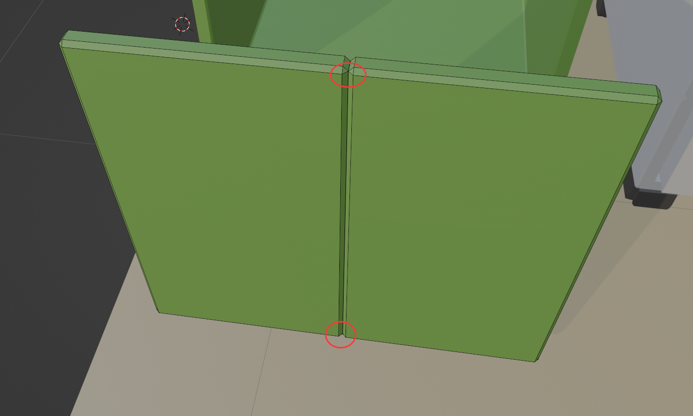

# V 的分离妙用

这种地方，一开始是一个面片，Ctrl + R，切割，这个时候就要在这两个地方分别选择点，进行 V 分离，然后选中两个面，按 E 往后方推，然后再线模式选中前方部分的（最好顶视图选中），然后 Ctrl alt Shift 选中中间的小竖线，将他们一起倒角。这样才会有图中分离的效果。

其实原理就是，你需要真的创造出两个不同的面，每个面都有4个点，如果不按 V 分离，那么这里就不会进行面分离的形状。

反思其实一开始就做两个门就没这么多花里胡哨的事情。