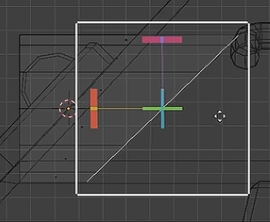

- [选择模式](#选择模式)
  - [全选](#全选)
  - [循环选择](#循环选择)
    - [Alt 循环选择](#alt-循环选择)
    - [Alt + Ctrl 环形选择](#alt--ctrl-环形选择)
  - [加减选择](#加减选择)
    - [Ctrl](#ctrl)
    - [Shift](#shift)
    - [按住 Ctrl + 框选](#按住-ctrl--框选)
- [切割](#切割)
- [删除](#删除)
  - [融并选区](#融并选区)
- [边](#边)
  - [环切](#环切)
- [光滑](#光滑)
- [法向缩放](#法向缩放)
  - [膨胀](#膨胀)
- [切变](#切变)
- [断离](#断离)

TAB 进入编辑模式

# 选择模式

点选择模式：1
边选择模式：2
面选择模式：3

## 全选

L：未知选取

Ctrl + L：未知选取

A：直接全选

## 循环选择

### Alt 循环选择

选择的时候可以按住 Alt 键，进行循环选择，比如选择一横排或者一竖排。

### Alt + Ctrl 环形选择

选择的时候可以按住 Alt + Ctrl 键，进行环形选择，这部分几乎只有线有用，点和面这部分没啥意义。

## 加减选择

### Ctrl 

快速加选

### Shift

逐个加选

### 按住 Ctrl + 框选

快速减选

# 切割

K ：手工切线。划分好之后按下 Enter 确认。

- 切透：切透功能，先按 A 全选，然后可以一刀下去切透。或者选中多少面，就切多少面的。
- 中分切割：按住 Shift 自动寻找线段中点

# 删除

选中之后 delete 或者 X

## 融并选区

Ctrl + X ：比较智能，比如一个边直接删除会连带附近的面啥的一起删除，而融并可以凭空消散边

# 边

## 环切

Ctrl + R

# 光滑

# 法向缩放

## 膨胀

Alt + S：膨胀

# 切变

方便地制作出切片

# 断离

V 可以方便地拆离边和点