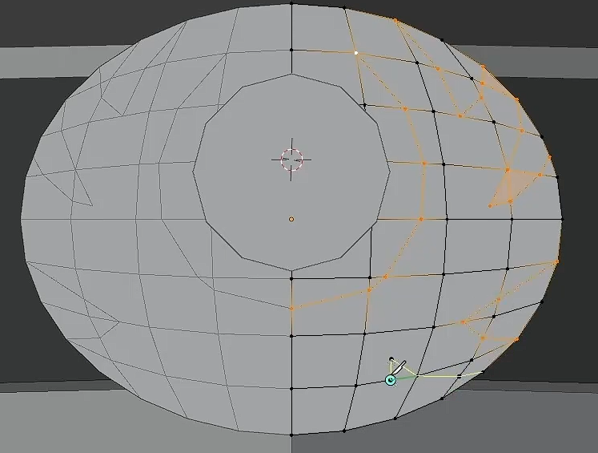

- [面模式](#面模式)
- [挤出](#挤出)
- [插入](#插入)
  - [边界](#边界)
- [填充](#填充)

# 面模式

Ctrl + F 呼出面菜单

如果有存在两个面有角度，想让这两个面平齐，可以选中这两个，然后使用缩放工具，按小键盘数字 0 解决。

# 挤出

Alt + E ：选择挤出方式

- 挤出面：（挤出的时候可以按 X Y Z 沿着某个方向挤出）
- 沿着法线挤出面：可以选择均等偏移，防止环面挤出时的角度问题。
- 挤出各个面：
- 挤出流形：不会残留面或者生成面。（挤出的时候可以按 X Y Z 沿着某个方向挤出）

Ctrl + 鼠标右键：快速挤出

# 插入

- 内插面 I ：插入面，I 的时候可以 Ctrl 挤出，相当于一下子就完成两个操作了

## 边界

内插面可以取消边界，这在镜像边界的时候可以与另一边混合

# 填充

- F ：填充成面
- 填充 Alt + F：用随机三角形填充成面
- 栅格化填充：按照曲率进行栅格化填充面。这在制作一些小物件的时候非常有用，可以快速制作基准线，栅格在创建的时候可以偏移摆正，然后方便我们 K 切割出想要的形状

