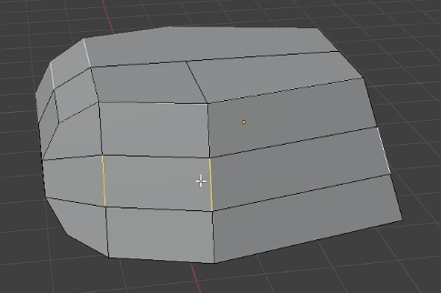
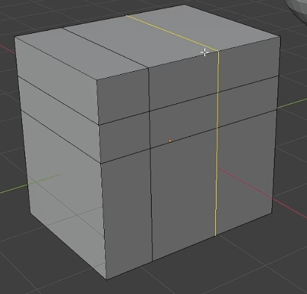

- [边模式](#边模式)
- [桥接循环边](#桥接循环边)
- [环切](#环切)
  - [两个环切之间非常窄](#两个环切之间非常窄)
  - [环切未响应](#环切未响应)
- [删除](#删除)
- [倒角](#倒角)
- [标记缝合边](#标记缝合边)

# 边模式

Ctrl + E ：边命令组

# 桥接循环边

将两组边接起来，图中可以增加分段

# 环切

- 边线滑移：
- 环切并滑移 Ctrl + R ：环切，增加一个分割环边。创建的分割环切默认是在中心位置，此时果想创建对称的分割环切，请确认中心环切，此时不要动，此时默认选中的就是这环切线，在此基础上进行倒角操作，会出现对称环切。
- 偏移边线并滑移 Ctrl + Shift + R : 环切偏移。这个可以直接创建对称环切

## 两个环切之间非常窄

可以选中这些支撑边，然后按照各自原点缩放来顶住环切

## 环切未响应

大概率是因为你想切的那些面不是四边面

# 删除

delete：正常的删除会把面一起删除掉
X + 融并边：将多余的边消失不见（快捷键 Ctrl + X ）

# 倒角

Ctrl + B ：创建边倒角，在此情况下，按 V 会切换到 点的倒角，再按下 V 切换回去。可以滚轮增加分段数

# 标记缝合边

把模型想象成纸盒或衣服，在背部、侧面等最不起眼的地方切开。 目的是让模型能摊平，同时把接缝藏到最不显眼的位置。

成功标记的边会变成红色

之后可以选中所有面进行 UV 展开