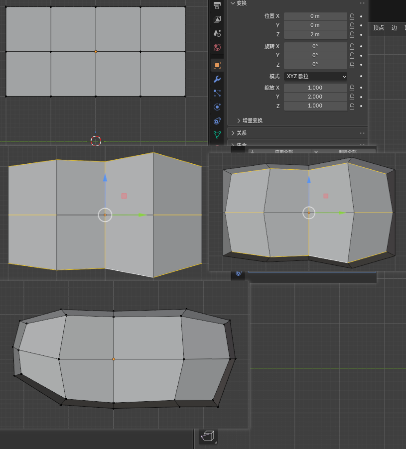
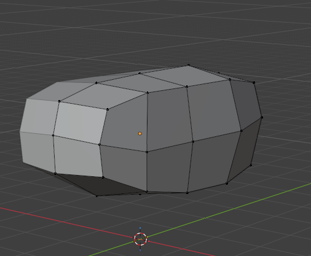
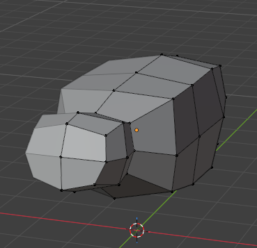
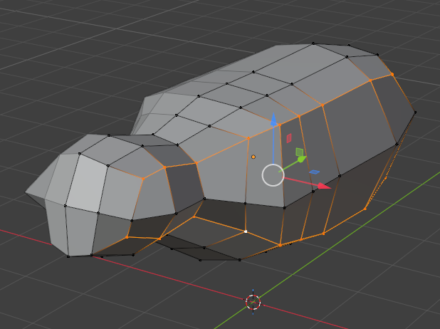
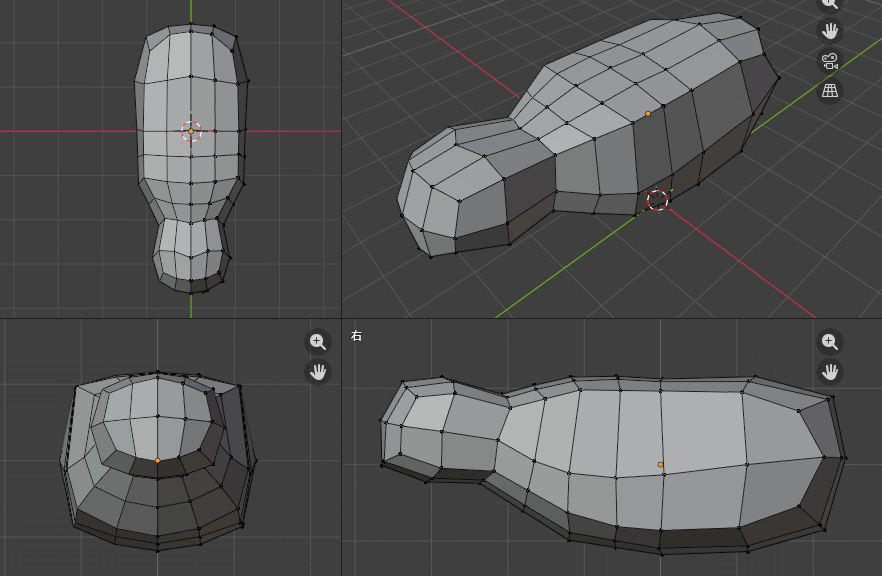
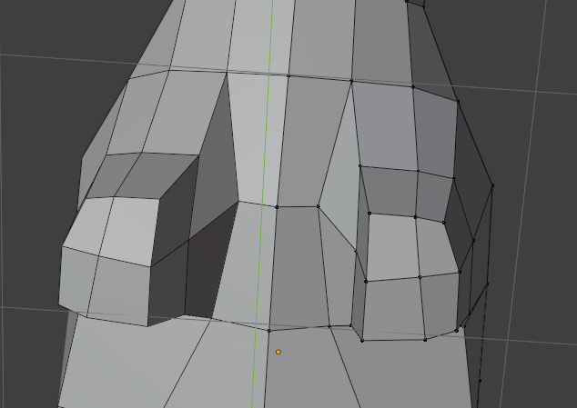
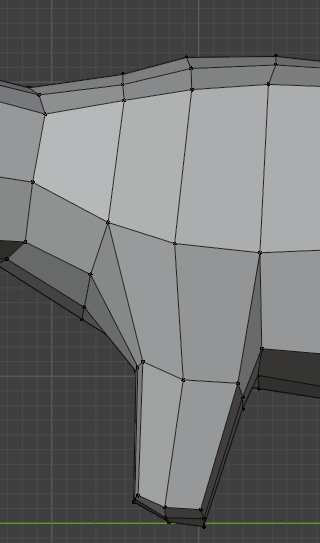
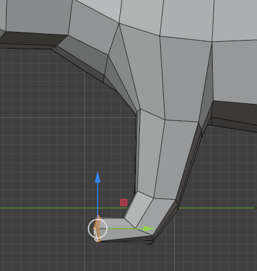
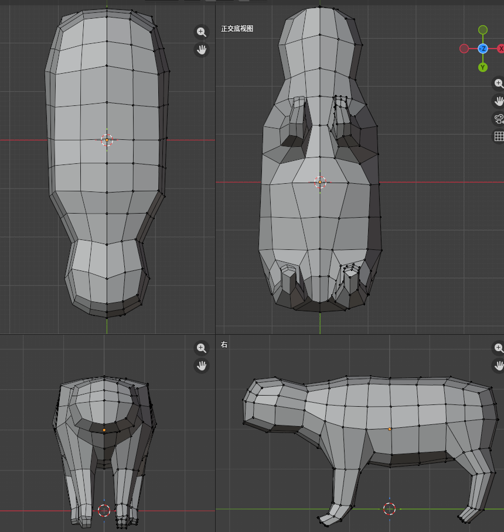

长方体，四分为段，收缩塑性，

挤出脖子和头，稍微调整下线段

增加线段，前肢两条，身躯两条，然后对身侧的边线 alt + s 缩放

这里的形体要求是中间粗壮，越往外走越苗条，侧边的边线要流线均匀，胸腔身体中线要有弧度，前弯后提

调整点位，让猫猫更圆滑

选中四个面挤出腿，要调整腿的边线，一个是下部的边线要往中间靠拢

猫猫的腿4段，肱骨，桡骨，腕骨，掌骨

后腿也是四段，但是要注意角度和胖瘦

增加切线去调整

