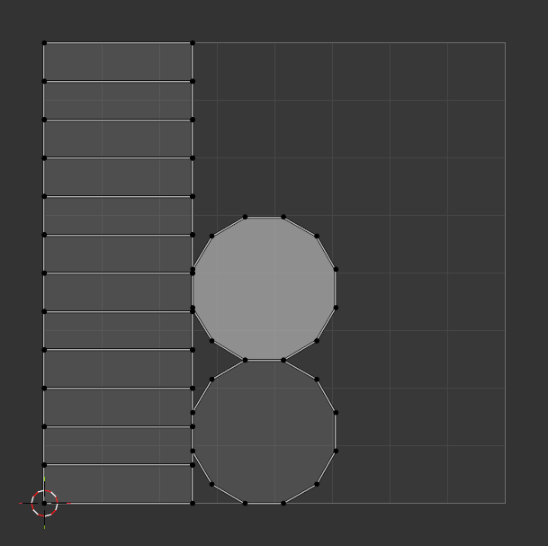
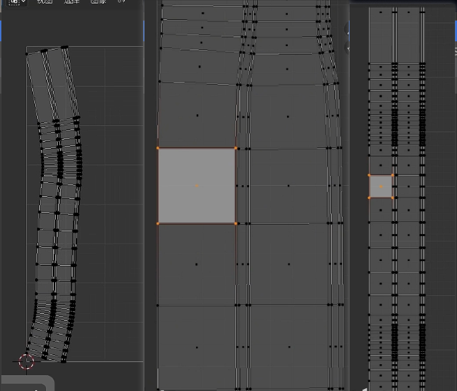

# 生成 UV

其实在新建那些模型的时候已经帮我们自动生成 UV 了，可以看到生成 UV 被勾选上了。

## 手动圆柱

选择上下顶盖和一条缝边进行标记缝合边

# 展开

沿着被标记为缝合边的展开

- 基于角度
- 共形
- 最小拉伸：曲面

# 沿活动四边面展开

比如一个坦克的履带，本来它是比较扭曲的 UV，你可以选中其中一个面进行缩放 0，让其归正，然后使用这个选项，将全部 UV 展开成规正矩形

