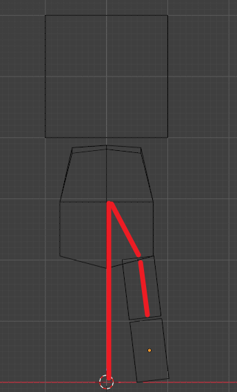
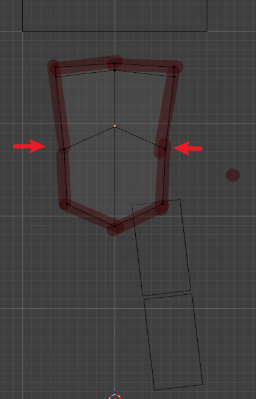
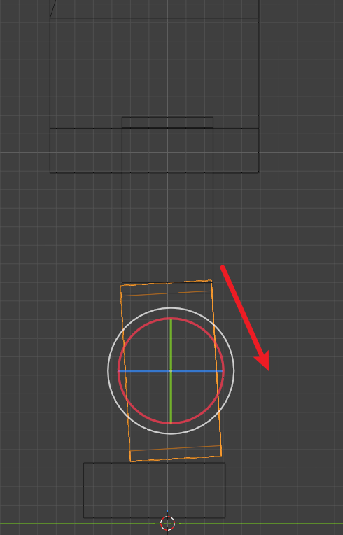
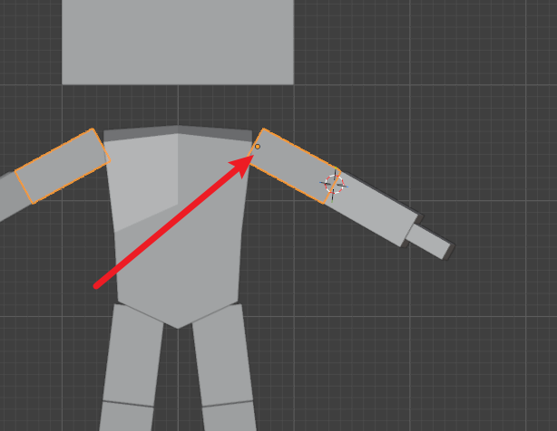
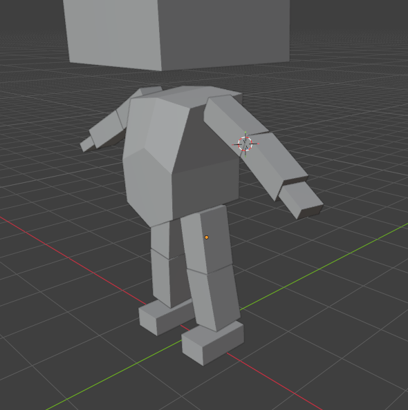
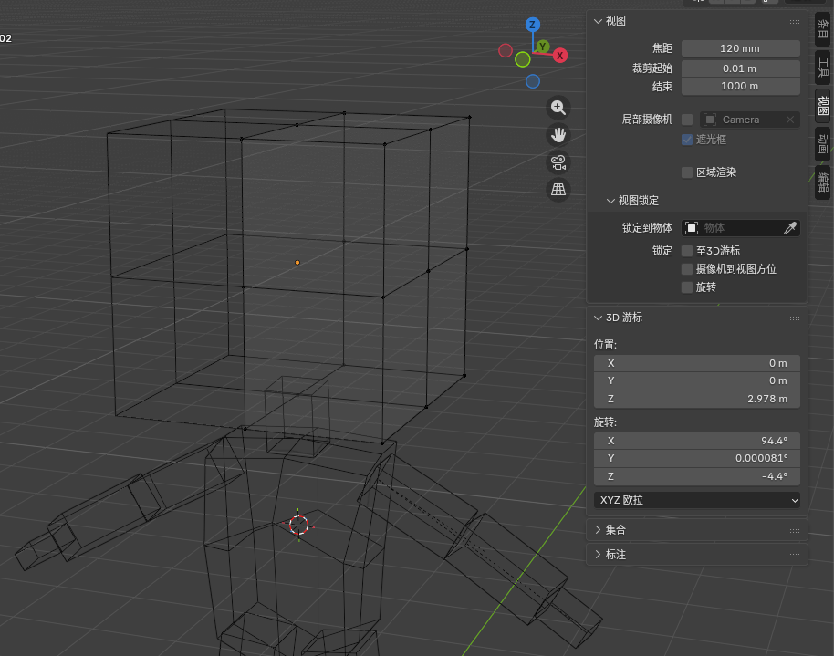
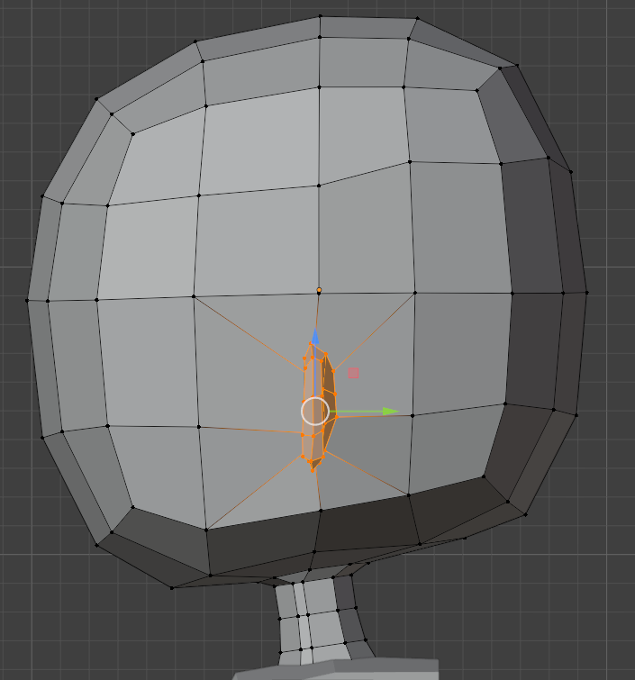
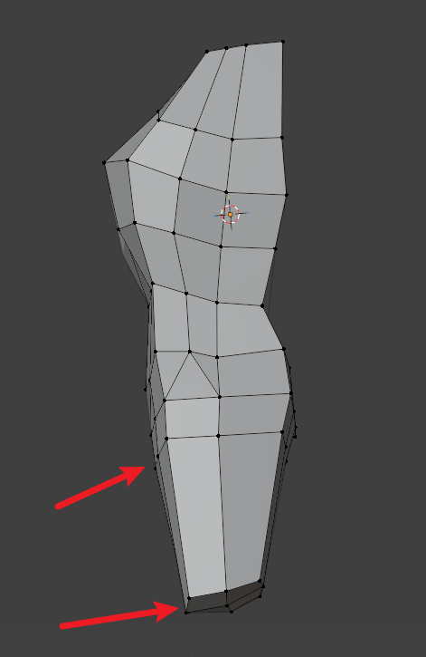

大腿，分开站立，方便后续骨骼

中间要压一压，肩膀会比下面宽的

小腿要稍微旋转一下，做出那种膝盖前倾的感觉，方便后续骨骼

一定注意胳膊的原点，后续小臂和手都是在大臂之下的

胳膊不能比腿粗，小臂也要适当旋转，做出胳膊肘往外的感觉

细分头颅，焦距 120 比较容易造型做准确

制作脖子的时候可以选中与脖子相接触的面，插入面，然后选中这些面的一圈线进行 loop tool 的圆环处理，可以调节圆环和脖子角度平齐，然后可以同样使用这个选项里的松弛

三头身的耳朵要稍微往下放

身体不要太厚，要和脖子接上，整个身形成 S 曲线，可以选中各个身形曲线，进行 loop tool 的空间 space 操作，让这些曲线倾斜一致

注意屁股的造型和大腿根部的布线，挤出然后旋转，可以对挤出的面进行环形

在大腿上部分环切往前移动制作出屁股，大腿膝盖那里倾斜一下

小腿延伸加分段，膝盖位置稍微往里一点点，小腿角度回调正向

脚丫从前后两个线延伸出来，桥接两边加分段，往外拉出脚底，记住鞋垫感觉

合并脖子和身体，看好线的数目，然后桥接循环边

自动平滑着色会自动出现锐边，锐边硬朗

手臂可以加环切做动画更加自然，手臂和肩膀布线流畅

# 头发

直接截取头皮然后往里收收点，实体化

使用雕刻工具 来回 钩 推 膨胀 贴钩

最后 平直着色 然后 精简  可以先不应用精简  先回到正常情况 F 放大 G 效果 进行移动 

# 阴影

可以在对象属性中关闭阴影

# 衣物

衣服也是从身体出来的

衣服如果有交叠的话，不能用镜像的话，可以先分离，这样便于选择，原本就在一起的点可能需要按距离融合一下以删除

按距离也可以进行焊接