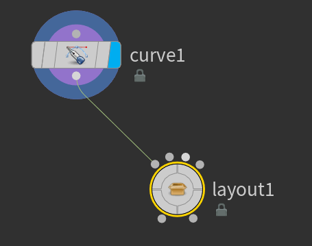
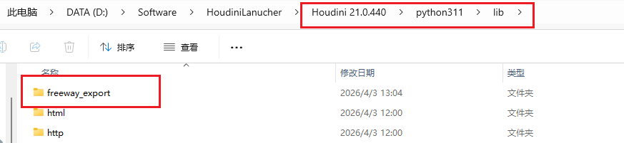

- [City Layout](#city-layout)
  - [本体设置](#本体设置)
    - [input type （影响 city shape）](#input-type-影响-city-shape)
    - [预览选项](#预览选项)
    - [city layout option](#city-layout-option)
    - [Road network option](#road-network-option)
    - [Road network sizes](#road-network-sizes)
  - [四个输入](#四个输入)
    - [city shape](#city-shape)
    - [主干道](#主干道)
    - [City Zone](#city-zone)
- [freeway](#freeway)
- [Unreal 的 城市案例](#unreal-的-城市案例)

#  City Layout 

在 Houdini 中，你将使用专门为 "城市示例" 项目创建的 City Layout 运算符来创建和定义城市的形状。City Layout 运算符将接受以下输入信息，一是城市形状、二是干线样条线，用于定义城市中主要直通道路，三是指定区域，用于在城市各个部分放置特定类型和高度的建筑物。

小城市大致为 1km 宽，大城市大致为 5km 宽。

## 本体设置

### input type （影响 city shape）

- 通过网格或者曲线创建：使用数字参数作为城市范围
- 手动输入：使用 curve 绘制出城市范围

### 预览选项

- full preview : 完全计算预览，删除一些错误的预览显示

### city layout option

设置城市密度、角度、街区大小等

### Road network option

设置道路合并度、移除小路等

### Road network sizes

设置道路宽度等

## 四个输入

### city shape

### 主干道

通过多个 curve merge 出组合主干道

### City Zone

划分城市区域。 用曲线连接 city zone 节点。曲线范围内的建筑物高度，通过 city zone 处理。

# freeway

高速路

# Unreal 的 城市案例

如果使用最新版本 houdini，额外需要自己做的是，这个例子里有些代码是 py2 需要改成 py3。

把这个文件放到对应版本 houdini 下

