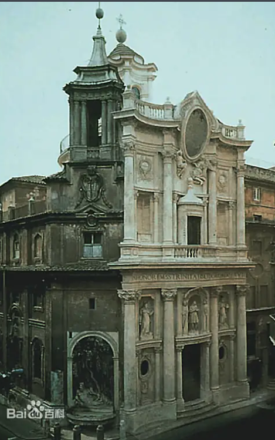
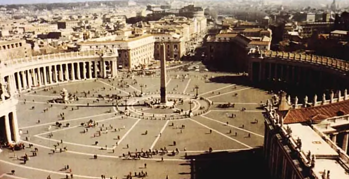

# 起源历史

巴洛克一词源于西班牙语及葡萄牙语的“变形的珍珠”。巴洛克是一种统称的风格，在建筑、家具、服装上都有体现。

巴洛克式建筑风格起源于17至18世纪的意大利，是欧洲历史上一个辉煌的时代，之前的文艺复兴为意大利带来了大量的财富和权势。于是意大利人在原本的文艺复兴建筑上，添加新的华丽、夸张及雕刻。从而形成了巴洛克。特点是极度奢华的装饰和戏剧性的效果。

随着欧洲文化“除旧布新”，在各方面都有重大的改变与成就。资产阶级兴起，君主政治渐独立于宗教之外，艺术上的趋势是“世俗化”，精力充沛，勇于创新，甚至好大喜功。所以巴洛克式建筑，从里到外，从上到下，都是金光闪闪的。

# 风格特点

- 炫耀财富；大量使用贵重的材料，充满了装饰，色彩艳丽，一身珠光宝气。
- 追求新奇；建筑师们标新立异，前所未见的建筑形象和手法层出不穷。而创新的主要路径是，首先，赋予建筑实体和空间以动态感，或波折流转，或对撞冲突。
- 打破建筑、雕塑和绘画的界限，使它们相互渗透；不顾结构逻辑，采用非理性的组合，取得反常的幻觉效果。

这种风格通过明暗对比和丰富的装饰元素，试图营造出一种强烈的情感体验。

# 细节样式

巴洛克建筑通常具有拉丁十字构图、尖塔、飞扶壁和华丽的玻璃百花窗，表现出神秘和崇高的情感。随着欧洲的扩张，巴洛克风格也传播到了美洲，成为全球建筑的重要风格之一。

|特征|表现实例|
|-|-|
|动态曲线|波浪形墙体（圣卡罗教堂）、螺旋柱（圣彼得华盖）|
|光影戏剧性|天窗投射金光（科纳罗礼拜堂）、镜厅反射（凡尔赛宫）|
|装饰堆叠|灰泥浮雕（十四圣徒教堂）、镀金祭坛（墨西哥主教堂）|
|空间融合|建筑-雕塑-绘画一体（贝尼尼作品）、花园轴线（凡尔赛）|

# 经典建筑

## 地域建筑简介

- 意大利：发源地与核心代表

    圣卡罗教堂（罗马）

    圣彼得大教堂广场（梵蒂冈）

    耶稣会教堂（罗马）

- 德语地区：宗教与宫廷的华丽表达

    十四圣徒朝圣教堂（德国班贝格）

    梅尔克修道院（奥地利）

    维尔茨堡官邸（德国）

- 法国与西班牙：王权与殖民风格

    凡尔赛宫（法国）

    圣地亚哥大教堂（智利）

    马德里皇宫（西班牙）

- 其他地区与变体：

    圣保罗大教堂（英国伦敦）

    哈尔滨“中华巴洛克”建筑群（中国）

## 罗马耶稣会教堂（意大利）

罗马耶稣会教堂[Church of the Gesu]（1568~1602）第一个巴洛克建筑。意大利文艺复兴晚期著名建筑师和建筑理论家维尼奥拉和泡达设计的罗马耶稣会教堂是由手法主义向巴洛克风格过渡的代表作，也有人称之为第一座巴洛克建筑。罗马耶稣会教堂平面为长方形，端部突出一个圣龛，由哥特式教堂惯用的拉丁十字形演变而来，中厅宽阔，拱顶满布雕像和装饰。两侧用两排小祈祷室代替原来的侧廊。十字正中升起一座穹窿顶。教堂的圣坛装饰富丽而自由，上面的山花突破了古典法式，作圣像和装饰光芒。教堂立面借鉴早期文艺复兴建筑大师阿尔伯蒂设计的佛罗伦萨圣玛丽亚小教堂的处理手法。正门上面分层檐部和山花做成重叠的弧形和三角形，大门两侧采用了倚柱和扁壁柱。立面上部两侧作了两对大涡卷。这些处理手法别开生面，后来被广泛仿效。

### 意义

巴洛克风格打破了对古罗马建筑理论家维特鲁威的盲目崇拜，也冲破了文艺复兴晚期古典主义者制定的种种清规戒律，反映了向往自由的世俗思想。

另一方面，巴洛克风格的教堂富丽堂皇，而且能造成相当强烈的神秘气氛，也符合天主教会炫耀财富和追求神秘感的要求。因此，巴洛克建筑从罗马发端后，不久即传遍欧洲，以至远达美洲。有些巴洛克建筑过分追求华贵气魄，甚至到了繁琐堆砌的地步。

## 圣卡罗教堂（意大利）

圣卡罗教堂（又称四喷泉圣卡罗教堂）是意大利罗马拉齐奥大区的标志性宗教建筑，由建筑师弗朗切斯科·博罗米尼于1638年至1641年间设计建造，为巴洛克建筑风格的代表作。其波浪形立面融合古典柱式曲线化元素，内部采用龟甲形平面与椭圆形穹顶结构，穹顶装饰几何图案组合形成立体光影效果。该教堂位于斐理斯路与皮亚路交界处，邻近四喷泉历史建筑群，现为奎利那雷山巴贝里尼枢机主教建筑群组成部分。

### 特色

立面采用双层波浪形轮廓设计，通过立柱变形与壁龛雕像形成立体层次：
- 下层设置四根凹形壁柱，柱间嵌有圣卡罗浮雕及天使雕像
- 上层凉廊采用凸形拱券组合，檐部饰以贝壳纹样与十字架雕塑
- 转角处设置四座喷泉雕像，分别象征台伯河、阿诺河及两位罗马女神

### 文化价值

该建筑被誉为"巴洛克建筑艺术的百科全书"，在艺术史领域具有三重价值：
- 空间组织方面首创曲面围合与动态透视技法
- 结构创新体现在石材曲率计算与复合穹顶支撑体系
- 装饰体系开创几何图案立体化组合范式，影响后期洛可可风格发展

2021年罗马市政府将其列入"不可移动文物"保护名录，2025年游客评价数据显示其位列罗马景点人气榜第52位

## 圣彼得广场（意大利）

圣彼得广场（Piazza San Pietro）位于梵蒂冈城国境内，由意大利建筑师贝尔尼尼于1656至1667年间设计建造。广场呈椭圆形布局，可容纳50万人，四周环绕284根塔斯干式圆柱，柱顶立有140尊圣人像，中央竖立着公元40年从埃及运抵的25.5米高方尖碑。作为罗马教廷举办大型宗教活动的主要场所，广场与圣彼得大教堂共同构成梵蒂冈的核心宗教空间。

该广场所在的梵蒂冈城于1984年被列为世界文化遗产，其巴洛克建筑群体现了文艺复兴至巴洛克时期的艺术成就。历史上，梵蒂冈前身教宗国通过1929年《拉特朗条约》确立政教合一体制，成为主权国家。广场主体建筑群见证了基督教精神发展进程，方尖碑迁移工程和柱廊雕刻细节均呈现贝尔尼尼的巴洛克艺术特征。

## 凡尔赛宫（法国巴黎）

凡尔赛宫（法文：Château de Versailles）位于法国巴黎西南郊外伊夫林省省会凡尔赛镇，地理坐标为北纬48°48'18"，东经2°07'18"。是巴黎著名的宫殿之一，也是世界五大宫殿之一（中国故宫、法国凡尔赛宫、英国白金汉宫、美国白宫、俄罗斯克里姆林宫）。 

凡尔赛宫宫殿为古典主义风格建筑，立面为标准的古典主义三段式处理，即将立面划分为纵、横三段，建筑左右对称，造型轮廓整齐、庄重雄伟。其内部装潢则以巴洛克风格为主，少数厅堂为洛可可风格。