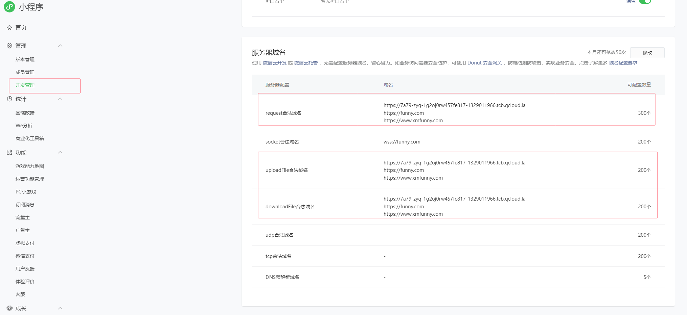
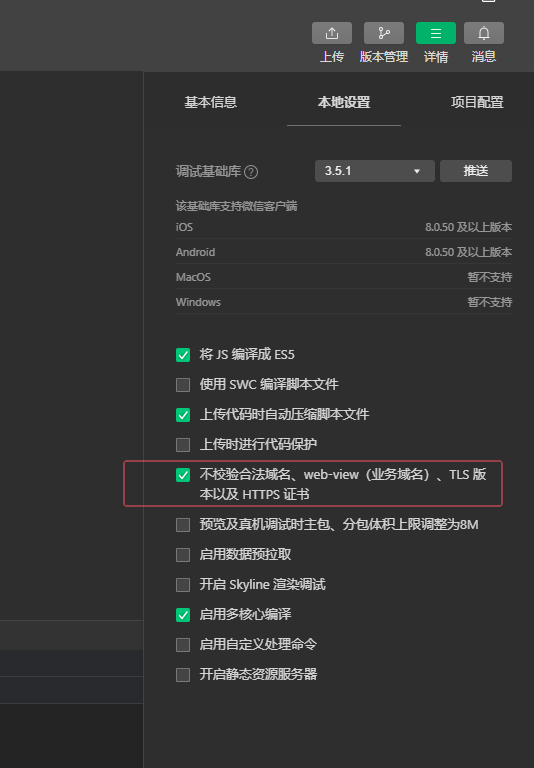
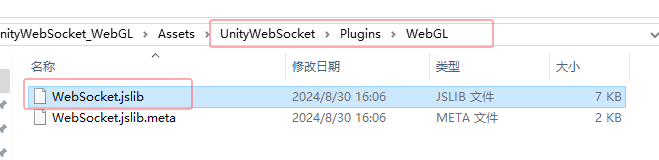
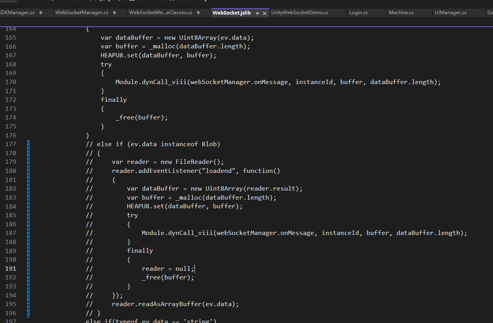

Postman 专用于API开发和测试的工具

消息包体结构

api_id
int
消息ID，用来标记消息，便于解析消息结构

data
object
消息内容，根据消息id会有不同的消息结构


Unity JsonUtility 解析消息


首先服务端需要先使用http网址进行微信code登陆，这里使用UnityWebRequest完成，但是注意在连接时，http需要在other setting设置里允许，因为他是不安全的。


```Cpp
private IEnumerator PostLoginHttpRequest() {
    WSWXLoginInfoRequest loginInfo = new WSWXLoginInfoRequest();
    loginInfo.username = "player_1";
    loginInfo.wx_code = 1231;

    string loginInfoString = JsonUtility.ToJson(loginInfo);
    // UnityWebRequest.kHttpVerbPOST 这里注意方式，是post还是get还是啥
    using(UnityWebRequest loginRequest = new UnityWebRequest(wxLoginAddress, UnityWebRequest.kHttpVerbPOST)) {
        UploadHandler uploader = new UploadHandlerRaw(Encoding.Default.GetBytes(loginInfoString));
        loginRequest.uploadHandler = uploader;
        loginRequest.uploadHandler.contentType = "application/json";  // 设置HTTP协议的请求头，默认的请求头HTTP服务器无法识别

        // 这里需要创建新的对象用于存储请求并响应后返回的消息体，否则报空引用的错误
        DownloadHandler downloadHandler = new DownloadHandlerBuffer();
        loginRequest.downloadHandler = downloadHandler;

        yield return loginRequest.SendWebRequest();

        if(loginRequest.result == UnityWebRequest.Result.ConnectionError || loginRequest.result == UnityWebRequest.Result.ProtocolError) {
            Debug.LogError(loginRequest.error);
        }
        else {
            //string reciveStr = System.Text.Encoding.UTF8.GetString(webRequest.downloadedBytes);
            Debug.Log("Form upload complete And receive data :" + loginRequest.downloadHandler.text);
            WSWXLoginInfoReceive loginInfoReceive = JsonUtility.FromJson<WSWXLoginInfoReceive>(loginRequest.downloadHandler.text);
            Debug.Log(loginInfoReceive);
            SendGameLogin(loginInfoReceive.token);
        }
    }

    //byte[] bodyRaw = Encoding.UTF8.GetBytes(loginInfoString);
    //loginRequest.uploadHandler = new UploadHandlerRaw(bodyRaw);
    //loginRequest.downloadHandler = new DownloadHandlerBuffer();
    //loginRequest.SetRequestHeader("Content-Type", "application/json");
}
```
WebSocket接入时，也要注意ws和wss的区别


## 与服务端连接
前置知识：http同步初始时间和登入服务（unity端使用unitywebrequest，get用于获取，post用于上传），websocket搞业务（这里使用 https://github.com/wechat-miniprogram/minigame-unity-webgl-transform/tree/main/Demo/UnityWebSocket_WebGL 下的）

1：确保你的资源中包括网络模块，如果你不确定，上传所有资源
2：正常线上产品，服务器需要在这里配置域名。

3：测试阶段，可以试试只使用IP连接，因为这个确认是在unity上可行的

把这个勾选上，应该就不会验证域名之类的，也就是开发模式，不检查配置，可以随便搞（目前没试过，因为应该搞成了在服务器配置上弄）

或者，使用假域名，让服务器配置https，本地机器hosts更改

## blob系列报错
### 报错Blob未定义
更换websocket版本为 https://github.com/wechat-miniprogram/minigame-unity-webgl-transform/tree/main/Demo/UnityWebSocket_WebGL 下的
结果报错变成
### missing function: WebSocketSetOnOpen
查询后怀疑是因为在加载 WASM 模块之前，JavaScript 环境没有正确加载且定义了所有必需的函数。
尝试使用延迟0.5s后才使用wasm进行登陆请求。
结果还是一样


对比两个版本的不一样的地方，其实就是这个文件影响的小游戏

那么这里的Blob是不是直接注释就可以呢？


结果是可以！
