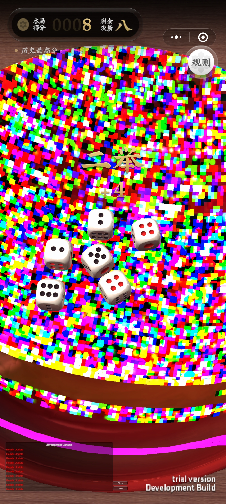
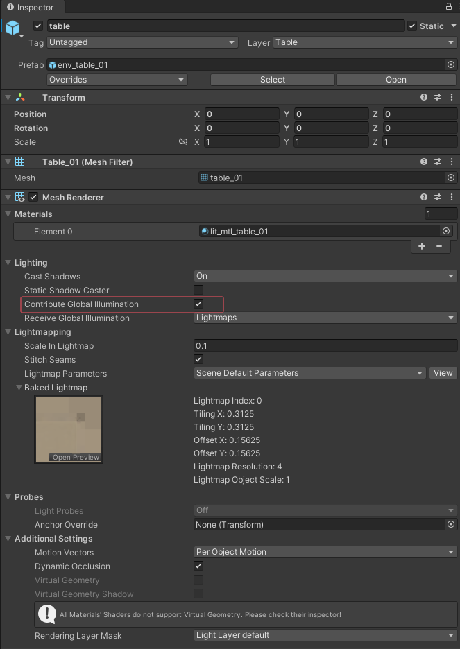
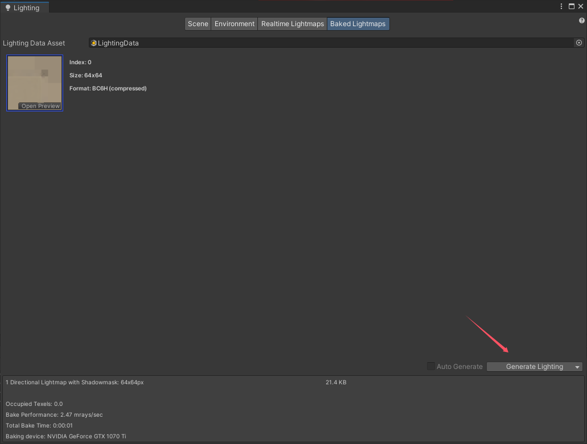
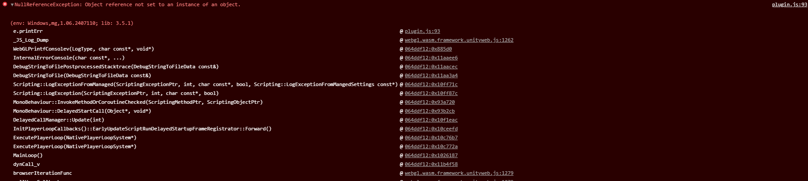
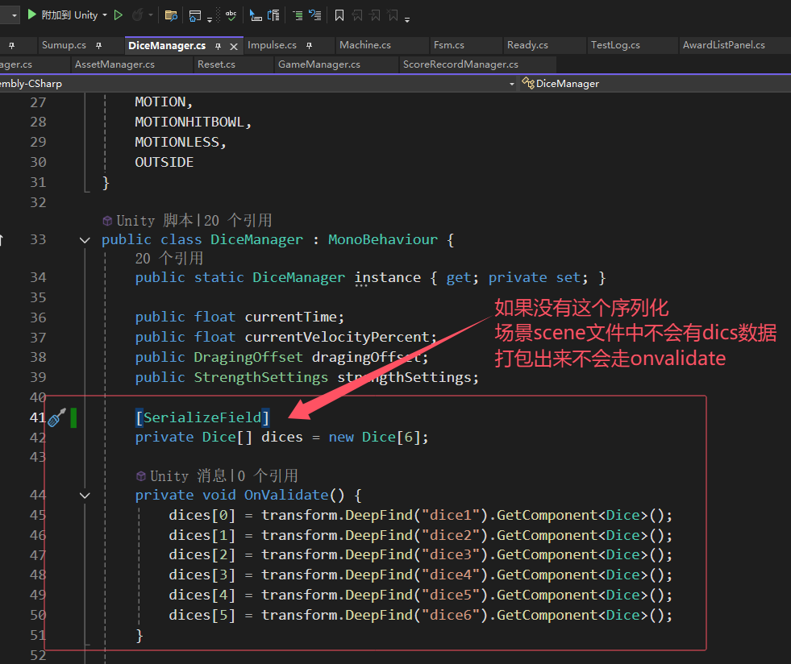
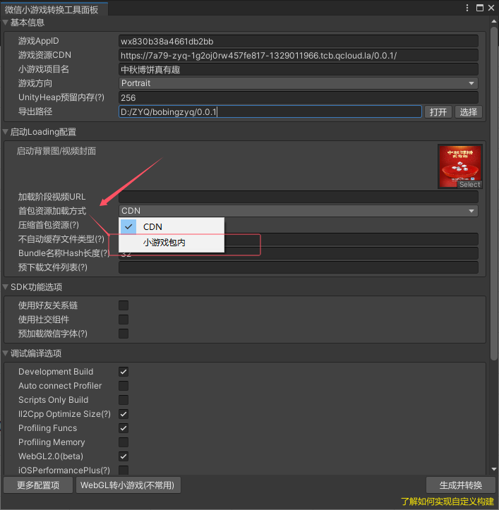
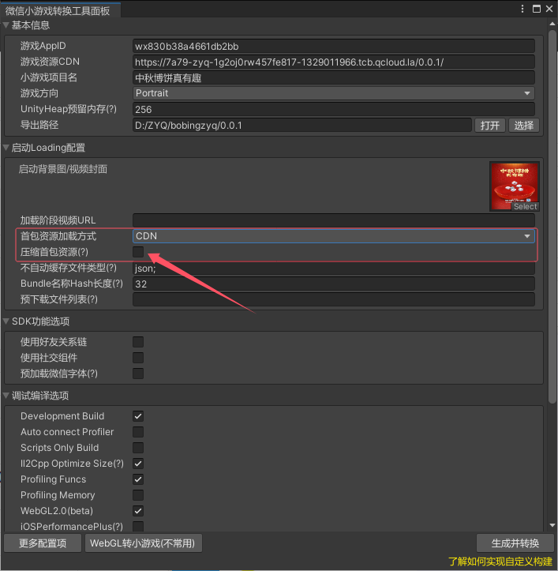
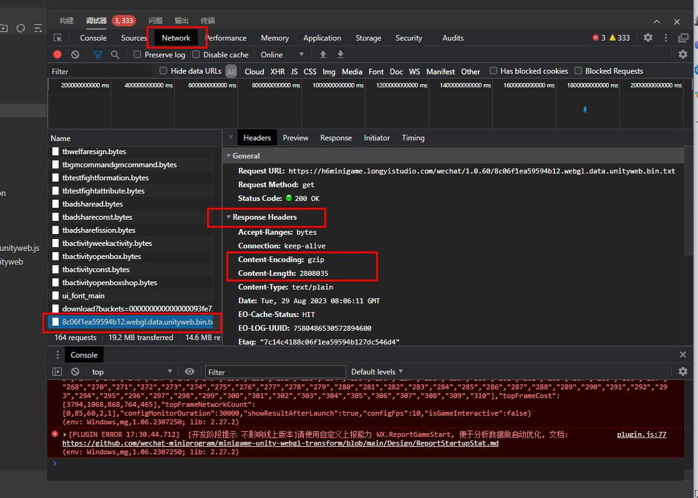

[团结导出小游戏](#团结导出小游戏)  
[团结小游戏工具](#团结小游戏工具)  
[博饼项目花屏问题](#博饼项目花屏问题)  
[打出包在微信小游戏工具一打开就报空](#打出包在微信小游戏工具一打开就报空)  
[转换小游戏的几种资源加载](#转换小游戏的几种资源加载)  
[如何在微信开发平台检查自己是否开了压缩](#如何在微信开发平台检查自己是否开了压缩)  
[调试](#调试)  

## 团结导出小游戏
https://docs.unity.cn/cn/tuanjiemanual/Manual/AutoStreamingDemo.html

1：跟着做
2：UOS CDN


## 团结小游戏工具
AutoStreaming
按需加载，减小启动包体，加速启动速度，减少运行内存
从引擎底层支持按需加载，将大部分资源从游戏首包中分离，在打包小游戏时加入streaming资源的配置文件，游戏启动后根据配置文件，在需要用到streaming资源时自动触发下载和加载，从而达到减小启动包体，加速启动速度的目的。AutoStreaming自动按需加载的逻辑可以避免将运行过程中未使用到的资源加载到内存中， 因此对减少内存占用也会有所帮助。

方便查看游戏资源情况和占用
AutoStreaming Editor工具能够发现游戏使用到的大部分资源，以及每个资源对应的内存占用大小，从而可以方便的查看资源设置是否需要调整优化，如是否开启压缩，分辨率是否过高等等。

TextureManager（有限制）
同一套AssetBundle可以支持多套纹理（每套纹理针对不同平台使用不同的压缩格式）；使用纹理优先级队列优化纹理显存使用；生命周期管理优化，可见读取，分帧读取，动态加载卸载；纹理资源重映射
1：TextureManager可以批量生成多种压缩格式的纹理数据，TextureManager模块开始初始化，贴图对象会根据以后信息和用户平台设定的纹理格式信息初始化Metadata信息，但是不会分配存储纹理数据。而后当纹理需要加载上传纹理数据时，引擎可以自动根据当前平台、设备性能选择合适的压缩格式进行下载使用。启用TextureManager后，Assetbundle只保留纹理的metadata信息，纹理数据被剥离出去。在Assetbundle打包好后，假如需要调整支持的纹理压缩格式，无需重新打包AssetBundle。
2：TextureManager支持设置纹理显存用量上限。当显存用量达到预设时，会根据策略计算纹理的分值并排序，优先从GPU上踢出低分值纹理。
3：纹理生命周期管理：纹理一开始仅仅创建对象，纹理可见时再进行实际的读取；分帧平滑调度；动态卸载加载；
4：纹理重映射：为了解决小游戏中的纹理冗余问题，TextureManager在上传纹理到GPU前会先查看是否已有同样的纹理。发现重复纹理的情况下，会在底层进行映射，使其共用GPU上的同一张纹理，从而避免纹理冗余带来的显存开销。

模型默认材质替换工具
引擎导入模型时，默认材质会引用到Standard Shader, 而Standard Shader, 无法主动打包进AssetBundle中。 因此当各个模型文件（如fbx文件）分开打包进不同的AB时， 就会产生大量Standard Shader 重复。
通过将默认材质指定为一个用户创建的材质，并将其一起打包到AB中，可以利用AB依赖机制避免打包FBX时Standard shader的重复。

AB依赖分析工具
AssetBundle依赖分析工具可用于查看游戏AB内的对象，资源和依赖关系，用于帮助优化AB打包时的资源组织结构，从而减少游戏启动时，需要使用到的AB总量。

小游戏宿主
提供小游戏运行环境，使用unityCDN，有强大的debug和分析能力

## 博饼项目花屏问题


碗和桌子开启了 Contribute Global Illumination ，参与了光照烘培。桌子效果没问题，碗不知道因为什么会花屏，关掉那个开关，重新生成烘培的贴图（即去掉碗），让碗实时处理光照就可以了。




## 打出包在微信小游戏工具一打开就报空

报错很抽象，无法定位问题。

结果是因为有一个脚本使用的OnValidate无法在运行时执行，导致dices为空，需要序列化dices，让scene保存住dices信息。


所以遇到这种问题，可以先在unity release下先进行尝试，看看能不能有清晰的报错信息。

## 转换小游戏的几种资源加载
1：游戏整个是一个包，大小不超过20M，直接放小游戏包内

2：全放在resources下，没有AA，AB管理。
分包，但是其实是进游戏流程中就要把所有内容都加载，所以需要搞下压缩会好些。

3：AA，AB管理，首包只有代码包，其余是资源，放在CDN，等于是进入自己的游戏界面之后再进行资源加载。首包很小全是代码，不需要压缩，压缩还要解压可能更费。

### 如何在微信开发平台检查自己是否开了压缩
首先如果运行游戏没有报这个Error，应该就没问题  
你的CDN未开启对txt文件的gzip/br，会增加文件：XXX.webgl.data.unityweb.bin.txt 的加载耗时！(env: Windows,mg,1.06.2209190; lib: 2.24.6)  

其次可以通过Network查看首包信息确定，但是我感觉这个是不是不好使？因为我明明没报错，这边也没显示  


## 调试
导出小游戏后可以在游戏右上角调出开发选项，可以在手机上看到log


## 打包转换memory报错Template报错
```Cpp
[Builder] BuildPlayer failed. emscriptenArgs: -s EXPORTED_FUNCTIONS=_sbrk,_emscripten_stack_get_base,_emscripten_stack_get_end -s ERROR_ON_UNDEFINED_SYMBOLS=0 -s TOTAL_MEMORY=256MB -s EXPORTED_RUNTIME_METHODS='["ccall","cwrap","stackTrace","addRunDependency","removeRunDependency","FS_createPath","FS_createDataFile","stackTrace","writeStackCookie","checkStackCookie","lengthBytesUTF8","stringToUTF8"]' --profiling-funcs 
UnityEngine.Debug:LogFormat (string,object[])

Exception: Invalid WebGL template path: D:\ZYQ\bobing\Packages\com.qq.weixin.minigame\WebGLTemplates\WXTemplate2022TJ! Select a template in player settings.
```

这个错误发生在我将library删除后，小游戏git 的 package突然报错了。结果移除掉package，重新使用git url后，可以了。

## UnityWebSocket打包错误
missing function: WebSocketSetOnOpen 
版本问题 用5.28的
