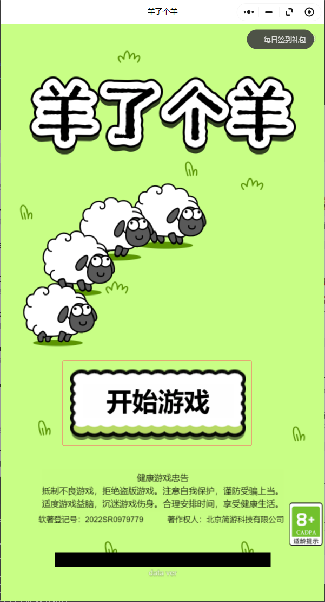

# 账号管理

# SDK
## 用户信息获取
因为某种原因，微信小游戏不能直接发出获取用户信息的弹窗，必须先由用户触发，才可以调用微信的获取用户信息的API。微信提供了WX.CreateUserInfoButton方法来创建一个按钮，通过用户点击这个按钮来由用户触发获取用户信息的API。在使用Unity的微信SDK提供的WX.CreateUserInfoButton方法时，创建出来的按钮是透明的，我们可以创建一个引导用户点击但没有实际功能的按钮，然后在根据这个按钮的位置，调用WX.CreateUserInfoButton创建一个透明的按钮覆盖在上面，就可以实现用户点击按钮，然后弹窗获取用户信息的功能。

这里有几个坑点，一个是创建的按钮是透明的，我们根本看不到（其实js版本的api是可以指定按钮样式的，但是Unity WXSDK提供的api不能），所以我们根本不知道我们创建出来的按钮位置在哪。然后第二个坑点来了，CreateUserInfoButton的前四个参数分别为按钮的坐标的x和y，和按钮的宽width和高height，我们需要提供按钮的屏幕坐标和高宽，就可以确定按钮的位置，但是这个微信api的屏幕坐标是以左上角为原点的，而Untiy是以左下角为原点的，所以我们要自己进行坐标的转换。而且按钮位置的锚点也是按钮的左上角，并不是按钮的中心。

但其实我们可以弄一个全屏幕的按钮，用来处理这些事件。或者像羊了个羊那样，在主界面弄一个开始游戏，将申请权限寄托在这个按钮上。

如果使用全屏幕按钮，我们还需要在回调中关闭这个按钮，不然这个按钮下的UI还是点不动。
如果使用绑定在开始游戏上的按钮，我们可以直接在回调中处理进入游戏的事件，当然，按钮还是需要关闭。

# 服务器对接
## 服务器连接
### HTTP
### WebSocket

## 微信消息对接流程

1：初始化微信SDK，微信Login获取code，GetSetting和CreateUserInfoButton获取用户信息。
2：利用用户信息发送HTTP登陆post，传入用户昵称和微信code。这里用户昵称仅仅作为服务器存储的数据，微信code用于服务端拿去openid获取用户信息。同时获取登陆回调。

# 好友排行榜
## 了解开放域
## 跑通官方示例了解具体做法
[Unity官方排行榜 Ranking Demo](https://github.com/wechat-miniprogram/minigame-unity-webgl-transform/tree/main/Demo/Ranking/Assets/RankDemo)  
[Unity侧开放域 Ranking Demo](https://github.com/wechat-miniprogram/minigame-tuanjie-transform-sdk/tree/main/Runtime/wechat-default/open-data)  

### 认识开放域文件
WX-WASM-SDK-V2/Runtime/wechat-default/open-data下为开放数据域的文件

~/data存放数据逻辑和工具类  
~/render/image 存放开放数据域需要的图片，因为开放数据域不支持外部图片url，所以要不将图片放到image文件夹中，要不在主域中将图片下载好，然后传进开放数据域中  
~/render/styles 存放开放数据域的wxss样式  
~/render/tpls 存放开放数据域的wxml模版  

## js界面
### 模板

