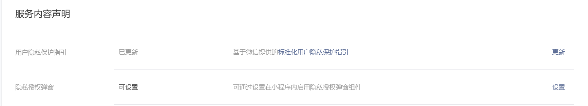

# 账号管理

# SDK
## 用户信息获取
因为某种原因，微信小游戏不能直接发出获取用户信息的弹窗，必须先由用户触发，才可以调用微信的获取用户信息的API。微信提供了WX.CreateUserInfoButton方法来创建一个按钮，通过用户点击这个按钮来由用户触发获取用户信息的API。在使用Unity的微信SDK提供的WX.CreateUserInfoButton方法时，创建出来的按钮是透明的，我们可以创建一个引导用户点击但没有实际功能的按钮，然后在根据这个按钮的位置，调用WX.CreateUserInfoButton创建一个透明的按钮覆盖在上面，就可以实现用户点击按钮，然后弹窗获取用户信息的功能。

这里有几个坑点，一个是创建的按钮是透明的，我们根本看不到（其实js版本的api是可以指定按钮样式的，但是Unity WXSDK提供的api不能），所以我们根本不知道我们创建出来的按钮位置在哪。然后第二个坑点来了，CreateUserInfoButton的前四个参数分别为按钮的坐标的x和y，和按钮的宽width和高height，我们需要提供按钮的屏幕坐标和高宽，就可以确定按钮的位置，但是这个微信api的屏幕坐标是以左上角为原点的，而Untiy是以左下角为原点的，所以我们要自己进行坐标的转换。而且按钮位置的锚点也是按钮的左上角，并不是按钮的中心。

但其实我们可以弄一个全屏幕的按钮，用来处理这些事件。