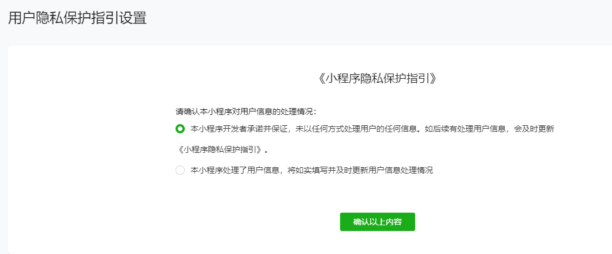

[用户隐私保护指引](#用户隐私保护指引)  
[微信登陆](#微信登陆)  
[获取用户当前设置](#使用cpp库操作文件)  
[获取用户信息](#获取用户信息)  
[授权用户信息弹窗](#授权用户信息弹窗)  
[关系数据链](#关系数据链)  

## 用户隐私保护指引
在微信小游戏开发中，如果你想获取用户信息，你需要在微信小程序的开发者网页，设置用户隐私保护指引，因为有很多微信API使用的前提就是这份协议。  

了解哪些API是收集了用户个人信息的API？
https://developers.weixin.qq.com/community/minigame/doc/0004c84925817819b7ffd8b2356008
文档最后提供了附录

一般会使用的
昵称、头像        wx.getUserInfo、wx.createUserInfoButton
位置信息        wx.getFuzzyLocation
微信朋友关系        wx.getFriendCloudStorage

别忘了开启授权弹窗


## 微信登陆
wx.login(Object object)

调用接口获取登录凭证（code）。通过凭证进而换取用户登录态信息，包括用户在当前小程序的唯一标识（openid）、微信开放平台账号下的唯一标识（unionid，若当前小程序已绑定到微信开放平台账号）及本次登录的会话密钥（session_key）等。用户数据的加解密通讯需要依赖会话密钥完成。

```js
wx.login({
  success (res) {
    if (res.code) {
      //发起网络请求
      wx.request({
        url: 'https://example.com/onLogin',
        data: {
          code: res.code
        }
      })
    } 
    else {
      console.log('登录失败！' + res.errMsg)
    }
  }
})
```

object.success 回调函数
只有一个code	string	
用户登录凭证（有效期五分钟）。开发者需要在开发者服务器后台调用 code2Session，使用 code 换取 openid、unionid、session_key 等信息 

object.fail 回调函数
errMsg	String	错误信息	
errno	Number	errno 错误码，错误码的详细说明参考 Errno错误码

## 获取用户当前设置
wx.getSetting(Object object)
返回值中只会出现小程序已经向用户请求过的权限

开发者可以使用 wx.getSetting 获取用户当前的授权状态。

部分接口需要经过用户授权同意才能调用。我们把这些接口按使用范围分成多个 scope ，用户选择对 scope 来进行授权，当授权给一个 scope 之后，其对应的所有接口都可以直接使用。

此类接口调用时：
如果用户未接受或拒绝过此权限，会弹窗询问用户，用户点击同意后方可调用接口；
如果用户已授权，可以直接调用接口；
如果用户已拒绝授权，则不会出现弹窗，而是直接进入接口 fail 回调。请开发者兼容用户拒绝授权的场景。

https://developers.weixin.qq.com/minigame/dev/api/open-api/setting/wx.getSetting.html
https://developers.weixin.qq.com/minigame/dev/guide/base-ability/authorize.html#%E6%9C%80%E4%BD%B3%E5%AE%9E%E8%B7%B5

authSetting	AuthSetting	用户授权结果	
subscriptionsSetting	SubscriptionsSetting	用户订阅消息设置，接口参数withSubscriptions值为true时才会返回。	2.10.1
miniprogramAuthSetting	AuthSetting	在插件中调用时，当前宿主小程序的用户授权结果

### AuthSetting
boolean scope.userInfo
是否授权用户信息，对应接口 wx.getUserInfo

boolean scope.userLocation
是否授权精确地理位置，对应接口 wx.getLocation。将废弃，请使用 scope.userFuzzyLocation 代替

boolean scope.userFuzzyLocation
是否授权模糊地理位置，对应接口 wx.getFuzzyLocation

boolean scope.werun
是否授权微信运动步数，对应接口 wx.getWeRunData

boolean scope.writePhotosAlbum
是否授权保存到相册，对应接口 wx.saveImageToPhotosAlbum

boolean scope.WxFriendInteraction
是否授权使用你的微信朋友信息，对应开放数据域内的 wx.getFriendCloudStorage 、wx.getGroupCloudStorage 、wx.getGroupInfo 、wx.getPotentialFriendList 、wx.getUserCloudStorageKeys 、wx.getUserInfo 、GameServerManager.getFriendsStateData 接口，以及主域内的 wx.getUserInteractiveStorage 接口。

## 获取用户信息
wx.getUserInfo(Object object)
用户授权：需要 scope.userInfo。

https://developers.weixin.qq.com/minigame/dev/api/open-api/user-info/wx.getUserInfo.html
https://developers.weixin.qq.com/minigame/dev/guide/open-ability/user-info.html
https://developers.weixin.qq.com/community/develop/doc/00022c683e8a80b29bed2142b56c01


在小游戏的设置中，你需要填写和上传你的隐私政策。这是获取用户信息的前提条件，因为微信要求所有小游戏在获取用户信息前都必须有明确的隐私政策。

https://developers.weixin.qq.com/minigame/dev/guide/open-ability/privacy.html
https://developers.weixin.qq.com/community/minigame/doc/0004c84925817819b7ffd8b2356008
https://developers.weixin.qq.com/minigame/dev/guide/base-ability/authorize.html#%E6%9C%80%E4%BD%B3%E5%AE%9E%E8%B7%B5




## 开放数据域
用户信息如果不存储在后台，可以在开放数据域中获取，但是有很多限制
如果获取到的用户信息仅用于展示而不需要存储到后台，则可以通过开放数据域的接口 OpenDataContext-wx.getUserInfo 来获取。由于保证了数据无法流出，这个接口即使没有用户授权也能直接调用。
https://developers.weixin.qq.com/minigame/dev/guide/open-ability/opendata/basic.html#%E9%99%90%E5%88%B6

## 关系数据链
可以获取好友的数据
https://developers.weixin.qq.com/minigame/dev/guide/open-ability/open-data.html

## 和服务端交互
RequestTask wx.request(Object object)
发起 HTTPS 网络请求。


## 授权用户信息弹窗
UserInfoButton wx.createUserInfoButton(Object object)
https://developers.weixin.qq.com/minigame/dev/api/open-api/user-info/wx.createUserInfoButton.html


还有个接口是wx.authorize(Object object)
但是说无法弹出窗口，请使用上面的button，就不知道这个接口存在意义是啥