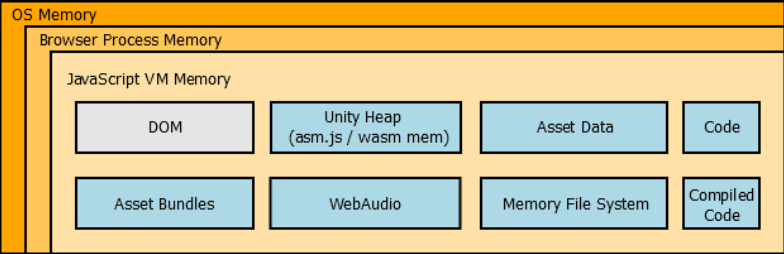
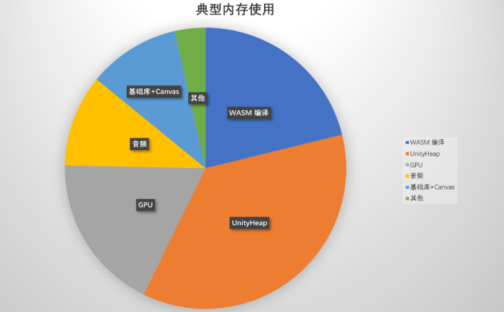
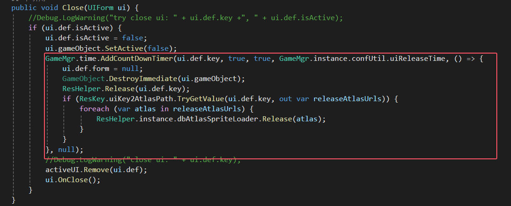
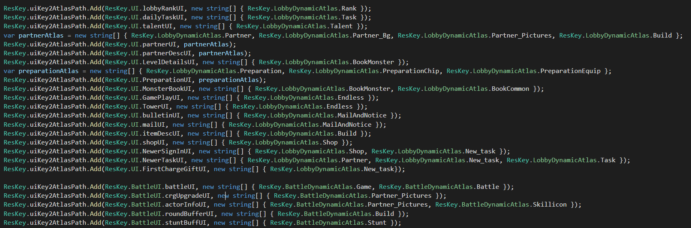
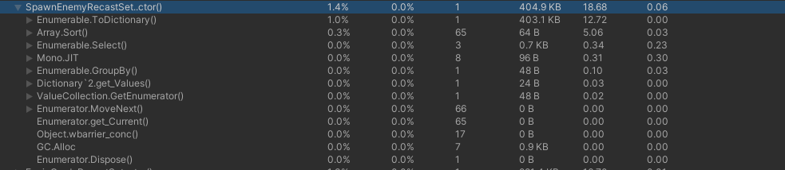
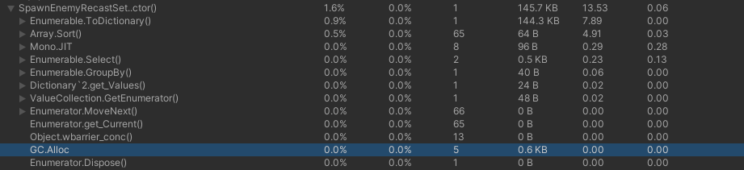

- [了解 Unity WebGL 中的内存](#了解-unity-webgl-中的内存)
  - [Unity 堆](#unity-堆)
  - [源代码/编译代码内存](#源代码编译代码内存)
  - [资产数据](#资产数据)
  - [内存文件系统](#内存文件系统)
  - [资产包 应用、缓存和压缩](#资产包-应用缓存和压缩)
    - [压缩](#压缩)
  - [WebAudio](#webaudio)
- [小游戏内存](#小游戏内存)
- [打包出来的微信小游戏自动连接 profile 进行分析](#打包出来的微信小游戏自动连接-profile-进行分析)
- [资源加载相关](#资源加载相关)
  - [资源分类](#资源分类)
    - [UI](#ui)
  - [动态加载和卸载](#动态加载和卸载)
  - [场景不可提前加载](#场景不可提前加载)
- [检查摄像机](#检查摄像机)
- [配置表内存及性能](#配置表内存及性能)
  - [去除额外的嵌套类](#去除额外的嵌套类)
  - [](#)
- [渲染设置](#渲染设置)
  - [render scale](#render-scale)

# 了解 Unity WebGL 中的内存

以下是在浏览器中运行 Unity WebGL 内容时的内存概览：



此图显示，在 Unity 堆之上，Unity WebGL 内容需要在浏览器内存中进行额外分配。了解这一点非常重要，这样才能优化项目，从而最大限度地降低用户流失率。

从图中可以看到，有几组分配：DOM、Unity 堆、资产数据和代码，网页加载后，这些数据和代码将持久存在内存中。其他内容，如资产包、WebAudio 和内存 FS 将根据内容中发生的情况（如资产包下载、音频播放等）而有所不同。

在加载时，asm.js 的解析和编译过程中还会有一些浏览器的临时分配，有时会导致一些使用 32 位浏览器的用户出现内存不足的问题。

## Unity 堆

一般来说，Unity 堆是包含所有 Unity 特定游戏对象、组件、纹理、着色器等的内存。

在 WebGL 上，需要提前知道 Unity 堆的大小，以便浏览器为其分配空间，而且缓冲区一旦分配，就不能缩小或增大。

负责分配 Unity 堆的代码如下：

buffer = new ArrayBuffer(TOTAL_MEMORY);

这些代码可以在生成的 build.js 中找到，并将由浏览器的 JS VM 执行。

TOTAL_MEMORY 由播放器设置中的 WebGL 内存大小定义。默认值为 256MB，但这只是我们任意选择的一个值。事实上，一个空项目只需 16 MB。

不过，真实世界的内容可能需要更多，大多数情况下需要 256 或 386 MB。请记住，所需的内存越大，能够运行它的最终用户就越少。

## 源代码/编译代码内存

一个简单的优化方法是启用 "剥离引擎代码 "功能，这样在构建时就不会包含不需要的本地引擎代码（例如：如果不需要，2d 物理模块将被删除）。请注意：请注意：托管代码总是被剥离。

请记住，异常支持和第三方插件会增加代码量。尽管如此，我们还是遇到过一些用户，他们需要在标题中加入空值检查和数组边界检查，但又不希望因为完全异常支持而产生内存（和性能）开销。要做到这一点，可以通过编辑器脚本等方式向 il2cpp 传递--emit-null-checks 和--enable-array-bounds-check 参数：

PlayerSettings.SetPropertyString("additionalIl2CppArgs", "--emit-null-checks --enable-array-bounds-check")；

## 资产数据

在其他平台上，应用程序只需访问永久存储（硬盘、闪存等）上的文件即可。在网络上，这是不可能的，因为无法访问真正的文件系统。因此，Unity WebGL 数据（.data 文件）一旦下载，就会存储在内存中。缺点是与其他平台相比，它需要额外的内存（从 5.3 版开始，.data 文件以 lz4 压缩方式存储在内存中）。

## 内存文件系统

虽然没有真正的文件系统，但正如我们前面提到的，Unity WebGL 内容仍然可以读/写文件。与其他平台的主要区别在于，任何文件 I/O 操作实际上都是在内存中读写。需要注意的是，该内存文件系统不在 Unity 堆中，因此需要额外的内存。同样，由于 Unity 的缓存系统依赖于文件系统，因此整个缓存存储都备份在内存中。这是什么意思？这意味着 PlayerPrefs 和缓存 Asset Bundles 等内容也将在 Unity 堆之外的内存中持久存在。

## 资产包 应用、缓存和压缩

### 压缩

在 5.3 和 5.4 中，同时支持 LZMA 和 LZ4 压缩。不过，尽管与 LZ4/Uncompressed 相比，使用 LZMA（默认值）可获得更小的下载大小，但它在 WebGL 上有几个缺点：会导致明显的执行停滞，而且需要更多内存。因此，我们强烈建议使用 LZ4 或完全不压缩（事实上，从 Unity 5.5 开始，LZMA 资产包压缩将不适用于 WebGL），为了弥补下载大小比 lzma 大的问题，您可能需要对资产包进行 gzip/brotli，并对服务器进行相应配置。

## WebAudio

Unity 将在 JavaScript 中创建特定的 AudioBuffer 对象，以便通过 WebAudio 播放。

由于 WebAudio 缓冲区位于 Unity 堆之外，因此 Unity 剖析器无法跟踪，您需要使用浏览器专用工具检查内存，以查看音频使用了多少内存。

需要注意的是，这些音频缓冲区保存的是未压缩的数据，对于大型音频片段资产（如背景音乐）来说可能并不理想。对于这些人，您可能需要考虑编写自己的 js 插件，以便使用 <audio> 标记来代替。这样，音频文件就能保持压缩状态，从而使用更少的内存。

# 小游戏内存



基础库+Canvas：在小游戏环境中并不存在 DOM，但依然会存在一些基本消耗，比如小游戏公共库，Canvas 画布等。典型地，小游戏公共库约占用内存 100~150MB，Canvas 画布与设备物理分辨率相关，比如 iPhone 11 Promax 占用约 80MB。

Unity Heap: 托管堆、本机堆与原生插件底层内存。举例，游戏逻辑分配的 C#对象等托管内存、Unity 管理的 AssetBundle 和场景结构等本机内存、第三方原生插件（如 lua) 调用的 malloc 分配。

WASM 编译：代码编译与运行时指令优化产生的内存，在 Android v8、iOS JavascriptCore 中还需要大量内存进行 JIT 优化

GPU 内存：纹理或模型 Upload GPU 之后的显存占用，由于 Unity2021 之前不支持压缩纹理，纹理内存会造成明显膨胀。

音频：Unity 将音频传递给容器（浏览器或小游戏）后，播放音频时将占用的内存。目前 UnityAudio 将自动适配微信小游戏，特别地请避免使用 fmod 播放长音频。

C:\Program Files\Unity\Hub\Editor\2022.3.13f1\Editor\Data\PlaybackEngines\WebGLSupport\BuildTools\Emscripten\node

"C:/Program Files/Unity/Hub/Editor/2022.3.13f1/Editor/Data/PlaybackEngines/WebGLSupport/BuildTools/Emscripten/node/node.exe" "C:/Program Files/Unity/Hub/Editor/2022.3.13f1/Editor/Data/PlaybackEngines/WebGLSupport/BuildTools/websockify/websockify.js" 0.0.0.0:5000 10.30.40.94:52969

"C:/Program Files/Unity/Hub/Editor/2022.3.13f1/Editor/Data/PlaybackEngines/WebGLSupport/BuildTools/Emscripten/node/node.exe" "C:/Program Files/Unity/Hub/Editor/2022.3.13f1/Editor/Data/PlaybackEngines/WebGLSupport/BuildTools/websockify/websockify.js" 0.0.0.0:5000 localhost:34999

10.30.40.94

127.0.0.1

通过

# 打包出来的微信小游戏自动连接 profile 进行分析

- 首先要更改转换小游戏的设置：    
developBuild = true  
autoProfile = true  
这里需要注意，不需要 profilingMemory = true 这个会很卡。  
也不需要 profilingFuncs = true 不过代码分包需要开这个，但是咱们是测试，这个可以关闭。  

- 更改原始包的连接代码：  
webgl.wasm.framework.unityweb.js  
这个文件中搜索
  ```js
  ws = new WebSocketConstructor(url, opts);
  ws.binaryType = 'arraybuffer';
  ```
  在上面增加连接的 ip 和端口
  ```js
  if (port == 54998){
    url = "ws://10.30.30.104:54998"
  }
  ws = new WebSocketConstructor(url, opts);
  ws.binaryType = 'arraybuffer';
  ```

- js 监听连接
  
  找到你所使用的 unity 版本的路径，使用 CMD 执行
  ```CMD
  "C:/Program Files/Unity/Hub/Editor/2022.3.13f1/Editor/Data/PlaybackEngines/WebGLSupport/BuildTools/Emscripten/node/node.exe" "C:/Program Files/Unity/Hub/Editor/2022.3.13f1/Editor/Data/PlaybackEngines/WebGLSupport/BuildTools/websockify/websockify.js" 0.0.0.0:54998 localhost:34999
  ```
  // 说明端口错误玩家不存在
  Failed to connect to player IP: 127.0.0.1:19221. Player did not respond

  // 说明端口正确玩家存在，但是玩家不想连你，也就是玩家想连接的 IP 不是你
  [65261] The message header is corrupted and for security reasons connection will be terminated.

  主要是保证 CMD 中的 0.0.0.0:54998 localhost:34999 其中 54998 就是对应更改代码中的 port == 54998

# 资源加载相关

## 资源分类

### UI

- 按照功能分类，把完全通用的移动到 Common , 比如按钮、品质框、底图、红点、进度条等。  
- 把场景通用的放到一起，比如邮件公告场景下，信封相关的图标。  
- 一个界面依赖的图集资源最好是 common 和本身图片，不和其他资源掺和

## 动态加载和卸载
- 整理出绝对需要的资源在一开始就加载：比如 Mgr，audio 等
- 针对完全的新手，加载第一关的资源
- 针对战斗内和战斗外做出资源的区分：
  - 进入主界面，只加载主界面资源，然后进入战斗时，释放掉主界面资源。 
  - 进入战斗，在读条阶段，加载本场战斗需要的资源，比如用到的伙伴，用到的地图和敌人。
  - 结束战斗，释放掉本场战斗需要的资源，并且也把池子里的资源清空，然后加载主界面资源。
- 针对每一个非主界面的功能子界面，都做自回收。

    
    
    这里的图集并非指所有的依赖图集，而是你认为可以卸载，别的地方很少用的图集。  
    比如其中的 partner 界面，在其关闭时，可以卸载所有伙伴相关的图集资源。  
    注意，这里并没有把 partner 的其他子界面放到这里，因为，其他子界面关闭会回到 partner 主界面，所以只需要在 partner 主界面进行关闭时统一卸载就好了。  
    然后有一个细节， partner desc 界面开启时，因为要节省资源，会在第一时间关闭 partner 界面，这时回收图集资源，但是因为有 partner desc 引用，所以卸载不掉，不用担心此时 partner desc 显示异常。

## 场景不可提前加载

尝试先下载场景 bundle，发现无法下载，会卡住。  
转念一想，其实场景 bundle 本身并不大，切换场景的卡顿，多半还是 single 加载导致。

# 检查摄像机

多一个摄像机就多出很多的 render texture

# 配置表内存及性能

## 去除额外的嵌套类



## 

# 渲染设置

## render scale
