# 微信小游戏开发文档
## 目录 
[整体流程概述](#整体流程概述)

[微信概念相关](#微信概念相关)  
- [开发流程和工具](#开发流程和工具)  
- [登入流程](#登入流程)  
- [授权管理](#授权管理)  
- [网络访问](#网络访问)  
- [开放域](#开放域)  

[项目设置](#项目设置)  
- [图形相关](#图形相关)  
- [代码相关](#代码相关)  

[WXSDK](#WXSDK)   
- [unity官方资源](#unity官方资源)   
- [接入UnityWXSDK](#接入)   
- [WXSDK使用和导出](#使用和导出)   
- [WXSDK开放域开发](#开放域开发)   

[资源管理](#资源管理)  
- [选择CDN](#选择cdn)  
- [ab包](#ab包)  
- [CDN需要上传的文件?](#需要上传的文件)  
- [缩小包体](#缩小包体)  

[网络](#网络)  
- [https](#https)  
- [websocket](#websocket)  

[微信功能相关](#微信功能相关)  
- [登入功能](#登入功能)  
- [获取用户昵称和头像](#获取用户昵称和头像)  
- [下载头像url并展示](#下载头像url并展示)  
- [位置信息](#位置信息)  
- [分享小游戏功能](#分享小游戏功能)  
- [关联跳转公众号](#关联跳转公众号)  
- [好友排行榜](#好友排行榜)  
- [挂起后返回游戏](#挂起后返回游戏)  

[遇到的一些问题](#遇到的一些问题)  
- [博饼项目花屏问题](#博饼项目花屏问题)  
- [打出包在微信小游戏工具一打开就报空](#打出包在微信小游戏工具一打开就报空)  
- [IOS紫屏问题](#ios紫屏问题)  

- [网络blob格式数据](#网络blob格式数据)  
- [心跳bytes断开连接问题](#心跳bytes断开连接问题)  
- [打包转换memory报错template报错](#打包转换memory报错template报错)  

[小技巧](小技巧)  
- [如何在微信开发平台检查自己是否开了压缩](#如何在微信开发平台检查自己是否开了压缩)  
- [手机开启调试](#手机开启调试)  
- [开发者工具模拟将游戏放到后台](#开发者工具模拟将游戏放到后台)  

## 整体流程概述
这篇文档是使用团结引擎制作导出微信小游戏的总结，其微信API内容写法是unity端WXSDK的写法。其主要内容包括：  
1：项目设置：使用团结引擎或者unity制作游戏  
2：WXSDK：导入WXSDK更改游戏设置让其能导出为微信小游戏   
3：资源CDN：整包作为首包或者CDN托管资源（资源优化）  
4：网络：接入网络模块服务器，使用http和websocket  
5：微信功能：接入微信接口实现登入、获取信息、转发分享等所需功能  

在逐步介绍这些内容之前，本文会先介绍微信的一些概念，来帮助大体理解微信小游戏是什么，如何管理的，有哪些限制之处。

## 微信概念相关
### 开发流程和工具
[注册小游戏账号并安装开发者工具官方文档](https://developers.weixin.qq.com/minigame/dev/guide/)  
[微信官方文档](https://developers.weixin.qq.com/doc/)：注意有很多API新版其实已经弃用，要注意阅读相关公告文件  
[微信公众平台](https://mp.weixin.qq.com/)：管理小游戏各种设置   
微信公众平台是很重要的管理小游戏的工具，在这里可以配置游戏基础信息、权限、网络等等。这些有用到的时候再进行提及。

### 登入流程
[登入流程官方文档](https://developers.weixin.qq.com/minigame/dev/guide/open-ability/login.html)  
基本登入流程是：微信接口WX.Login成功登入拿到wxcode，服务器拿到wxcode获取用户信息，然后将自定义登陆code返回。  

这里服务端能跟微信通信使用的是微信公众平台的密钥，所以你需要在这里生成给服务端开发使用
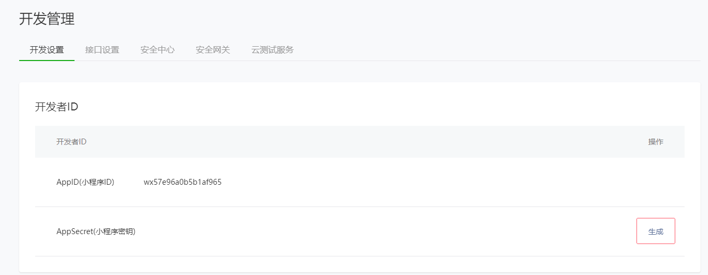

上文的wxcode属于消耗品，只能使用一次，交给服务端之后服务端返回token，这个是可以反复使用的登陆token，比如在挂起小游戏，达到服务端断开连接条件后，再进行唤醒时，需要重连，就可以使用缓存下来的token申请登陆，这个后面也会有示例代码。

### 授权管理
在实际开发过程中，我们会需要使用到用户信息，比如昵称头像地理位置，这些都需要用户同意授权，也就是平时我们玩游戏遇到的授权弹框。这些弹框是如何制作的呢？

需要在微信公众平台设置服务内容声明（首页-基本设置-服务内容声明）！  
用户隐私保护指引 指出你需要的权限，隐私授权弹窗 需要开启。
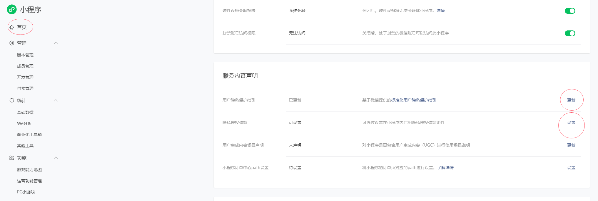

[《用户隐私保护指引》如何书写](https://developers.weixin.qq.com/community/minigame/doc/0004c84925817819b7ffd8b2356008)

一般会使用的  
昵称、头像          wx.getUserInfo、wx.createUserInfoButton  
位置信息            wx.getFuzzyLocation  
微信朋友关系        wx.getFriendCloudStorage  

开启之后才可以使用对应接口，不过这个没有审核属于自查，所以更改之后就会生效，具体在使用对应接口时，也有一些需要注意的地方，这个后面微信功能相关模块会详细介绍。

### 网络访问
所有你想用小游戏访问的网址，都应该在服务器域名中填写。比如https服务器网址，下载头像的网址，websocket服务器网址，CDN网址。

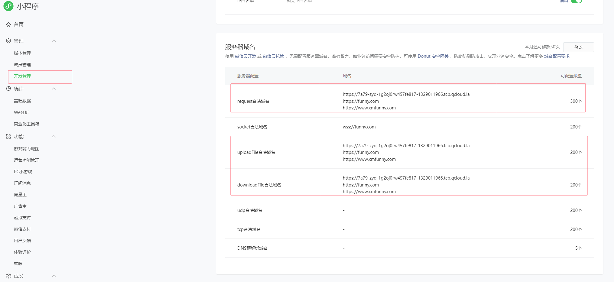

一般 request upload downloadfile 为一组，socket 为一组。

另外在微信开发者工具上，默认是不会检查域名合法性的，这是为了测试方便，所以如果你想确认你的服务器是否真的合法，真的配置上的话，可以将这个选项取消勾选来测试。  

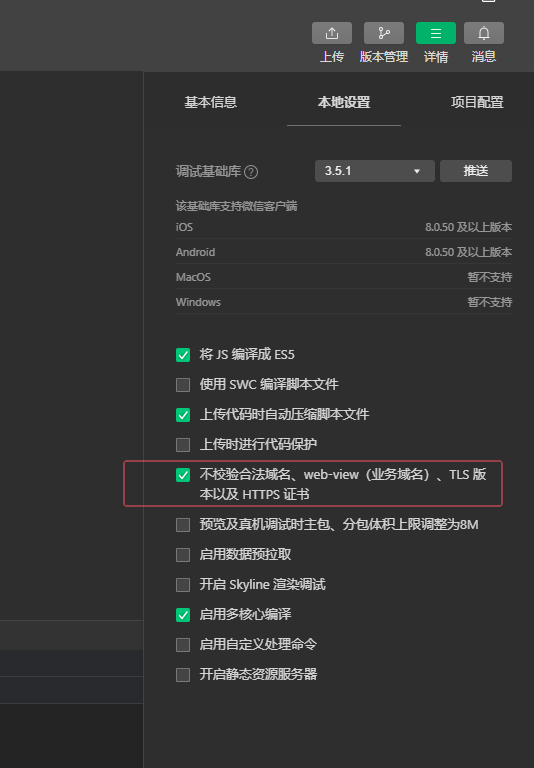


### 开放域
[开放数据域官方文档](https://developers.weixin.qq.com/minigame/dev/guide/open-ability/opendata/basic.html#%E9%99%90%E5%88%B6)

概括来讲就是微信为了保护用户的隐私，将很多信息都放在开放数据域保护起来。比如同玩好友信息。  

开放域是JS作用域，在这里可以使用js正常访问用户隐私数据。主域可以向开放域发送消息，开放域可以监听从主域发来的消息，但是开放域发送给主域的信息只能通过canvas通讯，即主域从开放域获取的信息是挂载在texture上的，也就是所谓的保护。  

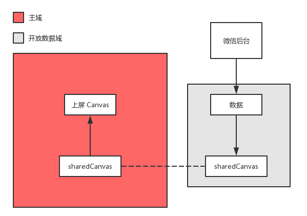

需要注意，如果要使用开放域canvas，需要
[添加](http://mp.weixin.qq.com/wxopen/plugindevdoc?appid=wx7a727ff7d940bb3f&token=&lang=zh_CN) 开放数据域渲染库


## 项目设置
引擎方面的选择的话，unity和tuanjie其实也没太大差别，尤其是你使用自己的CDN的话。因为团结主要是围绕着unity的CDN提供了很多原生便利，比如按需加载、资源优化等。不过这些工具绑定了unity的CDN，所以我们自己的CDN享受不到便利，另一方面，据说团结目前还不稳定有BUG，所以不如使用我们自己的按需加载，自己优化资源。实际上我们技术中心自己也有对应的工具。所以 unity 和 tuanjie 引擎使用差别上，几乎没有。

项目设置，首先当然是切换平台到小游戏平台，这其实自带了一些默认的设置，下面针对图形和代码简要说明一些内容。
### 图形相关
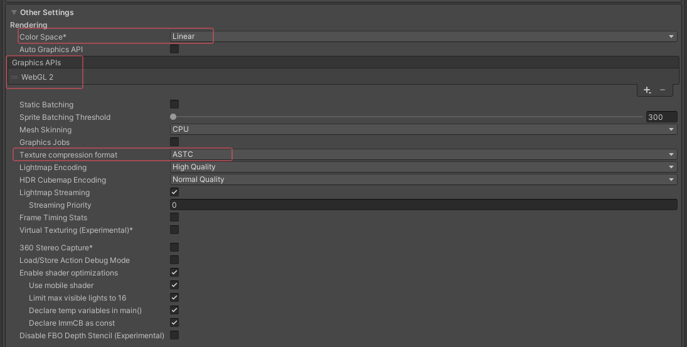

一般我们都会选用WebGL 2，这个API支持线性空间，效果更好。如果你的项目比较老，可能会需要WebGL 1，这个API就只能使用Gamma空间，而且注意WebGL1下光照贴图质量也只能选择normal。

移动设备压缩格式一般选择ASTC。

### 代码相关
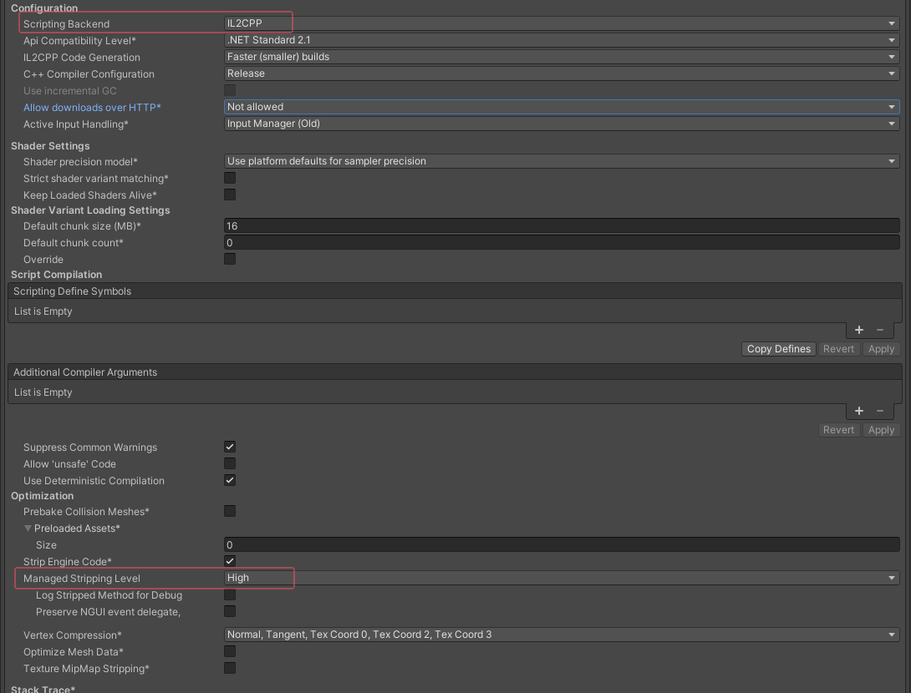

代码剔除粒度可以选择High，可以减小代码包资源大小。

## WXSDK
### unity官方资源
[WXSDK git仓库](https://github.com/wechat-miniprogram/minigame-tuanjie-transform-sdk) ：一定是从git url这边添加，不要以下载package形式添加，会有问题。   
[一些实用的功能Demo](https://github.com/wechat-miniprogram/minigame-unity-webgl-transform/tree/main/Demo) ：可以将demo中的示例复制出来学习尝试。  
[UnityWebGL wx 适配的所有的文档](https://github.com/wechat-miniprogram/minigame-unity-webgl-transform/tree/main/Design) ：很多功能这里都有详细说明，遇到没做过的可以现在这里找找。   
[Tuanjie wx 适配的所有的文档](https://wechat-miniprogram.github.io/minigame-unity-webgl-transform/)  
[Tuanjie wx 适配的引擎方文档（unity cdn）](https://docs.unity.cn/cn/tuanjiemanual/Manual/AutoStreamingDemo.html)

### 接入
通过查阅[适配入门文档](https://wechat-miniprogram.github.io/minigame-unity-webgl-transform/Design/SDKInstaller.html)可以逐步接入SDK，这里多贴出 “能力地图-生产提效包-快适配” 的路径
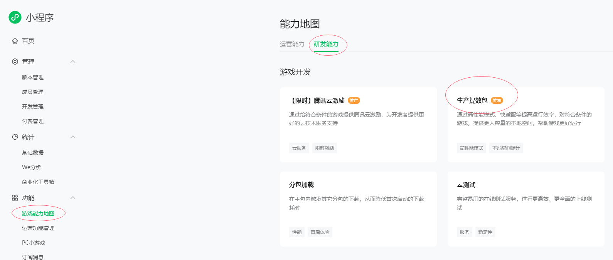
进入生产提效包，这里顺便把高性能模式也点出来.(不开这个的话，有一些IOS跑游戏可能会有白屏等显示问题，见[IOS紫屏问题](#ios紫屏问题)  )
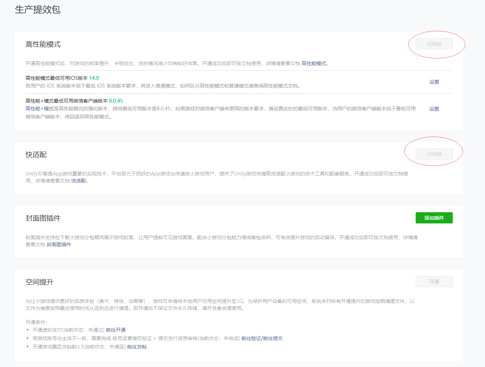

### 使用和导出 
#### 使用
命名空间 WeChatWASM 两个关键类 WX 和 WXBase 几乎囊括了所有的API了，API与官方示例的区别就是大写首字母，具体写法，可以参照后面的微信功能相关。
#### 导出
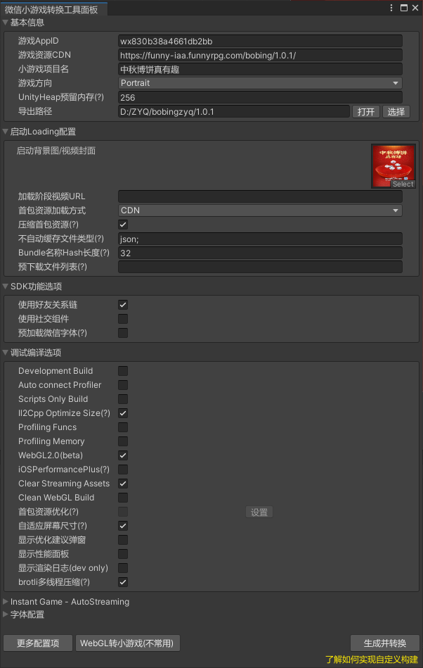  
从上到下依次解释：  

基本信息：  
AppID就是小游戏基础信息中的ID；游戏资源CDN就是本次打出来的包需要从哪里下载资源，一般CDN这边会使用 “ CDN地址/项目/版本/ ” 的写法；导出路径就是本地包生在哪里；  

loading配置：  
启动背景图，这个是指游戏在下载首包时展示给用户的图片。首包大小一般3-7M，一般网络3-5秒，可以在这里展示一些健康提示12+之类的，也可以在下载具体资源包时展示。这个过审需要的。  
首包资源加载方式，一般我们都会使用CDN，除非你的游戏真的非常小，打进整包也没有超过20M，那就可以直接小游戏包体内。两者都需要勾选压缩首包资源来减少用户下载等待。

SDK功能：  
好友关系链：如果你想制作好友排行榜，之类的用到好友信息的，需要勾选。  
社交组件：相互点赞交互之类的。这个没做过。  
预加载微信字体：这个目的是减少首包大小，我们都知道字体会占用很大一部分资源，如果首包就把字体下载了，可能用户会卡在启动界面比较久的时间。但是我们还需要在下载资源包的界面显示一些文本该怎么办？这就是预加载微信字体做的。他会去加载微信本身字体来显示你需要的文本。你可以在下面的字体配置里，具体配置你需要的文本，为了精简，一般可以把下载资源界面用到的字都写在下面的自定义unicode中。不过其实除了使用微信自己的字体，我们其实也可以再建造一个自己的TMP字体文件，只包含指定的文字，也不会很大，也能优美地在下载资源界面展示给用户一些信息。

[微信字体加载](https://wechat-miniprogram.github.io/minigame-unity-webgl-transform/Design/WXFont.html)

调试编译选项：
就如图配置就好。


### 开放域开发
首先，WXSDK处于package下，WX-WASM-SDK-V2/Runtime/wechat-default/open-data下为开放数据域的文件，你可以使用VScode打开文件夹目录。
  
打开之后各个文件说明如下：  
~ 最外部的文件就是主体逻辑文件了  
~/data存放数据逻辑和工具类  
~/render/image 存放开放数据域需要的图片  
~/render/styles 存放开放数据域的wxss样式  
~/render/tpls 存放开放数据域的wxml模版  

具体开发逻辑是：    
1：定好主域和开放域沟通的消息。  
2：对每一个消息，写好代码逻辑。  
3：对每一个消息，制定好 HTML + CSS 的模板显示。  
4：结合模板和逻辑数据，返回给主域。  

在制作开放域时，可以使用微信开发者工具开发，实时调整效果，效率更高。  
WXSDK的开放域，就对应着导出包体的open-data文件夹。  
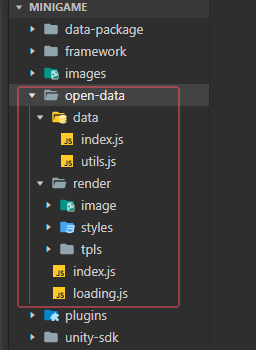   
结合示例更清楚。  
[unity的好友排行榜Demo](https://github.com/wechat-miniprogram/minigame-unity-webgl-transform/tree/main/Demo/Ranking/Assets/RankDemo)  
[unity的好友排行榜开放域](https://github.com/wechat-miniprogram/minigame-tuanjie-transform-sdk/tree/main/Runtime/wechat-default/open-data)  
[我的好友排行榜示例](#好友排行榜)

## 资源管理

因为要分首包和资源包，所以我们至少要使用一种资源管理工具，我这里游戏简单，就一个大的主场景，所以使用简单的Adressable，将Main场景建立为资源，加载场景下载主场景资源。

### ab包

这里使用我们公司自己的资源包管理工具。需要权限，找富洋申请。  

一共需要三个包  
"com.sofunny.asset": "git@git.sofunny.io:engine/packages/com.sofunny.asset.git?path=Assets/com.sofunny.asset#v0.40.4-for-webgl",  
主要包，为webgl专门设计的资源管理工具。  
"com.sofunny.common": "git@git.sofunny.io:engine/packages/com.sofunny.common.git#v0.1.1",  
通用包，一些通用代码。  
"com.sofunny.shares": "git@git.sofunny.io:engine/u3d-shares.git#v0.36.4",  
提供公共DLL库。  

具体使用详见 技术中台 Asset Package 文档 。


### 选择cdn

主要就是选择一个价钱合适的可靠的速度快的CDN。这里我们使用阿里云。具体负责人是洪祖尧。

本人使用过微信云开发的CDN，评价是太太太慢了，而且绑定在微信开发者工具上也不方便上传，现在阿里云的速度很快。

### 需要上传的文件

打包成功后，我们目录大概长这样  
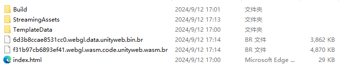   

Build ：中间无用文件，不需要上传。  
StreamingAssets ：这里就是我的AA主资源文件，需要上传，但不需要第一时间给用户下载。  
TemplateData ：WebGL 模板文件，不需要上传。  
bin.br ：首包资源包，需要上传，这里就是用户第一时间需要使用的资源。  
wasm.br ：首包代码包，需要上传，所有的代码文件。  
其他文件无需上传。  

### 缩小包体

包体分为首资源包和代码包

1：首资源包的话就是将主体游戏放在后面的场景去加载，首资源包只包进加载场景，然后在加载场景进行主体场景的下载，在这个过程中还可以做些申请权限的事务来掩盖加载时间，算是很经典的做法了。  
2：优化大文件：字体、天空球、超大贴图，这些大文件是否可以尽量减小，压缩得更小一点？  
3：检查 resources 文件夹：这个文件夹下的文件会无条件进入首包资源，请直接搜索这个文件夹，因为有些第三方插件会有这个文件夹，请删除不必要的资源。（比如 TMP 就会把默认字体和一些表情图片放到 resources 下，也要注意 TMP Setting 引用的默认字体，最好只为登陆界面固定文本字体生成一份默认字体喂给 TMP Setting ）  
4：图形设置中的无用 shader ：有些 shader 没有使用但是也会默认打进包体。可以设置为有引用的才包含。  
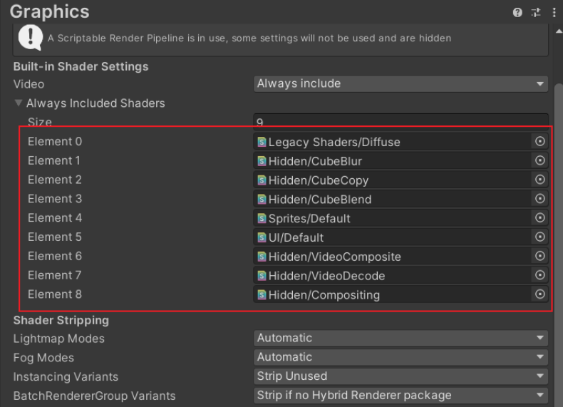  
5：代码包可以设置为实验性暴力剔除尝试。


## 网络
网络这部分消息都通过string json格式传送和解析。
### https
微信Login获取code，利用用户信息发送HTTP登陆post，传入用户昵称和微信code。这里用户昵称仅仅作为服务器存储的数据，微信code用于服务端拿去openid获取用户信息。同时获取登陆回调。  

代码就使用unity的webrequest
```Cpp
public void HttpGameLogin() {
    // loginInfo 服务端所需登陆数据
    WSWXLoginInfoRequest loginInfo = new WSWXLoginInfoRequest();
    loginInfo.username = PlayerManager.instance.username;
    loginInfo.wx_code = PlayerManager.instance.wx_code;
    Debug.Log($"[Bobing][Http] name : {loginInfo.username} code : {loginInfo.wx_code}");
    StartCoroutine(PostLoginHttpRequest(loginInfo));
}

private IEnumerator PostLoginHttpRequest(WSWXLoginInfoRequest loginInfo) {
    string loginInfoString = JsonUtility.ToJson(loginInfo);
    using(UnityWebRequest loginRequest = new UnityWebRequest(wxLoginAddress, UnityWebRequest.kHttpVerbPOST)) {
        UploadHandler uploader = new UploadHandlerRaw(Encoding.Default.GetBytes(loginInfoString));
        loginRequest.uploadHandler = uploader;
        loginRequest.certificateHandler = new CertificateHandlerCustom();
        loginRequest.SetRequestHeader("Content-Type", "application/json");
        DownloadHandler downloadHandler = new DownloadHandlerBuffer();
        loginRequest.downloadHandler = downloadHandler;

        yield return loginRequest.SendWebRequest();

        if(loginRequest.result == UnityWebRequest.Result.ConnectionError || loginRequest.result == UnityWebRequest.Result.ProtocolError) {
            Debug.LogError(loginRequest.error);
        }
        else {
            // 收到服务端Token后进行登陆
            Debug.Log("[Bobing][Http] Form upload complete And receive data :" + loginRequest.downloadHandler.text);
            WSWXLoginInfoReceive loginInfoReceive = JsonUtility.FromJson<WSWXLoginInfoReceive>(loginRequest.downloadHandler.text);
            PlayerManager.instance.token = loginInfoReceive.token;
            SendGameLogin(loginInfoReceive.token);
        }
    }
}
```
如何服务器只是http，还没有https，需要先允许http。
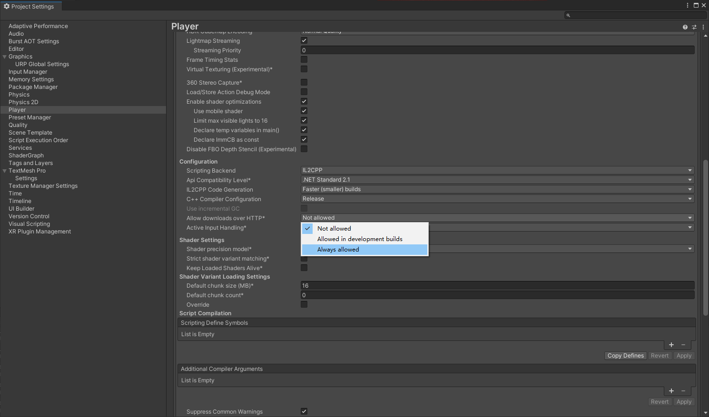

### websocket
这里使用 [UnityWebSocket](https://github.com/psygames/UnityWebSocket)  
[官方示例](https://github.com/wechat-miniprogram/minigame-unity-webgl-transform/tree/main/Demo/UnityWebSocket_WebGL/Assets/UnityWebSocket/Demo)    

```Cpp
WebSocket gameMainSocket;
const string mainAddress = "wss://zq.xmfunny.com/zqGame";
public void WebSocketConnect() {
    gameMainSocket = new WebSocket(mainAddress);
    gameMainSocket.OnOpen += MainSocket_OnOpen;
    gameMainSocket.OnClose += MainSocket_OnClose;
    gameMainSocket.OnMessage += MainSocket_OnMessage;
    gameMainSocket.OnError += MainSocket_OnError;
    gameMainSocket.ConnectAsync();
}

public void SendGameStart() {
    WSStartGamePack startGamePack = new WSStartGamePack();
    WSEmptyInfo emptyInfo = new WSEmptyInfo();
    startGamePack.data = emptyInfo;
    
    string json = JsonUtility.ToJson(startGamePack);
    Debug.Log("[Bobing][Socket SendGameStart]");
    gameMainSocket.SendAsync(json);
}

private void MainSocket_OnMessage(object sender, MessageEventArgs e) {
    if(e.IsBinary) {
        if(e.RawData.Length > 0) {
            Debug.Log($"[Bobing][Socket_OnMessage] 接受到服务器二进制信息 {e.RawData[0]}");
        }
        else {
            Debug.Log($"[Bobing][Socket_OnMessage] 接受到服务器二进制信息 但是为空");
        }
        return;
    }

    Debug.Log($"[Bobing][Socket_OnMessage] 接受到服务器信息 {e.Data}");
    WSPackHead wsPack = JsonUtility.FromJson<WSPackHead>(e.Data);
    switch(wsPack.api_id) {
        // 处理逻辑
    }
}
```
### postman
Postman 专用于API开发和测试的工具。可以用一些测试工具来测试服务端，依此判断是不是游戏的问题。

## 微信功能相关
微信相关功能需要初始化 WXSDK之后使用！
```Cpp
WX.InitSDK((int code) => { });
```
### 登入功能
```Cpp
public void Login() {
    LoginOption info = new LoginOption();
    info.complete = (result) => { Debug.Log($"WX: LoginComplete"); };
    info.fail = (result) => { Debug.Log($"WX: LoginFail Error : {result.errMsg}"); };
    info.success = (result) => { 
        Debug.Log($"WX: LoginSucess : {result.code}"); 
        PlayerManager.instance.wx_code = result.code; 
    };
    WX.Login(info);
}
```
登陆主要就是获取wxcode，来给服务端使用。一般是先登入，然后获取用户的昵称头像，然后挑选信息整合发送给服务端。  
[Login接口文档](https://developers.weixin.qq.com/minigame/dev/api/open-api/login/wx.login.html)


### 获取用户昵称和头像
这里对应着微信权限概念中的 " 昵称、头像 : wx.getUserInfo、wx.createUserInfoButton "。确保隐私协议添加了昵称头像，确保开启了授权弹窗之后，就可以执行下列代码来获取。
```Cpp
public void GetSetting() {
    GetSettingOption info = new GetSettingOption();
    info.complete = (result) => {
        Debug.Log($"WX: GetSettingComplete");
    };
    info.fail = (result) => {
        Debug.Log($"WX: GetSettingFail Error : {result.errMsg}");
    };
    info.success = (result) => {
        GetSettingSucess(result.authSetting);
    };

    WX.GetSetting(info);
}

private void GetSettingSucess(AuthSetting keyValuePairs) {
    foreach(var keyValue in keyValuePairs) {
        Debug.Log($"WX: GetSettingSucess keyValue: {keyValue.Key} , {keyValue.Value}");
    }

    // 已经授权，可以直接调用 getUserInfo 获取头像昵称
    if (keyValuePairs.ContainsKey("scope.userInfo") && keyValuePairs["scope.userInfo"] == true) {
        GetUserInfoOption info = new GetUserInfoOption();
        info.complete = (result) => {
        };
        info.fail = (result) => {
            Debug.Log($"WX: GetUserInfoOption Error : {result.errMsg}");
        };
        info.success = (result) => {
            GetUserInfoSucess(result.userInfo);
        };
        WX.GetUserInfo(info);
    }
    else {
        Debug.Log($"WX: 授权按钮显示!");
        var button = WXBase.CreateUserInfoButton(0, 0, Screen.width, Screen.height, "zh_CN", false);
        button.Show();
        button.OnTap((result) => {
            GetWXUserInfoSucess(result.userInfo);
            button.Hide();
        });
    }
}

private void GetUserInfoSucess(UserInfo userInfo) {
    Debug.Log($"WX: 已授权流程的用户信息获取 GetUserInfoSucess 头像：{userInfo.avatarUrl} 昵称：{userInfo.nickName}");
    PlayerManager.instance.avatar_url = userInfo.avatarUrl;
    PlayerManager.instance.username = userInfo.nickName;
    // 已经授权就不需要用户手动点击开始游戏了，直接进入游戏，显示进度条
    LoadMainSceneManager.instance.ActivateScene();
}

private void GetWXUserInfoSucess(WXUserInfo wxUserInfo) {
    Debug.Log($"WX: 未授权流程的用户信息获取 GetWXUserInfoSucess 头像：{wxUserInfo.avatarUrl} 昵称：{wxUserInfo.nickName}");
    PlayerManager.instance.avatar_url = wxUserInfo.avatarUrl;
    PlayerManager.instance.username = wxUserInfo.nickName;
}
```
首先使用 getsetting 来确认授权，如果尚未授权，调起授权按钮 CreateUserInfoButton 获取用户信息，如果已经授权，直接 GetUserInfo 获取用户信息。

[GetSetting文档](https://developers.weixin.qq.com/minigame/dev/api/open-api/setting/wx.getSetting.html)  
[CreateUserInfoButton文档](https://developers.weixin.qq.com/minigame/dev/api/open-api/user-info/wx.createUserInfoButton.html)  
[GetUserInfo文档](https://developers.weixin.qq.com/minigame/dev/api/open-api/user-info/wx.getUserInfo.html)

这里需要注意这个授权按钮。在使用Unity的微信SDK提供的WX.CreateUserInfoButton方法时，创建出来的按钮是透明的，我们可以创建一个引导用户点击但没有实际功能的按钮，然后在根据这个按钮的位置，调用WX.CreateUserInfoButton创建一个透明的按钮覆盖在上面，就可以实现用户点击按钮，然后弹窗获取用户信息的功能。

这里有几个坑点，一个是创建的按钮是透明的，我们根本看不到（其实js版本的api是可以指定按钮样式的，但是Unity WXSDK提供的api不能），所以我们根本不知道我们创建出来的按钮位置在哪。然后第二个坑点来了，CreateUserInfoButton的前四个参数分别为按钮的坐标的x和y，和按钮的宽width和高height，我们需要提供按钮的屏幕坐标和高宽，就可以确定按钮的位置，但是这个微信api的屏幕坐标是以左上角为原点的，而Untiy是以左下角为原点的，所以我们要自己进行坐标的转换。而且按钮位置的锚点也是按钮的左上角，并不是按钮的中心。

但其实我们可以弄一个全屏幕的按钮，用来处理这些事件。或者像羊了个羊那样，在主界面弄一个开始游戏，将申请权限寄托在这个按钮上。  
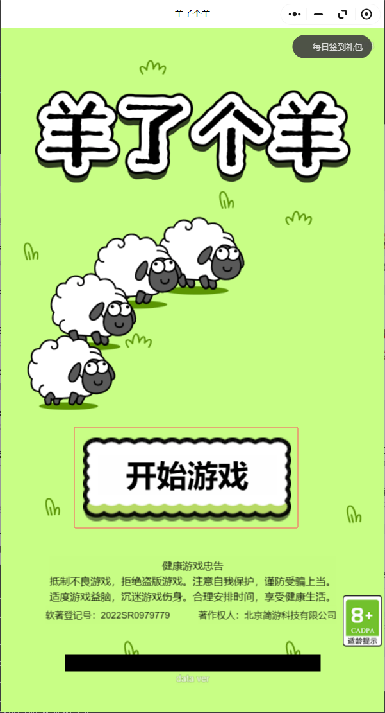

如果使用全屏幕按钮，我们还需要在回调中关闭这个按钮，不然这个按钮下的UI还是点不动。
如果使用绑定在开始游戏上的按钮，我们可以直接在回调中处理进入游戏的事件，当然，按钮还是需要关闭。

### 下载头像url并展示
```Cpp
using System.Collections;
using UnityEngine;
using UnityEngine.UI;
using UnityEngine.Networking;

public class TestAvatarDownload : MonoBehaviour
{
    public string imageUrl = "https://thirdwx.qlogo.cn/mmopen/vi_32/L6SG55UJpKT1xOXDgjiaxjAymZAXIYScAAmZcHl976pgvLODHicVC6BHwBqwYjia6sib1QxAmorGctwoIjXic3pYhvA/132"; // 替换为你的图片URL  
    public RawImage targetImage; // 用于UI显示的RawImage  

    public Button downloadBtn;

    private void Start() {
        downloadBtn.onClick.AddListener(DownloadImage);
    }

    public void DownloadImage() {
        StartCoroutine(DownloadImageWeb());
    }

    IEnumerator DownloadImageWeb() {
        using(UnityWebRequest uwr = UnityWebRequestTexture.GetTexture(imageUrl)) {
            yield return uwr.SendWebRequest();

            if(uwr.result != UnityWebRequest.Result.Success) {
                Debug.LogError("[bobing] Error downloading image: " + uwr.error);
            }
            else {
                Texture2D texture = DownloadHandlerTexture.GetContent(uwr);

                if(targetImage != null) {
                    targetImage.texture = texture;
                }
            }
        }
    }
}
```
测试时切记关闭这个不校验。
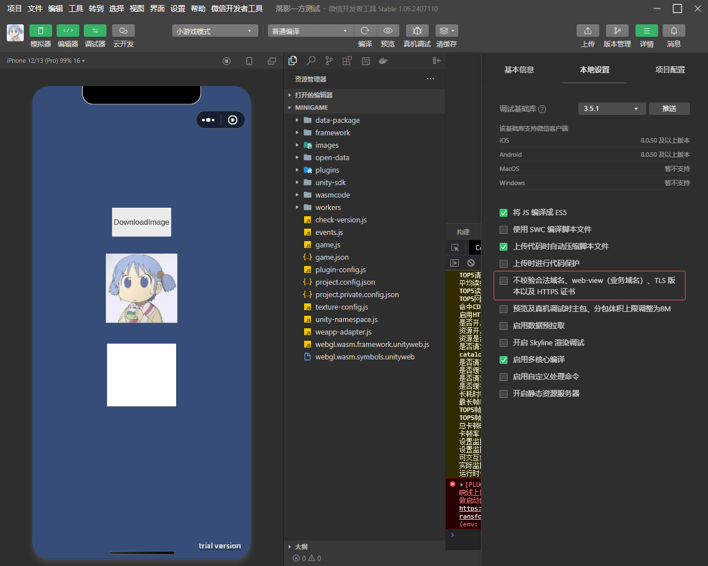

你会发现，通过 WX.GetUserInfo(info) 接口获取的url需要域名合法访问，也就是需要和服务器一样，在微信公众号上请求和下载域名中填写https://thirdwx.qlogo.cn
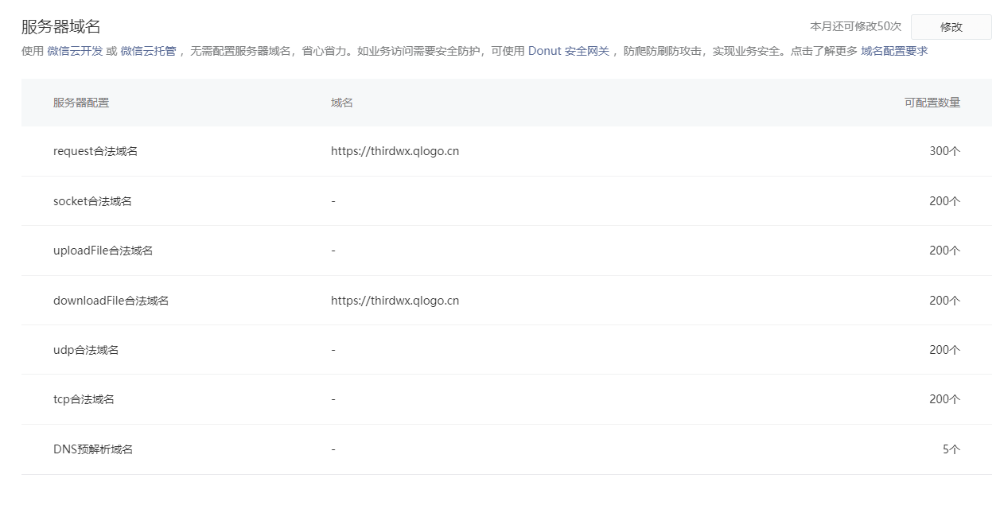

通过测试，似乎在更改完这项配置后需要重新打包才能应用上，估计是根据时间戳有判断。 

### 位置信息
需要明确目前只能拿到模糊的经纬度信息。即 userFuzzyLocation 。和用户昵称头像的获取差不多，区别在于权限的申请，这里需要使用Authorize，而且需要在game.json添加代码。

```Cpp
private void GetSettingSucess(AuthSetting keyValuePairs) {
    foreach (var keyValue in keyValuePairs) {
        Debug.Log($"WX: GetSettingSucess keyValue: {keyValue.Key} , {keyValue.Value}");
    }

    if (keyValuePairs.ContainsKey("scope.userFuzzyLocation") && keyValuePairs["scope.userFuzzyLocation"] == true) {
        Debug.Log($"已授权位置信息");
        GetFuzzyLocation();
    }
    else {
        Debug.Log($"未授权位置信息");
        AuthorizeOption authorizeOption = new AuthorizeOption();
        authorizeOption.scope = "scope.userFuzzyLocation";
        authorizeOption.complete = (result) => {
        };
        authorizeOption.fail = (result) => {
            Debug.Log($"WX: GetUserFuzzyLocationOption Error : {result.errMsg}");
        };
        authorizeOption.success = (result) => {
            GetFuzzyLocation();
        };
        WX.Authorize(authorizeOption);
    }
}

private void GetFuzzyLocation() {
    GetFuzzyLocationOption getFuzzyLocationOption = new GetFuzzyLocationOption();
    getFuzzyLocationOption.type = "wgs84";
    getFuzzyLocationOption.complete = (result) => {
    };
    getFuzzyLocationOption.fail = (result) => {
        Debug.Log($"WX: GetFuzzyLocationOption Error : {result.errMsg}");
    };
    getFuzzyLocationOption.success = (result) => {
        Debug.Log($"WX: GetFuzzyLocationOption Success{result.latitude} {result.longitude}");
    };
    WX.GetFuzzyLocation(getFuzzyLocationOption);
}
```

```json
// 需要在打包出来的小游戏项目中的game.json添加下述代码
"permission": {
    "scope.userFuzzyLocation": {
      "desc":"你的位置信息将用于小游戏位置接口的效果展示"
    }
  }
```
[getFuzzyLocation文档](https://developers.weixin.qq.com/minigame/dev/api/location/wx.getFuzzyLocation.html)
[authorize文档](https://developers.weixin.qq.com/minigame/dev/api/open-api/authorize/wx.authorize.html)

### 分享小游戏功能
首先明确一点：微信目前不允许你得知用户是否成功分享。所以我们能做的就只是帮助用户调起分享窗口。

如果你想让用户分享成功才能领取奖励，只能设置假门槛，掌握用户习惯猜测什么样的信息下用户可能是分享成功了。比如设置5秒时间、依据分享次数的概率失败（第一次极容易失败之类的心理战术）、或者两者结合。

[分享结果的判断方法（经验论）](https://developers.weixin.qq.com/community/develop/doc/000e867c7b8260ff08093aaff51000?highLine=%25E5%2588%2586%25E4%25BA%25AB%25E7%25BE%25A4)

[API文档](https://developers.weixin.qq.com/minigame/dev/api/share/wx.shareAppMessage.html)

```Cpp
public void Share() {
    ShareAppMessageOption shareAppMessageOption = new ShareAppMessageOption();
    shareAppMessageOption.title = "中秋博饼真有趣！";
    shareAppMessageOption.imageUrl = "/images/background.jpg";
    WX.ShareAppMessage(shareAppMessageOption);
}
```

这里的imageUrl是打包成小游戏之后的游戏根目录为基础。
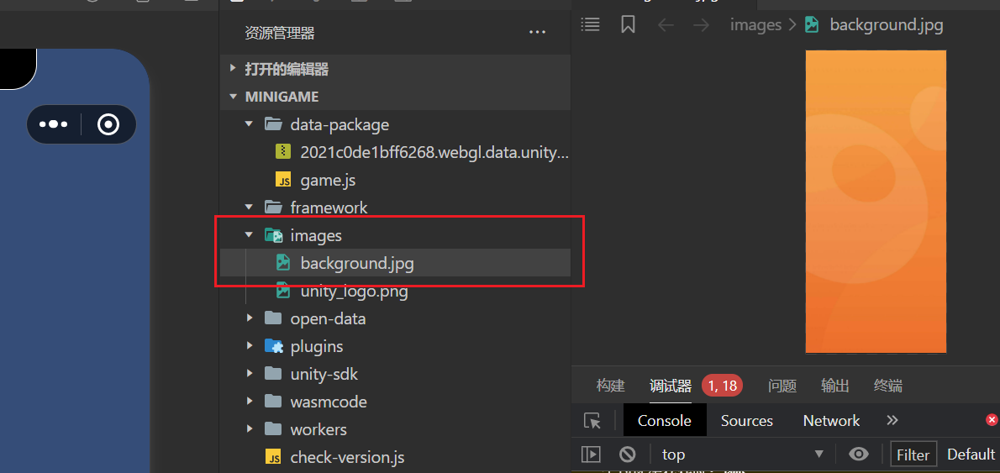  
对应unity就是sdk下的runtime image  
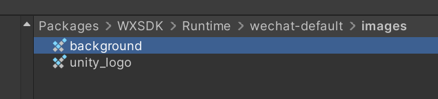  
在微信开发者工具中查看是这个效果  
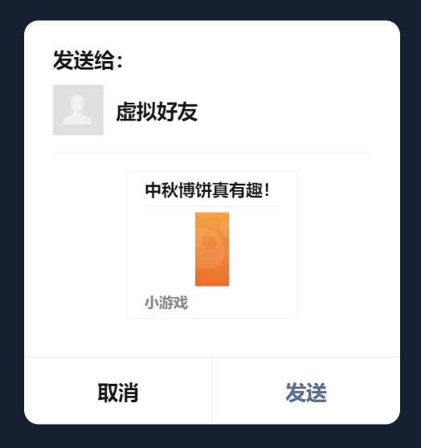  
手机上预览的效果  
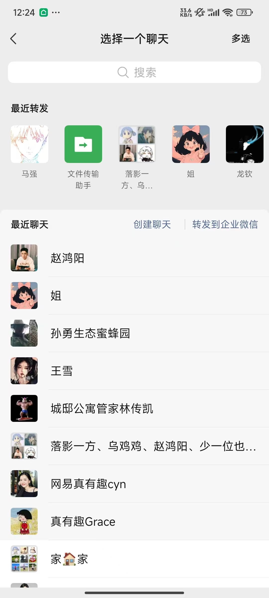  

[分享API不可以限定分享目标的证据](https://developers.weixin.qq.com/community/develop/doc/000c82b386461863793112b7e66400?_at=1726065621815)  
[分享API不可以监听分享结果的证据](https://developers.weixin.qq.com/community/develop/doc/00028237734090de1bf8c1cb55b800)

还有一种分享，是带Ticket的分享。好友在通过这个分享点击进去之后，客户端onshow接口会多一个ticket，可以通过服务端记录确认这个ticket，来实现分享并点击进入游戏后领取奖励的功能。这个还没做过。

### 关联跳转公众号
```Cpp
public void NavigateToOtherMiniProgram() {
    NavigateToMiniProgramOption navigateToMiniProgramOption = new NavigateToMiniProgramOption();
    navigateToMiniProgramOption.appId = "XXXXX appid";
    navigateToMiniProgramOption.success = (result) => { Debug.Log("[bobing] NavigateToOtherMiniProgram success!"); };
    navigateToMiniProgramOption.fail = (result) => { Debug.Log("[bobing] NavigateToOtherMiniProgram fail!"); };
    WX.NavigateToMiniProgram(navigateToMiniProgramOption);
}
```
需要在小游戏关联设置中关联两者才可以跳转  
[API文档](https://developers.weixin.qq.com/minigame/dev/api/navigate/wx.navigateToMiniProgram.html)

### 好友排行榜
#### 跑通官方示例了解具体做法
[Unity官方排行榜 Ranking Demo](https://github.com/wechat-miniprogram/minigame-unity-webgl-transform/tree/main/Demo/Ranking/Assets/RankDemo)  
[Unity侧开放域 Ranking Demo](https://github.com/wechat-miniprogram/minigame-tuanjie-transform-sdk/tree/main/Runtime/wechat-default/open-data)  

#### Unity侧坑点
Canvas必须是overlay（测试camera会无法交互）
RawImage最好将pivot设置为（0,0）方便计算微信接口的左上角，而且，一定要将X轴旋转180，旋转之后确认下RawImage位置。

#### 查看我的示例
#### 参考网址
[微信开放社区排行榜回答](https://developers.weixin.qq.com/community/develop/article/doc/0000ac7a2a4b280a61304d84d66413)  
[CSDN排行榜回答1](https://blog.csdn.net/weixin_49814585/article/details/135142895)  
[CSDN排行榜回答2](https://blog.csdn.net/qq_40364220/article/details/135403939)  
[Unity排行榜文档](https://github.com/wechat-miniprogram/minigame-unity-webgl-transform/blob/main/Design/OpenData.md)  
[方便制作排行榜的网页工具](https://wechat-miniprogram.github.io/minigame-canvas-engine/playground.html)  
[开放域好友接口文档](https://developers.weixin.qq.com/minigame/dev/guide/open-ability/open-data.html)

### 挂起后返回游戏
[OnShow文档](https://developers.weixin.qq.com/minigame/dev/api/base/app/life-cycle/wx.onShow.html)
挂起后，游戏可能与服务器断开了连接，回到游戏时，需要进行检测重连操作。
```Cpp
public void OnShow() {
    WX.OnShow((result) => {
        Debug.Log($"[bobing] 回到游戏了！");
        WebSocketManager.instance.WebSocketReConnect();
    });
}

public void WebSocketReConnect() {
    Debug.Log(gameMainSocket.ReadyState);
    if(gameMainSocket.ReadyState != WebSocketState.Open) {
        gameMainSocket.ConnectAsync();
        isReConnected = true;
    }
}

private void MainSocket_OnOpen(object sender, OpenEventArgs e) {
    Debug.Log($"[Bobing][Socket_OnOpen] {mainAddress}");
    if(isReConnected) {
        isReConnected = false;
        SendGameLogin(PlayerManager.instance.token); 
    }
}
```

## 遇到的一些问题
### 博饼项目花屏问题
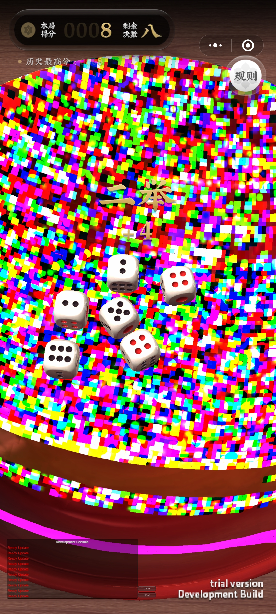

碗和桌子开启了 Contribute Global Illumination ，参与了光照烘培。桌子效果没问题，碗不知道因为什么会花屏，关掉那个开关，重新生成烘培的贴图（即去掉碗），让碗实时处理光照就可以了。

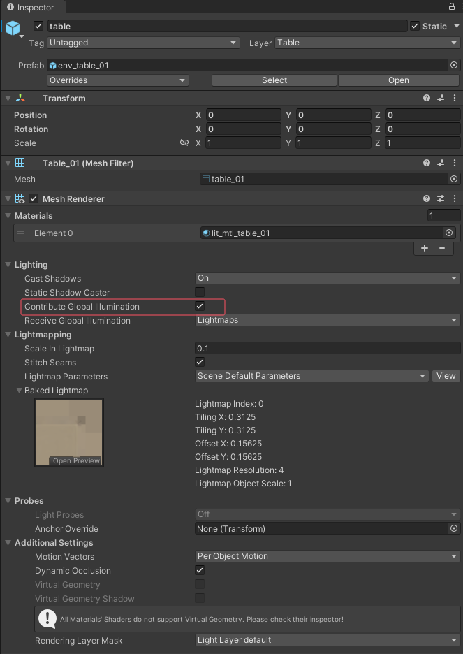
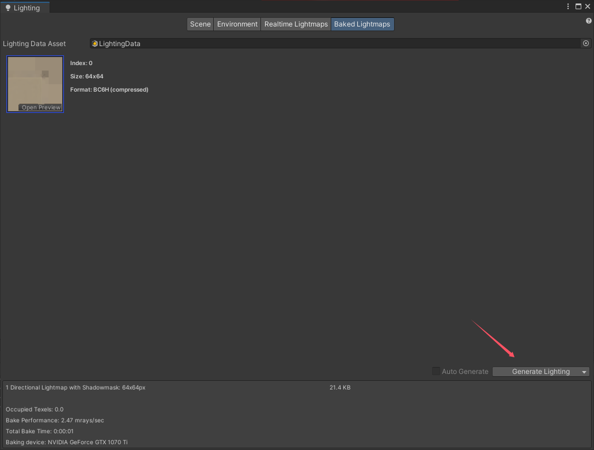
### 打出包在微信小游戏工具一打开就报空
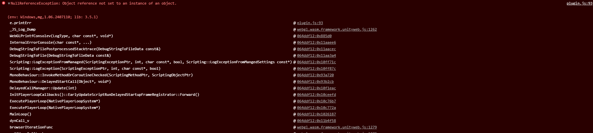
报错很抽象，无法定位问题。

结果是因为有一个脚本使用的OnValidate无法在运行时执行，导致dices为空，需要序列化dices，让scene保存住dices信息。
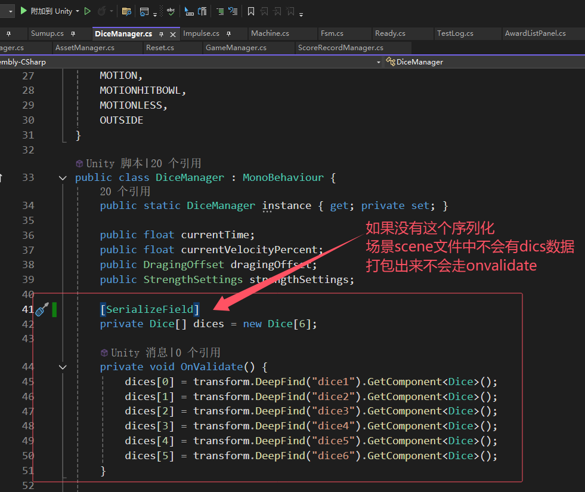

所以遇到这种问题，可以先在unity release下先进行尝试，看看能不能有清晰的报错信息。


### ios紫屏问题
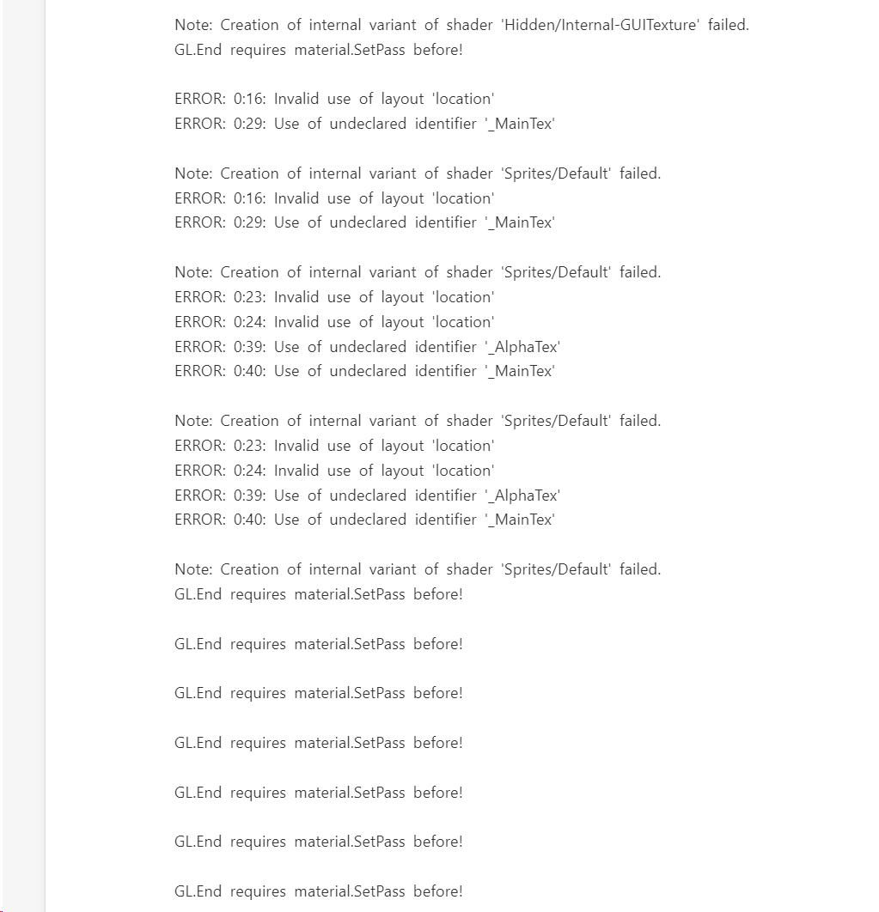
这个就是生产提效包的高性能没开导致的问题。


### 网络blob格式数据
报错Blob未定义。  

更换websocket版本为 
[demo使用的websocket版本](https://github.com/wechat-miniprogram/minigame-unity-webgl-transform/tree/main/Demo/UnityWebSocket_WebGL/Assets)。结果报错变成 " missing function: WebSocketSetOnOpen "  

对比两个版本的不一样的地方，其实就是这个文件影响的小游戏  （之前使用的是5月28日的package包）
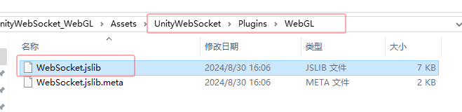  
那么这里的Blob是不是直接注释就可以呢？  
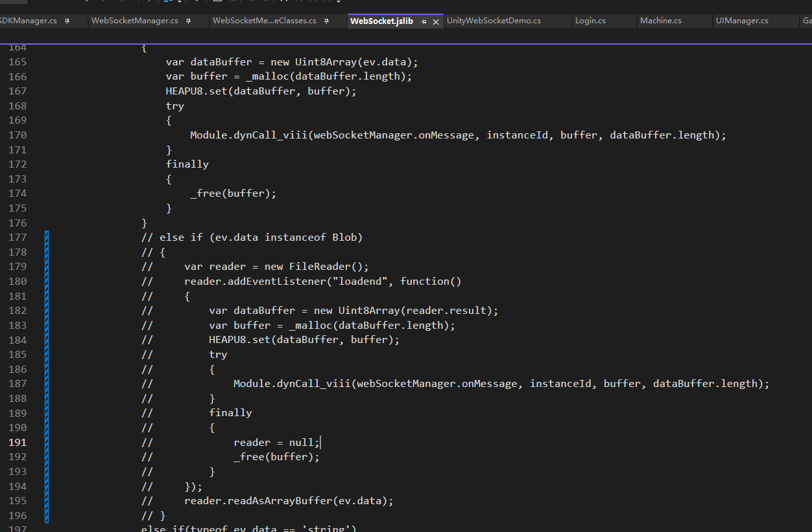
结果是可以！

后面发现其实[ 官方网络文档 ](https://github.com/wechat-miniprogram/minigame-unity-webgl-transform/blob/main/Design/UsingNetworking.md)里有提到  
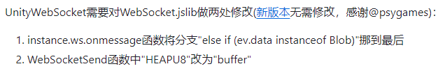

### 心跳bytes断开连接问题
```Cpp
public void SendPingRequest() {
    byte[] byteArray = System.BitConverter.GetBytes(1);
    Debug.Log($"[Socket SendPingRequest] {byteArray[0]} {byteArray.Length}");
    gameMainSocket.SendAsync(byteArray);
}
```

bytes是不是有问题？这个问题就还挺奇怪 电脑 开发者工具 都正常 然后手机上跑断开连接

WebSocketSend函数中"HEAPU8"改为"buffer"试试？


### 打包转换memory报错template报错
```Cpp
[Builder] BuildPlayer failed. emscriptenArgs: -s EXPORTED_FUNCTIONS=_sbrk,_emscripten_stack_get_base,_emscripten_stack_get_end -s ERROR_ON_UNDEFINED_SYMBOLS=0 -s TOTAL_MEMORY=256MB -s EXPORTED_RUNTIME_METHODS='["ccall","cwrap","stackTrace","addRunDependency","removeRunDependency","FS_createPath","FS_createDataFile","stackTrace","writeStackCookie","checkStackCookie","lengthBytesUTF8","stringToUTF8"]' --profiling-funcs 
UnityEngine.Debug:LogFormat (string,object[])

Exception: Invalid WebGL template path: D:\ZYQ\bobing\Packages\com.qq.weixin.minigame\WebGLTemplates\WXTemplate2022TJ! Select a template in player settings.
```

这个错误发生在我将library删除后，小游戏git 的 package突然报错了。结果移除掉package，重新使用git url后，可以了。

## 小技巧
### 如何在微信开发平台检查自己是否开了压缩

```Cpp
你的 CDN 未开启对 txt 文件的 gzip/br ，会增加文件：XXX.webgl.data.unityweb.bin.txt 的加载耗时！(env: Windows,mg,1.06.2209190; lib: 2.24.6) 
```

首先如果运行游戏没有报这个 Error ，应该就没问题  

其次可以通过 Network 查看首包信息确定，但是我感觉这个是不是不好使？因为我明明没报错，这边也没显示  
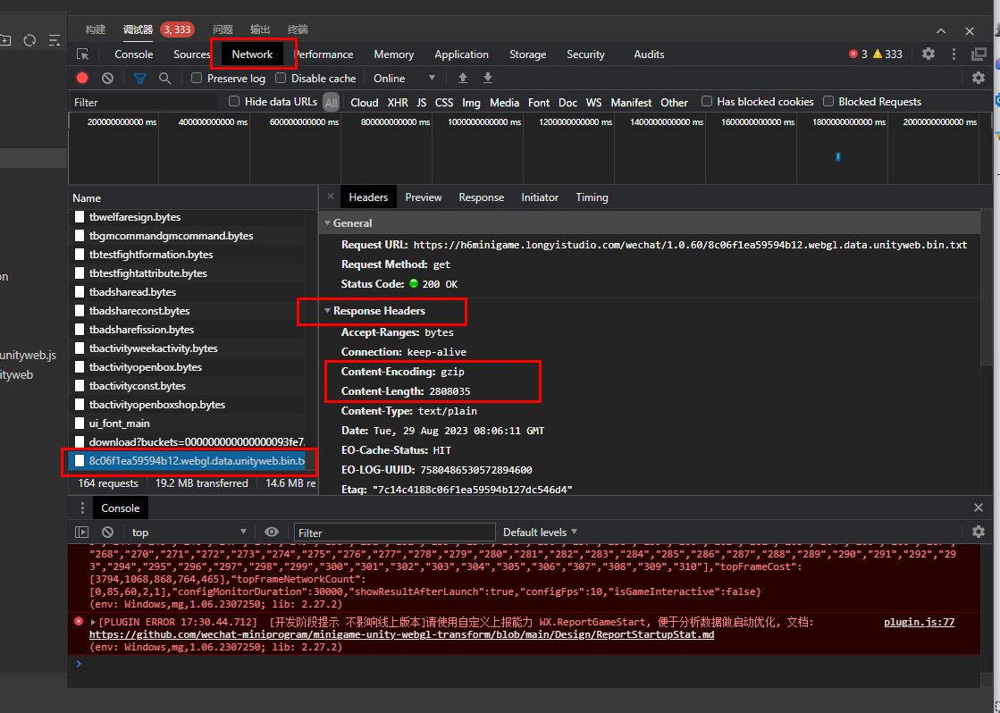

### 手机开启调试

导出小游戏后可以在游戏右上角调出开发选项，可以在手机上看到log

### 开发者工具模拟将游戏放到后台

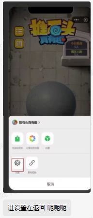