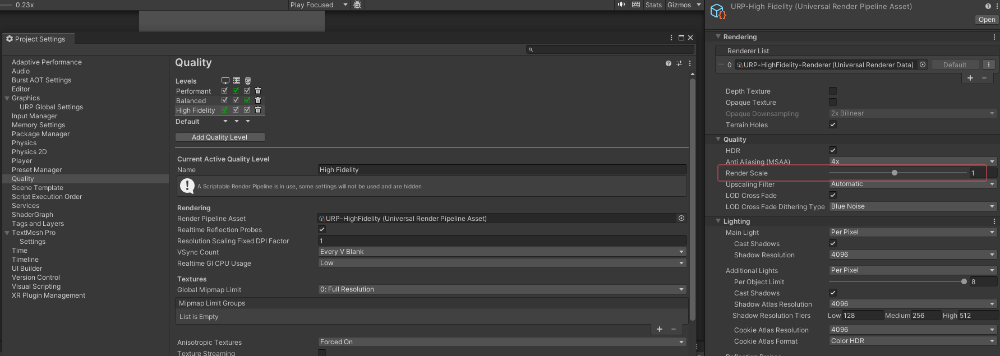

- [微信云测试](#微信云测试)
- [Unity Memory Profile](#unity-memory-profile)
- [首资源包优化](#首资源包优化)
  - [动态更换字体](#动态更换字体)
- [遇到的问题](#遇到的问题)
  - [TMP 动态字体](#tmp-动态字体)
  - [Render Scale 调节小于 1 的设置](#render-scale-调节小于-1-的设置)

# 微信云测试

# Unity Memory Profile

# 首资源包优化

## 动态更换字体

一个完整的字体要耗费好多内存，比如我们项目一个字体要 10 MB，而我们首代码资源包一共 7.1 MB，新手首关卡包一共 21 MB，如果字体完整加载进入，就要 31 MB，这很费。

目前是先把新手首关卡，用到字体的地方都换成静态字体。（将明显可以显示的放入静态字库，其他的不管显示）

然后再挂上动态加载字体的脚本。申请 CDN 字体资源。以此来实现动态字体在局内下载的效果。

这里当然是使用 editor 进行代码替换。然而，在替换过程中，有遇到以下问题：

- 预制体属性残留：如果你的预制体 UI 中嵌套了其他预制体，且那个预制体中的字体是 10MB 的大字体。此时将其更改为静态字体，变蓝提示出现，这时会在预制体源文件中存在引用提示，即提示源预制体是使用的 10MB 大字体，这样的话也会导致有些资源系统将其视为依赖！
- 预制体切除：如果你的预制体 UI 中嵌套了其他预制体，需要将那个预制体中的字体也这样更换，而且要考虑引用的预制体 bundle 的依赖关系。防止断不干净，如果预制体不多，可以直接卸载预制关系。
- TMP 动态字体残留：TMP 有个毛病，一个空字体的 tmp，给他赋值静态字体，并且在 text 文本中给上一个不属于它的文本显示范围的值，此时如果再将其字体更改为包含 text 文本的动态大字体，你会发现其下会生成 N 个 gameobject 用来显示文字，然后将文本换回静态字，这些 gameobject 不会消失，会视为资源，这也是有依赖的！
- TMP 默认字体材质残留：接着上面动态字体的说，此时静态字无法显示刚才动态字能显示的字，此时虽然表面上默认材质是静态字的，其实预制体源文件中，认为你还是需要动态字材质的，所以需要手动切换材质才行。
- 代码切换动态字为静态字：如果 tmp 本身的 text 不在静态字库内，代码无法切换成功。可以先保存字，然后切换，然后再赋值。

# 遇到的问题

## TMP 动态字体

动态字体，用到了再生成，好处是在不用字体或者用的很少的情况下，会很节省内存，需要注意的是这个动态生成的图大小，不要太大。

## Render Scale 调节小于 1 的设置

在移动了 Render Scale 设置之后：

据说会触发渲染 bil 啥的 的一个 bug 导致内存狂涨，通过 Memory Profile 观察，一个图就要占用几百 MB。
