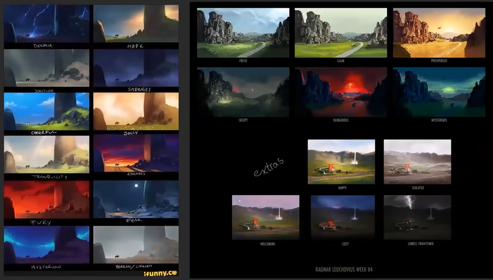
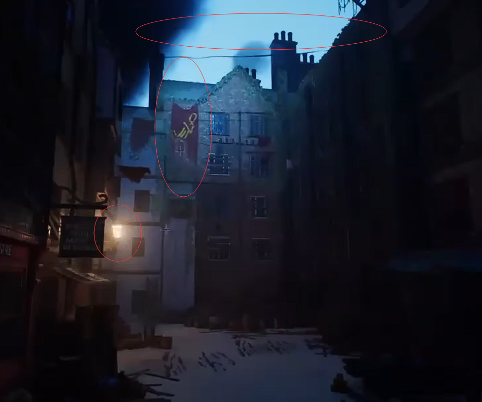
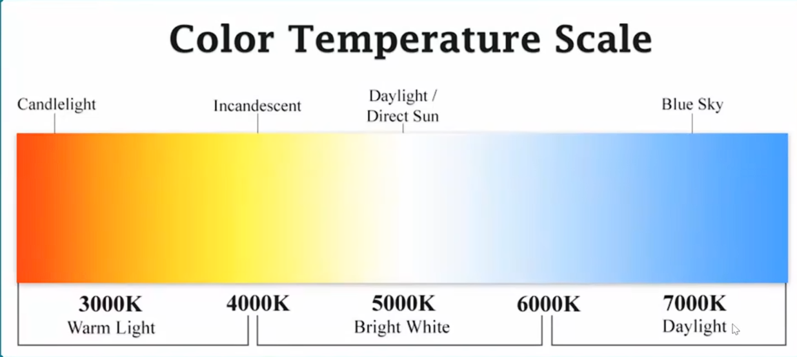
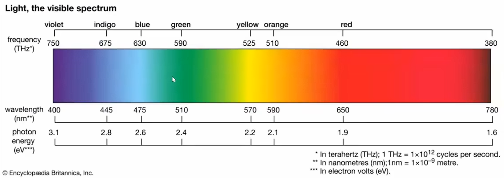
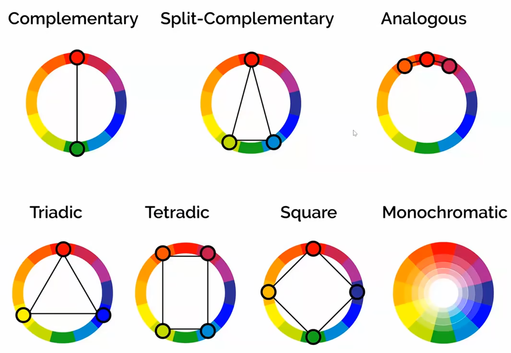

# 什么是光

光是一种波，使物体，对人眼可见。光从物体反射到我们的眼睛，让我们能看到这个东西。

# 创造光需要对自己提问

我的场景中要使用什么样的表面？

这个区域大概发生了什么？

这束光会是反射还是吸收？

光能切实地影响人的感受，给人带来不同的情感，比如夏天的阳光总会给我带来能量，而冬天则是能量低的代表。光，是有故事的，所以在处理任何场景时，我首先要问自己，这个场景的目的是什么？我想说什么？我想在这里讲哪个故事？

# 一个光的示例

## 天空灯光

这是世界上最大的灯光，它被称为大气。我总是以添加天空穹顶作为开始，以获得整体氛围。

## 信息光

用光来提供信息，照亮一些本来不应该被照亮的东西，这也许不符合实际，但适当地制作它，可以让人不反感的情况下提供信息。

比如上图中的 help，那个位置并没有光源，按理应该昏暗，但是这里为了提供给玩家信息，“这里有人需要帮助”，被特意照亮了，但是很适度，并不突兀。

## 引导光

一盏暖灯，提示玩家，这里是正确的路线，这里有生命存在。

## 总结

光在艺术作品中总是人为构造的，电影中也是如此。以便于我们更好地掌控氛围。

我认为，这种细致入微的摆布是会提升玩家体验，但是所耗费的心神庞大，后续变通维护比较艰难。我倾向于一切有因有果，而不是人为设计，就比如，help 的横幅，既然是有人需要求助，可以是这个人为了让远处的人能在昏暗之下注意到这个横幅，而在横幅后真的布置一个灯，也许是废都下的手摇电灯，也许是太阳能灯，也许是魔法世界里，给物体施加的辉光魔法。

有因有果有交互，即便于维护，又给玩家更进一步的沉浸感。

这里维护，我要额外说明一下，手打灯似乎脱离于游戏世界逻辑，给开发者和玩家带了不必要的疑惑。

光依托于可交互的物体，给玩家无比的沉浸感。

嗯，认可，课程后面也有提到，你放置一个灯的时候，考虑一下谁能打开或者关闭这个灯，我们试图打造一个“活的世界”，而不是一个精美的物件。

# 灯光魔法第一步：确定温度（颜色）

温度对于新手而言是一个非常好的可以快速上手的掌控氛围的工具。

## 颜色的配合

## 环境中光的配合

关键光，填充光和轮廓光