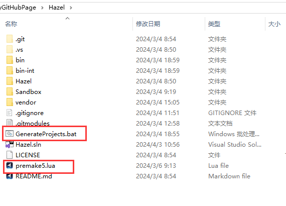

本文新建DLL引擎项目和EXE引擎项目，为两者配置合适的平台、输出路径和中间路径。


## 架构
游戏引擎应用划分为两部分，DLL引擎项目和EXE引擎项目，dll为引擎的核心部分，exe为开发者的应用部分。  
DLL负责所有的依赖库链接，EXE引用DLL，从而实现链接。  

这里将DLL命名为Hazel，EXE命名为Sandbox

## 项目设置
这里我们直接使用Premake进行项目设置。  
Premake是一个命令行工具，它读取软件项目的脚本定义，最常见的是使用它为Visual Studio, Xcode或GNU Make等工具集生成项目文件。有关Premake的说明，在另外的文章有[详细介绍]()。  
 
在这里，我们就把它理解为项目的设置就好，只需要一个文件一个cmd命令，就可以一键为项目设置属性。

为什么不使用VS自身的项目设置：  
- vs选项卡根据其版本不同有变化，不好记。premake使用lua，语法简单，基本不会变动。  
- vs选项卡分散到子目录里，不易于观察。premake都在一个文件下，一目了然。  
- vs选项卡无法处理跨项目之前的沟通。比如在这里，我们需要在DLL引擎项目生成DLL之后，将DLL移动到EXE引擎项目生成的目录里，不然EXE就会因为DLL缺失而无法运行。vs无法做到这点，但是premake是命令行工具，可以很轻松地移动文件。

下面是项目的详细设置：
```lua
-- workspace 项目解决方案
workspace "Hazel"
    -- 系统架构，我们这里直接使用x64
	architecture("x64")
	-- 默认启动项目。其实就是将这个项目在项目设置文件中的位置置顶，以作为启动项目。
	startproject "Sandbox"
    -- 自定义的、应用于生成的 设置集合，是解决方案的必填属性。里面可以填写自己喜欢的名称，其意义取决于它在下面的设置
	configurations
	{
		"Debug",
		"Release",
		"Dist"
	}
-- 输出目录变量：生成配置（Debug还是Release还是Dist，即上面的configurations） - 系统（这里就是windows） - 系统架构（就是上面的architecture）
-- 当然这只是一个自定义的输出目录的命名，这里给出的算是很全面了，其实主要还是区分是那个配置输出的，即，根据configurations的不同，会生成在不同的文件夹
outputdir = "%{cfg.buildcfg}-%{cfg.system}-%{cfg.architecture}"

-- 项目名称
project "Hazel"
    -- 设置生成的工作区或项目文件的目标目录
    -- 这里指解决方案Hazel的子项目Hazel会在Hazel解决方案文件夹的子文件夹Hazel下生成
	location "Hazel"
    -- 设置由项目或配置创建的二进制对象的类型，例如控制台或窗口化应用程序，或者共享库或静态库
    -- 这里指共享库DLL
	kind "SharedLib"
    -- 语言
	language "C++"
	-- 静态运行时
    -- 这里off，意为多线程DLL，静态库的话，内存不好管理而且代码臃肿
	staticruntime "off"

    -- 目标输出目录
	targetdir ("bin/" .. outputdir .. "/%{prj.name}")
    -- 中间输出目录
    -- 中间目录我们使用bin-int而不是obj主要是想跟bin对齐，所以使用int作为后缀的方法。更方便、美观。
	objdir ("bin-int/" .. outputdir .. "/%{prj.name}")

    -- 将指定文件添加到项目中
    -- 这个就是vs的包含和排除文件
	files
	{
		"%{prj.name}/src/**.h",
		"%{prj.name}/src/**.cpp"
	}

    -- 指定附加包含目录
	includedirs
	{
		"%{prj.name}/src",
		"%{prj.name}/vendor/spdlog/include"
	}
    
    -- 系统配置项
	filter "system:windows"
        -- c++语言版本
		cppdialect "C++17"
        -- 系统版本，设置为最新
		systemversion "latest"
        
        -- 宏定义
		defines
		{
			"HZ_PLATFORM_WINDOWS",
			"HZ_BUILD_DLL"
		}

        -- 后处理
        -- 这里调用cmd，将项目配置中的目标文件复制到另一个项目
        -- 因为exe项目依赖于dll动态库，所以exe文件夹下应该要有对应的dll
		-- 这里的cmd复制语句，使用""包裹，以在不存在文件夹时创建文件夹
		postbuildcommands
		{
			("{COPY} %{cfg.buildtarget.relpath}  \"../bin/" .. outputdir .. "/Sandbox/\"")
		}


	filter "configurations:Debug"
		defines "HZ_DEBUG"
		runtime "Debug"
		-- 调试符号，开启
		symbols "On"

	filter "configurations:Release"
		defines "HZ_RELEASE"
		runtime "Release"
		-- 优化代码，发布版本当然要以性能为主
		optimize "On"

	filter "configurations:Dist"
		defines "HZ_DIST"
		runtime "Release"
		optimize "On"

project "Sandbox"
	location "Sandbox"
    -- 可执行文件
	kind "ConsoleApp"
	language "C++"
	staticruntime "off"

	targetdir ("bin/" .. outputdir .. "/%{prj.name}")
	objdir ("bin-int/" .. outputdir .. "/%{prj.name}")

	files
	{
		"%{prj.name}/src/**.h",
		"%{prj.name}/src/**.cpp"
	}

	includedirs
	{
		"Hazel/vendor/spdlog/include",
		"Hazel/src"
	}

    -- 依赖项链接
	links
	{
		"Hazel"
	}

	filter "system:windows"
		cppdialect "C++17"
		systemversion "latest"

		defines
		{
			"HZ_PLATFORM_WINDOWS",
		}

	filter "configurations:Debug"
		defines "HZ_DEBUG"
		runtime "Debug"
		symbols "On"

	filter "configurations:Release"
		defines "HZ_RELEASE"
		runtime "Release"
		optimize "On"

	filter "configurations:Dist"
		defines "HZ_DIST"
		runtime "Release"
		optimize "On"
```

配合bat来一键生成项目配置。
```cmd
call vendor\bin\premake\premake5.exe vs2022
PAUSE
```



这里需要注意一点，这里的配置其实是项目的最终配置，包含了后面几节的内容。

## 测试print

```Cpp
// Test.h in Hazel
#pragma once

namespace Hazel
{
    __declspec(dllexport) void Print();
}
```

```Cpp
// Test.cpp in Hazel
#include "Test.h"
#include <stdio.h>

namespace Hazel
{
    void Print()
    {
        printf("Welcome to Hazel Engine\n");
    }
}
```

```cpp
// Application.cpp in Sandbox
namespace Hazel
{
    __declspec(dllimport) void Print();
}

int main()
{
    Hazel::Print();
}
```


