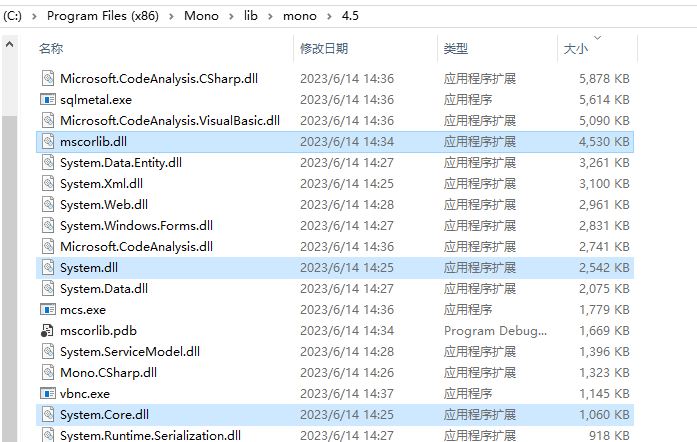
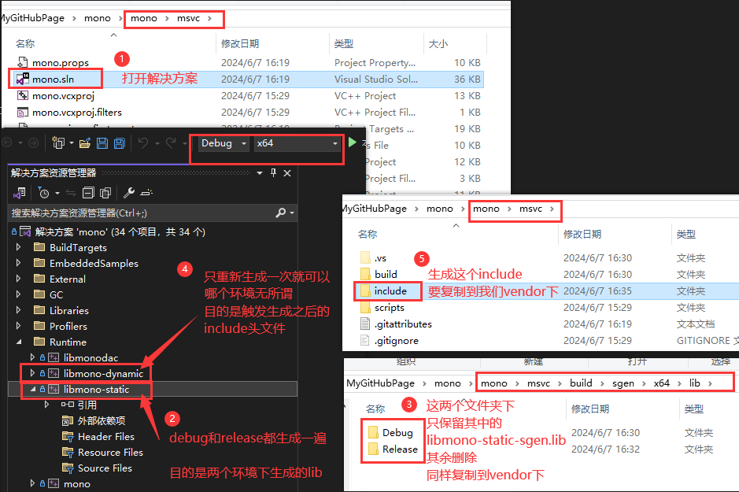
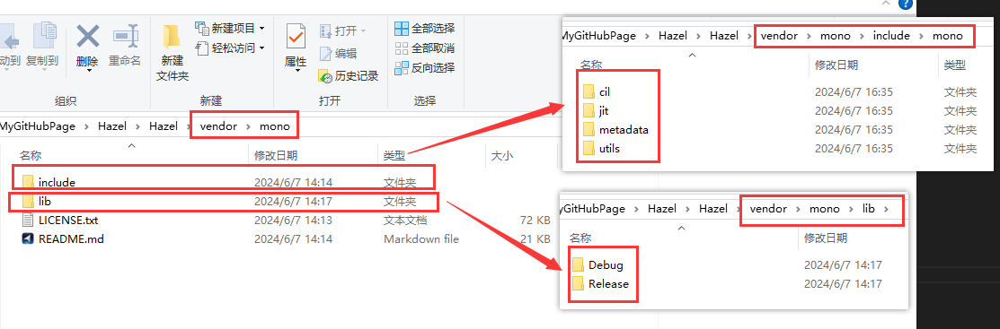
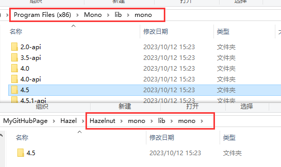

## mono介绍

Mono 是 Microsoft [.NET Framework] 的一个开源实现。它最初的设计目的是为了将 .NET 语言（主要是 C#）引入 Windows 以外的平台。
如今，它对于跨平台支持并不是绝对必要的，因为 Microsoft 一直致力于使 .NET 本身就可以跨平台。但 Mono 对于引擎脚本系统仍然非常有用，因为与 .NET Core 或 .NET Framework 不同，它提供了一个不错的 C/C++ API 来嵌入 .NET runtime。

现在，Mono 实际上有“两个”版本，其中一个被我称为 Classic Mono，这也是我们将在这里介绍的主要内容，另一个被我称为 .NET Core Mono 。我不会深入讨论 .NET Core 和 .NET Framework 之间的差异，但最大的区别是经典 Mono 最多仅支持 C# 7 或 .NET Framework 4.7.2，而 .NET Core Mono 支持最新版本C#，并作为 .NET Runtime 项目的一部分进行开发。

Mono 的两个版本均由 Microsoft 开发，但 Classic Mono 并未集成到 .NET 中，而 .NET Core Mono 则“集成”到了 .NET 中。我最终还将介绍如何构建 Mono 的 .NET Core 版本，但我将首先介绍classic Mono，因为它更简单，并且更适合游戏引擎。

为什么游戏引擎中，不使用.Net Core 版本的mono？

简而言之：它不支持重新加载程序集(assemly)。如果您不知道 C# 程序集是什么，我建议您仔细阅读一下它们，但它们本质上是一个 DLL 文件，其中包含所有代码，转换为中间语言（通常称为“IL”或“字节码”）。

那么为什么程序集重新加载在这种情况下很重要呢？因为当其他人编写 C# 脚本时，您希望对代码所做的更改立即在引擎（或编辑器）中生效，而无需重新启动整个编辑器/游戏。为此，我们首先必须卸载旧程序集，然后加载新程序集，而无需重新启动程序。


## mono使用

mono下载
https://www.mono-project.com/download/stable/#download-win

据说4.5版本支持类似热更新东西。
找到对应版本，注意这三个dll
   
后面可能会提及

从github拷贝某一个tag版本的mono，
git clone --recursive https://github.com/mono/mono

下图是mono的用法

最终vendor结构如下


最后将安装的4.5版本mono移动到编辑器项目


## 代码层
### 初始化mono
```Cpp
#include <mono/jit/jit.h>
#include <mono/metadata/assembly.h>

MonoDomain *domain;

domain = mono_jit_init (domain_name);
```
### C++调用C#

