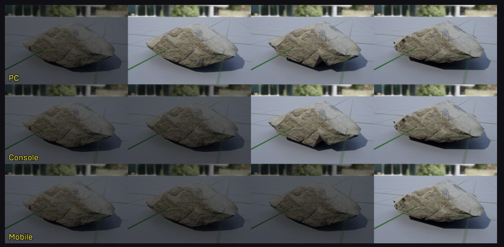

- [创建 LOD](#创建-lod)
  - [通过指定 FBX 创建](#通过指定-fbx-创建)
  - [自动创建](#自动创建)
    - [LOD 组](#lod-组)
    - [手动创建](#手动创建)
  - [为不同平台设定 LOD](#为不同平台设定-lod)
- [碰撞 LOD](#碰撞-lod)
- [编辑器预览](#编辑器预览)
- [批量修改资源](#批量修改资源)


# 创建 LOD

## 通过指定 FBX 创建

## 自动创建

### LOD 组

首先，找到项目的 BaseEngine.ini 文件，并在文本编辑器中打开它。

现在，查找"[StaticMeshLODSettings]"部分。如果你在BaseEngine.ini文件中没有看到此条目，请将以下代码复制并粘贴到BaseEngine.ini文件中。

```ini
[StaticMeshLODSettings]
LevelArchitecture=(NumLODs=4,LightMapResolution=32,LODPercentTriangles=50,PixelError=12,SilhouetteImportance=4,Name=LOCTEXT("LevelArchitectureLOD","Level Architecture"))
SmallProp=(NumLODs=4,LODPercentTriangles=50,PixelError=10,Name=LOCTEXT("SmallPropLOD","Small Prop"))
LargeProp=(NumLODs=4,LODPercentTriangles=50,PixelError=10,Name=LOCTEXT("LargePropLOD","Large Prop"))
Deco=(NumLODs=4,LODPercentTriangles=50,PixelError=10,Name=LOCTEXT("DecoLOD","Deco"))
Vista=(NumLODs=1,Name=LOCTEXT("VistaLOD","Vista"))
Foliage=(NumLODs=1,Name=LOCTEXT("FoliageLOD","Foliage"))
HighDetail=(NumLODs=6,LODPercentTriangles=50,PixelError=6,Name=LOCTEXT("HighDetailLOD","High Detail"))
```

NumLODs=4：总共 4 级 LOD
LODPercentTriangles=50：每一级大约保留上一级 50% 三角形
PixelError=10：控制 LOD 切换和简化误差，数值越大通常越激进。这个数值越高，减面越狠，对于一些封闭式物体可能会导致形状偏差过大，穿透等，所以一般还是控制其不要太大，对于 LOD 切换距离，建议在多选资源处脚本化处理。
Name=...：编辑器里显示的名字

LevelArchitecture：建筑、场景结构
SmallProp：小道具
LargeProp：大道具
Deco：装饰物
Vista：远景物体
Foliage：植被
HighDetail：高细节物体

Vista：只有 1 个 LOD，不自动生成多级
Foliage：这里只有 1 个 LOD 预设
远景和植被默认 不做多级 LOD。

需要重启引擎并且需要重新指定才可以刷新。

### 手动创建

可以调节三角形百分比

## 为不同平台设定 LOD



在PC上查看此静态网格体时，其只会显示 4 个LOD中的 3 个，因为 PC 的最小LOD值被设为 1。
在主机上查看此静态网格体时，其只会显示 4个LOD中的 2个，因为 主机 的最小LOD值被设为 2。 
在移动平台上查看此静态网格体时，其只会显示 4 个LOD中的 1 个，因为 静态网格体的最小LOD值被设为 3。


# 碰撞 LOD


# 编辑器预览


在这个视角下，不同级别的 LOD 会有颜色区分。

# 批量修改资源

在 Content Browser 里：选中一批 Static Mesh，右键，Asset Actions → Bulk Edit via Property Matrix，在右边搜 LOD Group，一次性给所有选中的网格设成同一个组

