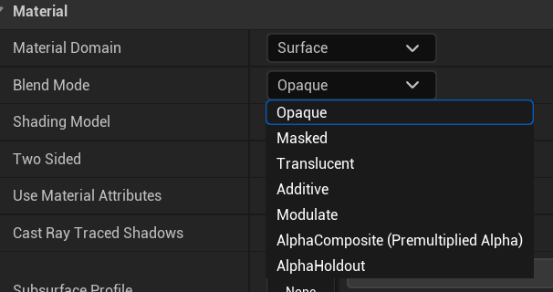

- [混合模式 BlendMode](#混合模式-blendmode)
  - [Opaque](#opaque)
  - [Masked](#masked)
    - [Opacity Mask Clip Value](#opacity-mask-clip-value)
  - [Translucent](#translucent)
  - [Additive](#additive)
  - [Modulate](#modulate)
  - [AlphaComposite](#alphacomposite)
  - [AlphaHoldout](#alphaholdout)
- [Shading Model](#shading-model)

# 混合模式 BlendMode

blend mode

决定了该物体与其背后像素的融合方式

## Opaque

不透明混合：一个光线无法穿透的表面

支持所有光照特性（PBR、阴影、反射等）

## Masked

遮罩：黑白图以控制显隐

### Opacity Mask Clip Value

0-1，超过的显示，不超过的隐藏

## Translucent

半透明混合模式，用于需要某种形式透明度的对象，这与 Masked 混合模式不同，它允许不同程度的半透明。这种混合模式通过获取不透明度值或纹理来工作，并将其应用于表面，使黑色区域完全透明，白色区域完全不透明，而不同的色度导致相应的透明度水平。

## Additive

叠加混合，一般用来做各种特殊效果，什么火啊，光斑啊。

## Modulate

很适合做 “暗化” 或 “染色” 背景

## AlphaComposite

类似标准透明混合，适合 UI 或特殊合成

## AlphaHoldout

用透明贴图在背景上“挖洞”，做遮罩用

# Shading Model

