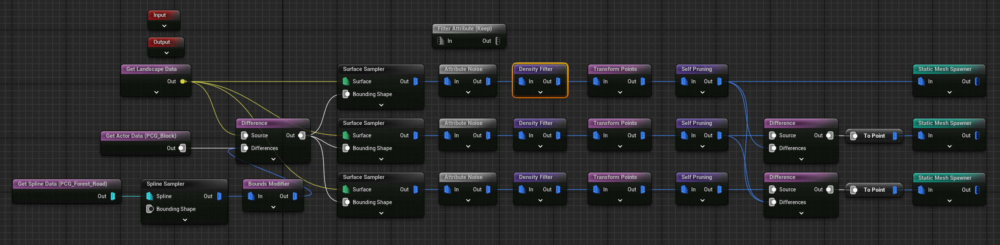
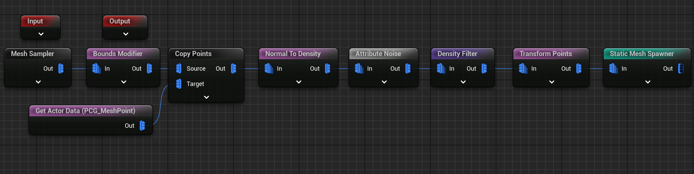

GetLandscapeData => Surface Sampler 直接把 PCG 拖到场景里，可以按 D 预览

常用节点 
Attribute Noise : Looseness
Density Filter : 上下限
Transform Points : 比较重要，可以直接调节随机位置，缩放和旋转（位置比如 z 的值设置为 -10 啥的，用来表达石头镶嵌进地面）
Self Pruning : 裁剪半径

最后输出
Static Mesh Spawner : 指定使用哪几种实际静态网格，而且可以调节这些静态网格权重，对于每一种网格也可以设置它的碰撞检测

# Difference

## 图表之间的重叠过滤

首先，一个 PCG 图表可以有多个不同流程的输出，都输出在同一个方框内，这时，两个流程可能会有交叉重叠的部分！

此时第二个图表可以使用 Difference 来过滤掉重叠的部分！

甚至第三个图表 Difference 另外两个图表

## 世界角色阻挡范围过滤

新建体积 Volume 类型是，阻挡体积，可以自由设置其形状大小，设置角色 tag

配合 Get Actor Data 节点（设置为获取世界所有角色，通过 tag 获取指定范围）获取

通过 difference 进行重叠部分的剔除

# Filter Attribute

仅仅在 landscape layer 为 N（例如 Forest） 上进行 pcg

# Mesh Sampler

甚至可以在 mesh 上程序化生成内容，最经典的例子就是长满了苔藓的柱子。

这里还可以通过操作指定上下柱子里的点不生成。