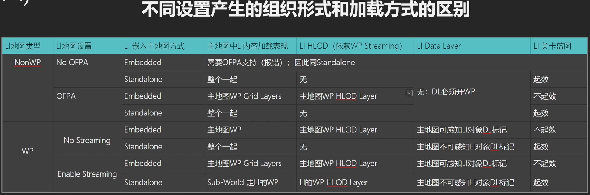
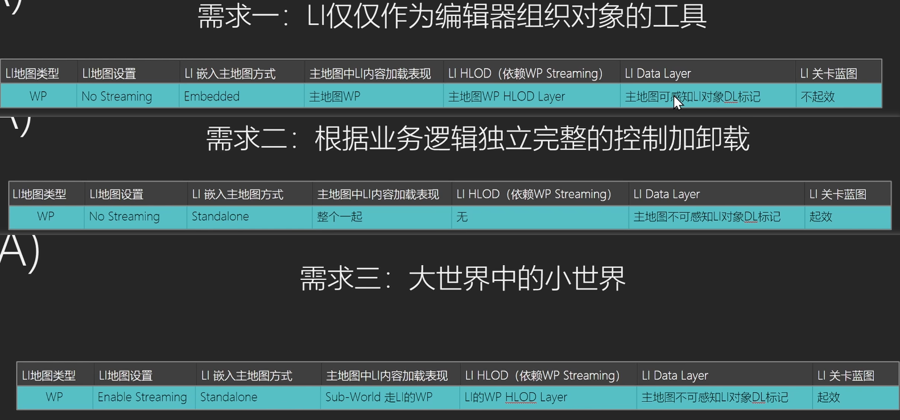

[世界分区官方教程](https://www.bilibili.com/video/BV1vy11YzEwa/?spm_id_from=333.1387.favlist.content.click&vd_source=386bdb94ff2a430f8d22a6de9755030c)

一套对象组织管理和加卸载系统

基于 Grid Layer Cell 的空间标记距离加载

- Grid Layer 创建 3D Cell 
- 根据 Actor 的空间位置被标记到相应的 Cell
- 以 Cell 为单位根据距离远近加卸载

组织规则
- 被组织的物体需要开启 Is Spatially Loaded 标记开关
- 被标记对象的质心空间位置决定其进入哪一个标记 Cell
- Cell 大小由 Grid Layer 设定（最小值） 并根据这个值自适应被标记对象的尺寸
- 相近空间位置的对象们可以处于不同的 Grid Layer Cell，以此进行同一个区域的不同类型物体的不同加载策略（比如牛羊和草地和牧场灯光都在一个Cell中，根据距离从远到近，可以先加载灯光，再加载草地，再加载牛羊）
- 特殊对象拆分：
  - 地形在新建的时候就要定义拆分大小，通过控制 World Partition Grid Size,如果之后要改，需要通过 Commandlet 重 build
  - 植被拆分大小通过 WorldSetting 设置 Instanced Foliage Grid Size
  - SplineRoad 通过 WorldSetting 设置 Landscape Spline Meshes Grid Size，如果重建，可以在 WorldPartition 面板重新 Build，Build - Build Landscape Spline Meshes
  - PCG 可以在 PCG Component 里调整 size，可以在 PCGWorldActor 里调整，或者在 PCG Graph 里使用 Grid size 调整
  - HISM 和 water 目前无法被拆分

加卸载规则
- 以 Cell 为运载单位（当然）
- 判定距离是指 Streaming Source 与 Cell 整体 Bounds 的距离（注意不是 Cell 那个绿框，而是 Cell 整体的包围盒，如果有物体超出 Cell 绿框，这个距离就会大于 Cell 绿框了）

Grid Layer 设置的考量因素
- 高密度小 Cell,空旷地区大 Cell
- 不同类型不同 Cell (当然也要平衡性能)
- 加卸载距离考虑游戏性、物理、内存（堡垒之夜 256 m 的距离，20 个 cell 左右，8000 个 actor）
- 加载距离可以做平台区分
- 有些需要手动合批的内容，避免太大太分散（否则 Cell 会太大 甚至绝大多数 Mesh 在 Cell 之外导致的物体间加卸载逻辑问题，以功能单位为一批）
- 跨 Cell 强引用：导致这两个对象产生了非常大的包围盒，这会导致在一个很大的距离之间，很难去卸载掉资源。应该尽量避免非常远距离的跨 Cell 强引用，或者使用动态生成代替强引用
- 不支持动态标识：
  - Spawn 对象总是被加载（可以把它 Spawn 到 Level Instence Actor 下，跟随加卸载）相应的，如果某个对象你不希望他跟随加卸载，就可以让它以 Spawn 形式生成
  - Moveable 对象，如果打上标记了，跟随 Cell 加卸载可能会有问题，这种对象最好不要打标记。
- 预先加载可见对象
- Location Volume 管理加载区域（编辑器内）

HLOD
HLOD 其实跟世界分区(WP)是一套，只不过从 Grid Layer 叫成了 HLOD Layer，地图要开 WP 和 streaming
在近距离的时候，所有HLOD都被加载了，只是没有被显示出来，离得远了之后，那些精细Cell被卸载，HLOD启用。

解决两个问题：生成 HLOD 和 无缝衔接 HLOD

- HLOD Layer 资产：定义使用什么样的优化策略：优化方式和优化层级
  - Layer Type : 使用实例化的合并方式 或者 合并以后减面。
  - Parent Type : 定义 当前生成的HLOD 如果要继续 生成 HLOD 使用的优化策略。

- Actor 中的设置：把刚才创建的 HLOD 资产指定给 Actor。使用相同 HLOD Layer 的资产 Actor 会使用相同的优化策略以及层级来生成 HLOD，但是不代表 使用相同 HLOD Layer 的资产 Actor 就要合到一个 Instance 或者 Mesh 里。具体哪些 Actor 要合在一起，可以在 World Setting 里设置，根据世界分区为单位指定。

- World Setting 中的设置：把创建的 HLOD Layer 的所有资产（包括 parent 的）都指定进去，然后设置需要多大的 Cell，Cell 的加卸载距离等等。然后生成的 HLOD 就以 Cell 为单位加载了，工作方式和 Grid Layer 类似。有两个方式来指定 HLOD Layer
  - HLODSetups Array : 可以为不同 Index 指定不同的 Cell 大小和加载距离
  - HLOD Layers Array : 不同 HLODLayer 共享一个 Partition Layer
  - 例子：比如建筑和小物件，建筑使用 Instance 优化策略，小物件使用 合并减面优化策略。但是两者可以走同一个 Cell，也可以不走同一个 Cell

HLOD Layer 设置考量因素
- HLOD Layer 策略：小的，差不多的跨关卡物件可以使用 实例化。 大的，数量少的本关卡物件（比如山，大地形）可以使用 组合。
- HLOD 本省生成比较费时，尤其是合并模型做减面的处理。可视距离比较远，所以小物件可以不必参与到 HLOD 生成当中。
- Cell 大小和数量的考量，性能允许的情况下，尽量少的 Cell
- 加卸载距离的考量。服务于视效，看起来没问题的情况下，越近切换到下一级越好（越早点剩性能）
- 可以逐平台调整 HLOD 加载距离

HLOD 编辑器内的加载和显示的控制
- Show 菜单里可以打开 HLOD 的显示
- 可以在检视面板使用大头针固定显示某几项
- 可以在 show 菜单同时打开 HLOD 和 原本地形

DataLayer 加卸载
- DL 组织方式
  - 创建和配置 DL 资产
  - 创建和配置 DL 实例（引用资产，存放在 WorldDataLayers 里）
  - 为 Actor 打上 DL 标记（把 Actor 标记到 DL ，这个信息是存放在 Actor 本身的）
- DL 加载规则
  - 代码或 BP 按需加载
  - OR AND
  - WP Partition 标记协同
- 编辑器内组织管理
  - 使用 Editor Only DL 管理
  - DL 子母关系方便管理
  - 利用 Sequencer 的 DL Track 组织管理：可以进行各种组合的尝试并保留到轨道上（反正是编辑器资产）
  - 避免 DL 包含极大的对象数量，不是说运行时有压力，而是编辑器下会一下子全部加载，会很有压力
  - 分类以任务点兴趣点为基础，也是避免其包含太多内容的一项
- 最佳实践
  - Actor复制之后，DL标记需要清理
  - 利用 DL 做多平台优化
  - DL 做好提前规划负责人（因为管理复杂）

Sub Level (LI PLA)
Level Instances (LI) / Packed Level Actors (PLA)
- 组织规则：
  - 嵌入方式：嵌入式，独立式
    - 嵌入式：默认，其中对象会被打散
    - 独立式：整体加卸载（默认情况下 wp 不显示以 standalone 方式的 LI，需要 cmd 执行 wp.Editor.DisableLevelInstanceEditorPartialLoading 1）
  - 是否 WP：一开始创建时选择。也可以在主地图中选择几个物体创建 WP 地图
  - 是否 OFPA：在 LI 的 world setting 中设置
  - 是否 Streaming：在  LI 的 world setting 中设置
  - WP 强制开启 OFPA，非 WP 一定没有 Streaming，Streaming 只有 wp 的地图才有这个开关
- 加载方式

- LI 实例屏蔽部分对象
- 对 LI 实例做变化 DL actor filter
- 利用可视化直观管理LI

