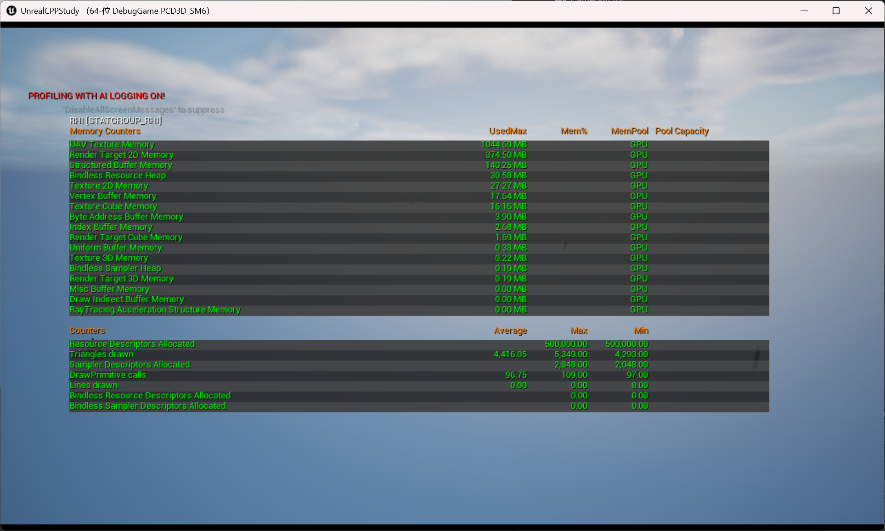

- [ISM（InstancedStaticMeshComponent）](#isminstancedstaticmeshcomponent)
- [HISM（HierarchicalInstancedStaticMeshComponent）](#hismhierarchicalinstancedstaticmeshcomponent)
- [使用 HISM 和 不使用的区别](#使用-hism-和-不使用的区别)
- [材质设置](#材质设置)
- [LOD 设置](#lod-设置)
- [剔除设置](#剔除设置)
  - [ClusterTree 显示](#clustertree-显示)
  - [Desired Max Draw Distance](#desired-max-draw-distance)

# ISM（InstancedStaticMeshComponent）

用途：同一个 Static Mesh 的大量重复渲染，比如一排路灯、围栏段、弹孔等。

核心点：
- 只加载一次 Mesh / 材质，多个实例共享
- DrawCall 批量提交（相比一堆 StaticMeshComponent，大幅减少 CPU 开销）
- 每个实例有 自己的变换（位置、旋转、缩放）

> 可以理解成：“我有 1 个模型，要在场景里放 1000 个版本，只是 Transform 不同”。

# HISM（HierarchicalInstancedStaticMeshComponent）

在 ISM 基础上加了 层级包围盒（BVH）：
- 引擎会把实例分成层级树结构
- 做 分块剔除（Hierarchical Culling）：整块不在视锥里，就整块不渲染

更适合：
- 范围很大、分布广 的实例（森林、石头群、远景建筑）

# 使用 HISM 和 不使用的区别

使用 standalone game

打开控制台（~ 键）

输入 ： stat RHI

重点看这几项
- DrawPrimitive calls（DrawCall 数量）
- Triangles（三角面数）

完全空的场景独立运行的游戏数据 
4284 - 5340  90 - 102

不使用 HISM
195761 - 319661  107 - 151

使用 HISM

4293 - 5349    97 - 109

# 材质设置

必须要勾选 Used with Instanced Static Meshes 此项参数，不然材质无法显示。

# LOD 设置

Forced Lod Model 默认是零，意味着按照模型自己的 lod 去设置

# 剔除设置

剔除是基于 ClusterTree (簇树) 进行的。引擎在构建时会根据空间位置将海量实例分成多个簇，剔除时只会剔除那些超出距离或视野的簇。因此，HISM 能更精细地控制大范围物体的可见性，这正是它适合做植被的原因

## ClusterTree 显示

为了验证剔除是否按预期工作，可以在编辑器中启用可视化工具：在视口左上角点击 显示 (Show) > 可视化 (Visualize) > 高级 (Advanced)，找到并开启 HISM ClusterTree 或 HISM Occlusion Bounds，即可看到 HISM 内部用于剔除的簇结构，方便你判断剔除粒度是否合理 

## Desired Max Draw Distance

超过多少之后，剔除

但是实际使用下来这个剔除是很怪的，实在不适合乱序大世界物件，不只是剔除怪，编辑器也非常卡，这个 HISM 还是拿来用小范围的物件合批比较好。如果是乱序大世界，可以试试 PCG