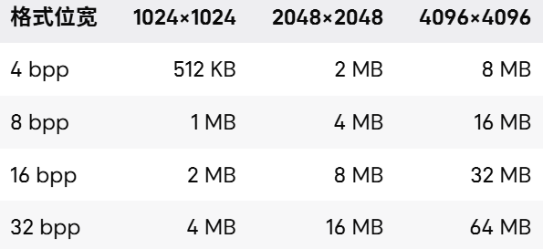

- [影响贴图 “大小” 的核心因素](#影响贴图-大小-的核心因素)
- [图片位深](#图片位深)
  - [怎么计算？](#怎么计算)
  - [通道的 “8 位” 具体指什么？](#通道的-8-位-具体指什么)
  - [位深高低有什么影响？](#位深高低有什么影响)
- [BPP](#bpp)
- [BPP 和 图片位深](#bpp-和-图片位深)
  - [精度损失](#精度损失)
  - [为什么视觉上通常还能接受](#为什么视觉上通常还能接受)
- [压缩算法](#压缩算法)
  - [BC1 (DXT1)](#bc1-dxt1)
    - [主要策略](#主要策略)
    - [为什么偏偏是 5/6/5？](#为什么偏偏是-565)
  - [BC2](#bc2)
  - [BC3 (DXT5)](#bc3-dxt5)
  - [BC4](#bc4)
  - [BC5](#bc5)
  - [BC6H](#bc6h)
  - [BC7](#bc7)
  - 
- [Default 通用颜色图](#default-通用颜色图)
- [BC7 高质量彩色图](#bc7-高质量彩色图)
- [Normalmap 法线图](#normalmap-法线图)
- [Masks ORM/RMA 打包图](#masks-ormrma-打包图)
  - [sRGB 是干啥的？](#srgb-是干啥的)
- [Grayscale / Alpha 单通道图](#grayscale--alpha-单通道图)
  - [是不是其实就相当于打包图的一个通道？](#是不是其实就相当于打包图的一个通道)
- [Alpha](#alpha)
  - [为什么比整张 RGBA 存透明更省？](#为什么比整张-rgba-存透明更省)
- [HDR Compressed](#hdr-compressed)
  - [BC6H 技术细节如何？为啥说比 FLOAT 省很多？](#bc6h-技术细节如何为啥说比-float-省很多)
- [HDR](#hdr)
- [UserInterface2D UI 图](#userinterface2d-ui-图)
  - [压缩块是啥东西？](#压缩块是啥东西)
  - [为啥 UI 需要 32 BPP？就是纯粹的清晰度需求？](#为啥-ui-需要-32-bpp就是纯粹的清晰度需求)
- [VectorDisplacementmap / Displacementmap](#vectordisplacementmap--displacementmap)
- [平台格式区别](#平台格式区别)
  - [PC / 主机](#pc--主机)
  - [移动端](#移动端)
- [选择建议](#选择建议)
  - [BaseColor](#basecolor)
  - [Normal](#normal)
  - [Roughness / Metallic / AO](#roughness--metallic--ao)
  - [黑白遮罩](#黑白遮罩)
  - [UI](#ui)
  - [HDRI / 环境贴图](#hdri--环境贴图)
- [常见坑](#常见坑)

图片压缩、图片格式、RGBA、优化贴图、优化图片、贴图设置、图片设置、BPP、图片位深

# 影响贴图 “大小” 的核心因素

- 分辨率
- 是否带 Alpha
- 是否生成 MipMap
- 目标平台
- 压缩格式本身的 bpp（每像素位数）

需要对图片格式占用大小心里有个数，常见显存占用：

如果带完整 MipMap，通常再乘 约 1.33。

# 图片位深

24 bit / 32 bit 颜色位深

用多少个二进制位（bit）来表示图像里的颜色/亮度信息。（每个像素能记录得有多细。）

比如：
- RGB8 = 24 bit
- RGBA8 = 32 bit

这通常是 未压缩 概念。

## 怎么计算？

24 位真彩色 ： RGB 8-bit/channel 三个通道相加。

## 通道的 “8 位” 具体指什么？

如果一个通道是 8-bit，那它能表示的数值个数是： 2^8 = 256

也就是 0 到 255。强度等级细分为 256 级。位深越高，颜色/亮度 过渡越细腻。

## 位深高低有什么影响？

位深低
- 文件/内存通常更省
- 但容易出现：
  - 色带（banding）
  - 渐变断层
  - 精度不足

位深高
- 颜色过渡更平滑
- 更适合后期和高动态范围
- 但更占空间
 
# BPP

BPP = Bits Per Pixel

压缩后每个像素平均要占多少 “位” 来存储。（注意是 bit（位），不是 byte（字节）。）

8 bit = 1 byte

所以如果是 32 bpp，就等于每像素 4 byte

# BPP 和 图片位深

源图片位深影响原始精度。

运行时压缩格式影响最终显存占用。

## 精度损失

像 BC1 / BC3 / BC5 / BC7 这类，很多都是有损压缩。之后运行时 GPU 再采样、“解码”，从已经压缩过的数据里还原近似值。

RGBA8 / G8 / FloatRGBA , 无损 / 未压缩，这些要么未压缩，要么不是那种有损块压缩，精度保留更多。但代价就是更占显存。

## 为什么视觉上通常还能接受

这些压缩格式是按 “人眼不敏感的地方优先牺牲” 去设计的

- 轻微颜色误差
- 某些渐变细节
- 一些高频噪点

# 压缩算法

BC 类型 ： Block Compression 把纹理按 4×4 像素块压缩，每个块占固定字节数。

- GPU 原生支持
- 显存里通常直接存压缩后的数据
- 采样时硬件按块解码
- 大多是有损压缩
- 优点是 省显存、降带宽、适合实时渲染

## BC1 (DXT1)

BC1 是一种很常见的 GPU 块压缩纹理格式，也叫 DXT1 。

- 每组只占 8 字节
- 4 bpp
- 按 4×4 像素块压缩
- 主要用来压 普通颜色图

### 主要策略

每个 4×4 block = 16 个像素，但 BC1 不会给 16 个像素分别存完整 RGB。

1. 选出两个 “端点颜色”
2. 根据这两个端点颜色插值出候选色，一般挑选出 4 个
3. 一个 block 中的像素，自行挑选选择这 4 个候选色中的哪一个作为自己的颜色

BC1 的目标是更小的存储，现在我们需要存储两个参考颜色，16 个像素的 4 种索引选择。

对于 16 个像素的 4 种索引选择，需要 16 * 2 = 32 位 = 4 字节 = 2 bpp

现在还有两个参考颜色要存储，在只存储 RGB 每个通道都用 256 也就是 8 位的话，需要 3 * 8 * 2 = 48 位 = 6 字节 = 3 bpp

BC1 目标是更小的 BPP，所以这个算法稍微削减了 RGB 每个通道的位， RGB 分别以 565 位存储， (5 + 6 + 5) * 2 = 16 * 2 = 32 位 = 4 字节 = 2 bpp

### 为什么偏偏是 5/6/5？

因为人眼对 绿色 更敏感，所以给 G 多 1 bit

## BC2

- BC1 + 4-bit Alpha	per pixel
- 16 字节	8 bpp	（BC1 + 每个像素 4 位透明度 4 * 16 = 64 位 = 8 字节 = 4 bpp）
- 旧格式，现基本都用 BC3 （透明度过渡不如 BC3 自然）

## BC3 (DXT5)

- BC1 + 2 个精细端点透明度
- 16 字节	8 bpp	（BC1 + 2 个端点 8 位透明度 8 * 2 = 16 位 = 2 字节 = 1 bpp + 16 个像素从 8 个候选透明度中挑选，也就是 3 bit 索引 16 * 3 = 48 = 6 字节 = 3 bpp）

## BC4

BC4 是一种 单通道纹理压缩格式。专门拿来压 1 个通道数据的 BC 格式。

- 只存一个通道
- 4 bpp （ 8 位单通道的两个端点，插值 8 种索引 8 * 2  = 1 bpp + 16 * 3 = 3 bpp）
- 按 4×4 像素块压缩
- 属于 有损压缩
- 很适合存 灰度/遮罩类数据

相比于无压缩的版本 8 * 16 = 8 bpp，节省了一半空间

## BC5

本质上是两份 BC4

BC5 主要压 RG 两个通道（对应 xy 轴），B 通道运行时重建（z 轴根据 xy 重建）

- 把精度留给最重要的数据 ： 法线最关键的是 XY 方向变化。BC5 专门给两个通道较稳定的压缩。
- 通道质量更稳定 ： 对两通道数据表现更好，法线失真更少。
- 通道之间不会互相污染得那么明显 ： R 当成一张单通道图，G 当成另一张单通道图

## BC6H

作用：压缩 RGB 颜色（通常是 16-bit 浮点/高动态范围数据）
特点：有损，但为 HDR 设计，误差和伪影通常比直接压 8-bit 色彩更可控

常见实现对应 RGB 三通道的 HDR 压缩

8 bpp

- 挑一种模式（不同模式端点精度/位宽/插值规则不同）
- 量化端点
- 给每个像素分配索引

无透明度哦！但是支持 HDR

## BC7

通常可理解为支持 RGBA，但是不支持 HDR

## 

# Default 通用颜色图

无 Alpha：通常走 BC1 / DXT1，4 bpp；1024*1024 0.5 MB

有 Alpha：通常走 BC3 / DXT5，8 bpp；1024*1024 1 MB

适用：Base Color / Albedo 、普通颜色贴图、大多数场景贴图

# BC7 高质量彩色图

高质量彩色压缩，8 bpp

适用于：高质量 BaseColor 渐变很多、压缩瑕疵明显的贴图 次世代 PC / 主机项目

画质通常比 BC1/BC3 更好

但比 BC1 更大，也更吃平台支持

# Normalmap 法线图

通常走 BC5，8 bpp

# Masks ORM/RMA 打包图

无 Alpha：通常走 BC1 / DXT1，4 bpp；

有 Alpha：通常走 BC3 / DXT5，8 bpp；

一张图塞多个通道，非常省资源

一般建议 关闭 sRGB

## sRGB 是干啥的？

# Grayscale / Alpha 单通道图

G8（未压缩 8-bit 单通道）

某些平台可能走 BC4（4 bpp）

适用于：Height（高度图） Roughness（单独存） AO（单独存） 黑白遮罩

单通道贴图比 RGBA 更省

如果只是一个通道，尽量别存成全彩 RGBA

## 是不是其实就相当于打包图的一个通道？

# Alpha

Alpha 单通道压缩，常见为 BC4，4 bpp

单独透明遮罩、单通道控制图

比整张 RGBA 存透明更省

## 为什么比整张 RGBA 存透明更省？

# HDR Compressed 

HDR 压缩，常见为 BC6H，8 bpp

适用于：HDR 环境贴图 Sky / IBL / Reflection 相关 HDR 纹理

适合高动态范围数据、比 Float 省很多

## BC6H 技术细节如何？为啥说比 FLOAT 省很多？

# HDR

高精度 HDR，常见是 FloatRGBA 之类，通常 64/128 bpp 非常大。

真正需要高精度浮点数据时、特殊渲染缓存/科研类贴图

画质高，但非常占显存，游戏里要慎用

# UserInterface2D UI 图

UI 贴图，常常是 未压缩 B8G8R8A8，32 bpp

- UI 图标
- 按钮
- 字体图集
- 需要边缘特别干净的 2D 元素

- 清晰，不容易出现压缩块
- 但非常占内存
- 不适合大面积场景贴图

## 压缩块是啥东西？

## 为啥 UI 需要 32 BPP？就是纯粹的清晰度需求？

# VectorDisplacementmap / Displacementmap

多用于位移/向量数据，常会选未压缩或较高精度格式

- 常见会比普通压缩贴图更大
- 具体取决于是否走 RGBA8、G16、Float 等

- 位移贴图
- 向量位移
- 特殊数据纹理

更重精度，不重压缩率

# 平台格式区别

以下是一般来说常见的格式

## PC / 主机 

- BC1：4 bpp
- BC3：8 bpp
- BC4：4 bpp
- BC5：8 bpp
- BC6H：8 bpp
- BC7：8 bpp

## 移动端

ASTC：主流，质量/体积可调
ETC2：安卓常见
iOS 还会有平台自己的优化路径

# 选择建议

## BaseColor

普通：Default
质量要求高：BC7

## Normal

Normalmap

## Roughness / Metallic / AO

尽量打包成一张 Masks

例如：
- R = AO
- G = Roughness
- B = Metallic

## 黑白遮罩

Grayscale / Alpha

## UI

UserInterface2D 但要注意尺寸别太大

## HDRI / 环境贴图

HDR Compressed

# 常见坑

- 不必要的 Alpha ： 如果 BaseColor 多了 Alpha，可能从 BC1 变 BC3，体积直接翻倍。
- 法线图用错压缩 ： Normal 不要用普通 Default，尽量用 Normalmap。
- 单通道图存成 RGBA ：浪费显存，能用灰度/单通道就别用全彩。
- UI 图拿去做场景贴图 ： UI 压缩通常很大，不适合大量场景资源。
- 忽略 MipMap ： Mip 会额外增加约 33% 显存，但通常值得，因为能减少闪烁和远处采样问题。