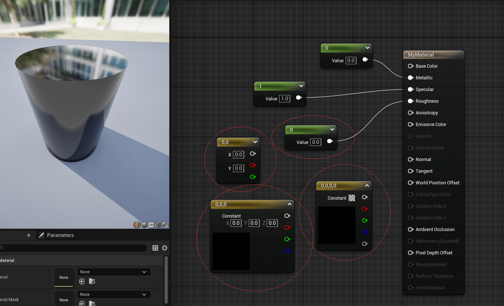
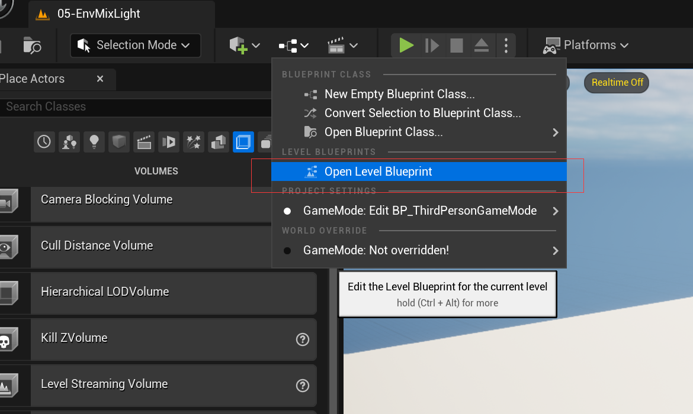
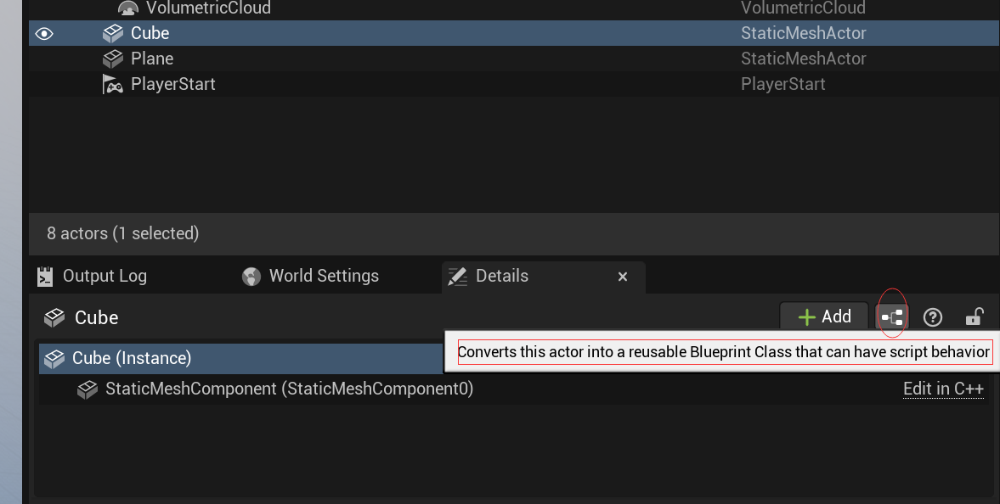

- [基础操作](#基础操作)
  - [移动操作](#移动操作)
  - [表面对齐](#表面对齐)
  - [单位移动](#单位移动)
  - [复制物体](#复制物体)
- [多个静态网格复合](#多个静态网格复合)
- [控制台](#控制台)
- [文件夹和组](#文件夹和组)
  - [文件夹](#文件夹)
  - [组](#组)
- [导入资源的设置](#导入资源的设置)
  - [FBX](#fbx)
- [创建几何体](#创建几何体)
  - [各个面分离](#各个面分离)
  - [表面吸附](#表面吸附)
  - [笔刷编辑模式](#笔刷编辑模式)
  - [掏](#掏)
  - [转换为staticmesh](#转换为staticmesh)
- [运行](#运行)
  - [从鼠标射线处开始运行](#从鼠标射线处开始运行)
- [材质](#材质)
  - [命名](#命名)
  - [1234快捷键](#1234快捷键)
  - [连线快捷键](#连线快捷键)
- [光](#光)
  - [自动曝光](#自动曝光)
  - [UE的天空光系统](#ue的天空光系统)
- [游戏运行设置](#游戏运行设置)
  - [从某处运行](#从某处运行)
  - [玩家生成位置](#玩家生成位置)
  - [pawn](#pawn)
  - [游戏模式](#游戏模式)
  - [F8弹出](#f8弹出)
- [体积（触发器）](#体积触发器)
- [蓝图](#蓝图)
  - [关卡蓝图](#关卡蓝图)
  - [actor蓝图](#actor蓝图)
  - [组件蓝图](#组件蓝图)
  - [结构体引脚分割](#结构体引脚分割)
  - [多actor蓝图](#多actor蓝图)
  - [实用节点](#实用节点)
  - [使用技巧](#使用技巧)
- [宏](#宏)
  - [宏库](#宏库)
  - [纯宏](#纯宏)
- [函数](#函数)
  - [纯函数](#纯函数)
- [全局数据](#全局数据)
- [UI](#ui)
- [输入](#输入)
- [操作快捷键](#操作快捷键)

# 基础操作

## 移动操作

- 鼠标左键    左右旋转 前后移动
- alt + 鼠标左键 = 鼠标右键  随意旋转
- 鼠标中间    平移

选中之后移动的时候按住 shift 可以镜头跟随移动。

## 表面对齐

表面对齐，根据中心点对齐鼠标相交物体表面。  

但是用的不多，毕竟他需要中心点，而我们一般都是用最外边框点，所以不如使用END键落地。

## 单位移动

## 复制物体

按住alt去移动，就会复制一个一模一样的物体。

ctrl+D复制物体，会有一个自动的位置偏移

# 多个静态网格复合

# 控制台

值得注意的是，控制台可以执行很多有用的命令，而且编辑器下许多按钮其实就是在控制台输入的，比如FPS显示按钮，其实就是 STAT FPS命令。

# 文件夹和组

## 文件夹

世界中的物体很多，有时候可能需要分门别类，比如人在一个文件夹，畜生在一个文件夹，某个房间一个文件夹，方便我们观看选择。

但是要注意这个文件夹删除的时候，旗下的物体不会被删除，而是放生到大世界中。别把自己恶心到了。

你可以通过多选物体然后右键去移动到某个文件夹下面。

## 组

可以为多个物体设置为一个组，具体表现在视图多选物体之后的右键中有一个创建组的按钮。

这样以后在选中这个组任意一个物体，都会默认选中整个组。方便移动。

Ctrl键+G 快速编组  shift键+G 快速取消编组

合成一组之后还可以unlock临时解锁组。

# 导入资源的设置

## FBX 

可以设置合并网格，不创建材质，缩放大小等

# 创建几何体

这样创建的几何体和普通的形体创建不同。

普通形体创建带有的组件叫 static mesh

几何体创建带有的组件叫 brush

## 各个面分离

可以对每个面赋不同材质，并且可以通过 brush setting 对每个面进行拉伸创建且不拉伸材质。

也就是每个面是分开的。

可以使用Geometry来对面进行多选。多选也可以直接把材质拖到某一个面上，也会给所有面都替换。

可以控制材质UV

## 表面吸附

几何体表面吸附依靠面的点，而不是普通形体的中心点

## 笔刷编辑模式

## 掏

## 转换为staticmesh

注意！几何体转换为静态网格体的时候，是不会生成阻挡的，需要在转换完成后手动生成一次，手动生成的这次就跟static mesh 手动生成的一样了，就很SB

手动生成阻挡

生成之后会多出一个东西，BlockingVolume

兄弟们，还是不要用几何体做实际游戏项目！太坑爹了。

# 运行

## 从鼠标射线处开始运行

# 材质

## 命名

一般使用 M_ 开始

## 1234快捷键

按住数字1然后鼠标左键去创建一个单值节点  
按住数字2然后鼠标左键去创建一个双值节点   
以此类推

3 对应颜色  
4 对应带透明度的颜色

## 连线快捷键

按住 alt 左键点击快速删除连线。

按住 Ctrl 键然后按住左键拖拽连线。

# 光

## 自动曝光

将直射光强度调低，你会发现UE依然会让其慢慢变亮

## UE的天空光系统

# 游戏运行设置

## 从某处运行

可以选中物体，直接右键然后从此处运行。

## 玩家生成位置

## pawn

游戏世界的操纵主体。也是actor，也是蓝图创建。

## 游戏模式

为当前project创建游戏模式就可以，world是对当前关卡的游戏模式创建，会覆盖 project 的 gamemode.

world 是更小的概念，跟 level 绑定。 project 是对整个项目所有关卡的默认设置。

然后为世界设置游戏模式，之后此关卡运行起来的时候，就会自动生成游戏模式actor。

## F8弹出

# 体积（触发器）

通过体积触发XXX

# 蓝图

关卡蓝图（一个关卡只有一份）

actor 蓝图 （有多少种actor就有多少蓝图）

组件蓝图（有多少种自定义组件就有多少蓝图）

## 关卡蓝图

## actor蓝图

## 组件蓝图

## 结构体引脚分割

## 多actor蓝图

## 实用节点

不受限于流程 sequence 同时执行多方代码

timeline 随时间变化输出多种数值

delay 自由延迟

make literal float 多个相同的字面量可以用这一个

do once 后面的节点只执行一次

## 使用技巧

可以使用子图整理预览，但是不能复用

可以使用函数整理蓝图，可以复用

可以按住alt点击连线，来断线

可以按住Ctrl点住连线，来换连

多选之后，按 C 添加注释。

# 宏

有多流程输出节点。

## 宏库

供所有使用。一些通用代码可以放在这里。

## 纯宏

也是省略了流程线，更加简洁。

# 函数

属于对应的Actor，别的蓝图想调用的话，需要指定Actor

## 纯函数

不改变游戏数据，在蓝图里显示的话，就没有流程线，比较简洁。

# 全局数据

创建 gameinstance 蓝图

在项目设置中可以设置 gameinstance

只有设置了这项之后，蓝图中的方法才能获取到咱们手动创建的那份

# UI

绑定 UI 各种属性，进行设置

# 输入

# 操作快捷键

G ： 隐藏显示一些场景提示

Ctrl + alt + F11 ： 编译代码并应用

