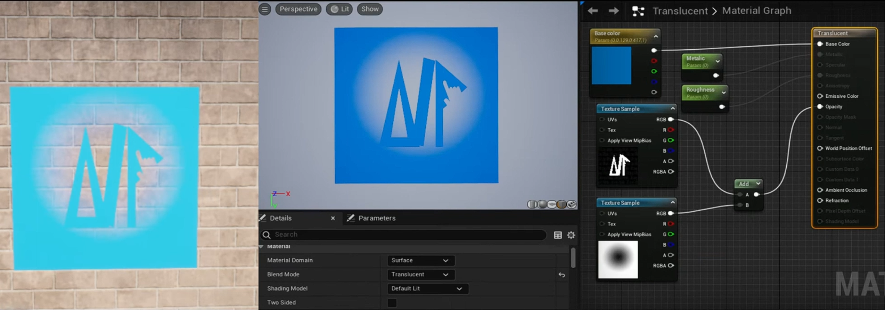

- [混合模式](#混合模式)
  - [Opaque](#opaque)
  - [Masked](#masked)
    - [Opacity Mask Clip Value](#opacity-mask-clip-value)
  - [Translucent](#translucent)
  - [Additive](#additive)
  - [Modulate](#modulate)
  - [AlphaComposite](#alphacomposite)
  - [AlphaHoldout](#alphaholdout)
- [常用快捷键节点](#常用快捷键节点)
  - [1234快捷键](#1234快捷键)
  - [L lerp 节点](#l-lerp-节点)
  - [S 参数节点](#s-参数节点)
    - [将单变量转换为参数](#将单变量转换为参数)
  - [M 乘法节点](#m-乘法节点)
  - [D 除法节点](#d-除法节点)
  - [C 创建注释](#c-创建注释)
- [常用节点](#常用节点)
  - [panner 平移器](#panner-平移器)
  - [sine 正弦函数](#sine-正弦函数)
  - [saturate 饱和函数](#saturate-饱和函数)
  - [sine\_remapped](#sine_remapped)
  - [Component Mask](#component-mask)
- [Texture Sample](#texture-sample)
- [法线贴图](#法线贴图)
- [材质偏移](#材质偏移)
- [杂项](#杂项)
  - [连线快捷键](#连线快捷键)
  - [预览材质效果](#预览材质效果)
  - [查看材质源码](#查看材质源码)

# 混合模式

blend mode

决定了该物体与其背后像素的融合方式

## Opaque

不透明混合：一个光线无法穿透的表面

支持所有光照特性（PBR、阴影、反射等）

## Masked

遮罩：黑白图以控制显隐

### Opacity Mask Clip Value

0-1，超过的显示，不超过的隐藏

## Translucent

半透明混合模式，用于需要某种形式透明度的对象，这与 Masked 混合模式不同，它允许不同程度的半透明。这种混合模式通过获取不透明度值或纹理来工作，并将其应用于表面，使黑色区域完全透明，白色区域完全不透明，而不同的色度导致相应的透明度水平。

## Additive

叠加混合，一般用来做各种特殊效果，什么火啊，光斑啊。

## Modulate

很适合做 “暗化” 或 “染色” 背景

## AlphaComposite

类似标准透明混合，适合 UI 或特殊合成

## AlphaHoldout

用透明贴图在背景上“挖洞”，做遮罩用

# 常用快捷键节点

## 1234快捷键

按住数字1然后鼠标左键去创建一个单值节点  
按住数字2然后鼠标左键去创建一个双值节点   
以此类推

3 可以对应颜色，位置  
4 可以对应带透明度的颜色

如果你把本应该连接3变量的槽位连接到1变量数据类型上，引擎会自动把其余两位按照1变量值填充。

如果你把本应该连接3变量的槽位连接到2变量数据类型上，填充默认值 0

## L lerp 节点

lerp 这个节点表示了 A-B 的程度

## S 参数节点

按住 S 左键，快速添加浮点数参数

### 将单变量转换为参数

## M 乘法节点

按住 M 键 添加乘法节点

把两个颜色混合在一起  这两个颜色甚至可以 uv 流动

## D 除法节点

## C 创建注释

可以更改注释字体大小和颜色

# 常用节点

## panner 平移器

## sine 正弦函数

## saturate 饱和函数

## sine_remapped

输入时间，最大值，最小值

输出 sine 随时间波动的数值范围

## Component Mask

可以遮罩数值

# Texture Sample

一般来说，如果你想做出一个物体表面各个地方展现出不同粗糙度，你可以使用 texture sample 采样一个噪音图。

这个噪音图一般是 rgb 三通道都是相同数值的，可能同样是 0.1，0.8 这种，但是各个位置不同。

噪音图可以使用初学者内容包中的 perlin noise

# 法线贴图

法线贴图作用就是让表面细节更加真实

# 材质偏移

ue里，想让东西动起来，要么写代码，要么使用材质 offset

# 杂项

## 连线快捷键

按住 alt 左键点击快速删除连线。

按住 Ctrl 键然后按住左键拖拽连线。

## 预览材质效果

可以右键节点预览效果，右键，start previewing node

## 查看材质源码

Window -> Shader Code -> HLSL Code