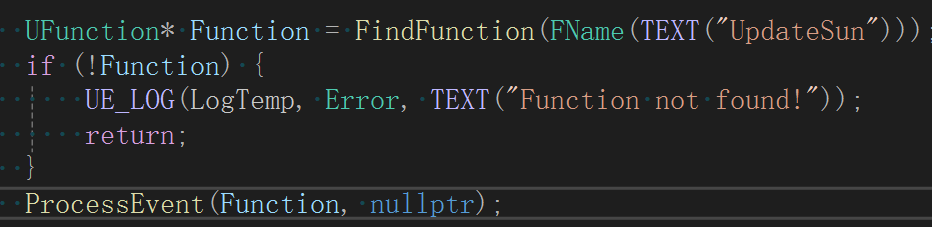
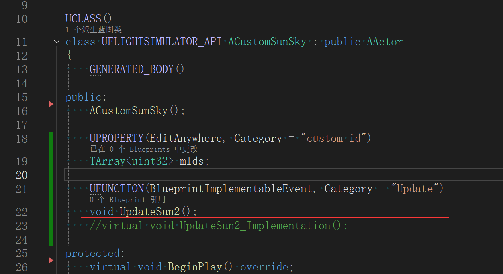
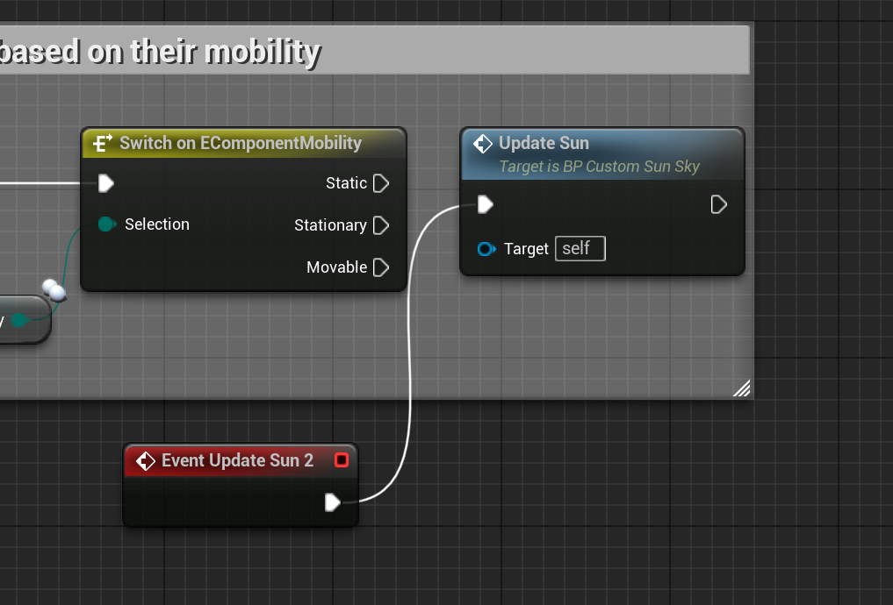
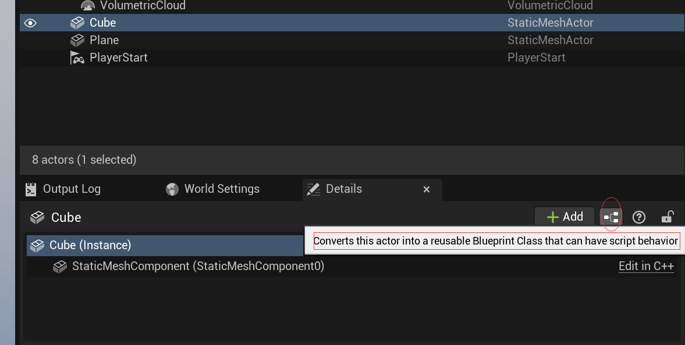
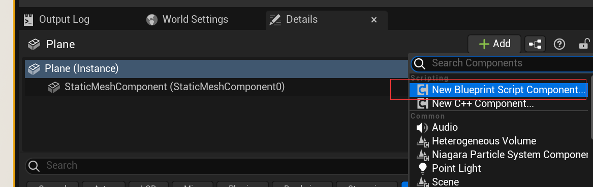
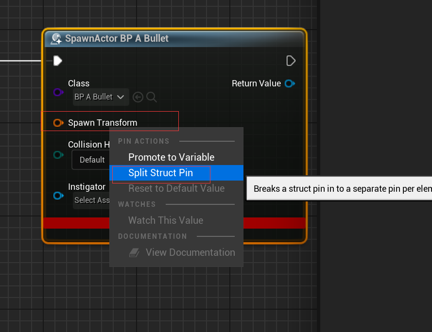
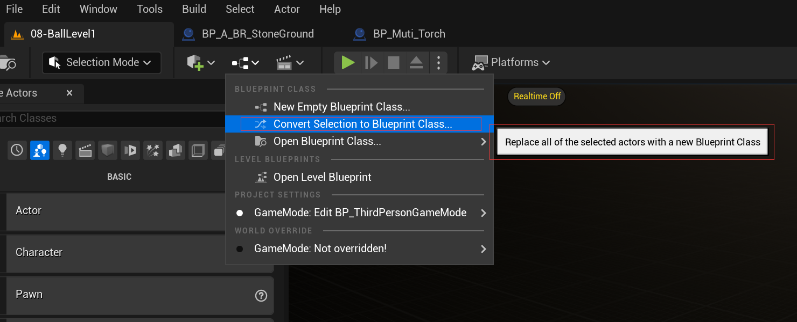

- [从已有 class 创建蓝图](#从已有-class-创建蓝图)
- [调用一个纯蓝图函数](#调用一个纯蓝图函数)
- [蓝图](#蓝图)
  - [关卡蓝图](#关卡蓝图)
  - [actor蓝图](#actor蓝图)
  - [组件蓝图](#组件蓝图)
  - [结构体引脚分割](#结构体引脚分割)
  - [多 actor 蓝图](#多-actor-蓝图)
  - [实用节点](#实用节点)
- [调试](#调试)

# 从已有 class 创建蓝图

可以从已有 class 中创建蓝图，来制作这份 “菜单”。

# 调用一个纯蓝图函数

我有两种方法去调用一个纯蓝图函数。

假如说，我想调用的函数是一个叫 UpdateSun 的函数

第一种是反射。代码会如下。

第二种是在C++中声明一个事件。

在 C++ 里，这个 UpdateSun2() 就可以当函数直接用。而蓝图中，需要在事件图表中，用这个事件，连接你想调用的蓝图函数。如下图

# 蓝图

关卡蓝图（一个关卡只有一份）

actor 蓝图 （有多少种actor就有多少蓝图）

组件蓝图（有多少种自定义组件就有多少蓝图）

## 关卡蓝图

## actor蓝图

## 组件蓝图

## 结构体引脚分割

## 多 actor 蓝图

## 实用节点

sequence ： 不受限于流程，可以同时执行多方代码

timeline ： 随时间变化输出多种数值

delay ： 自由延迟

make literal float ： 多个相同的字面量可以用这一个

do once ： 后面的节点只执行一次

# 调试

按下 D 进入此节点的调试显示。

按下 Ctrl + alt + D 关闭其他所有的调试显示，只保留当前的。
