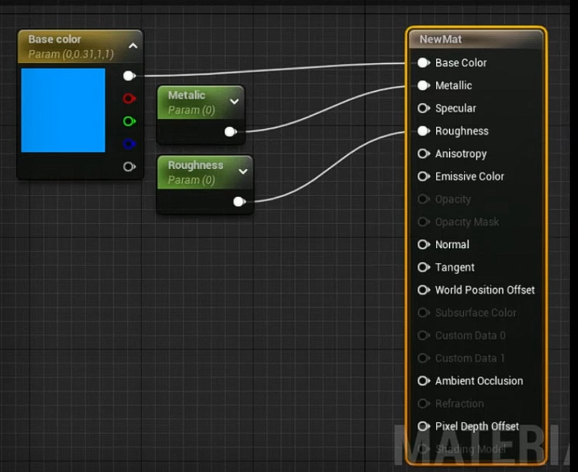
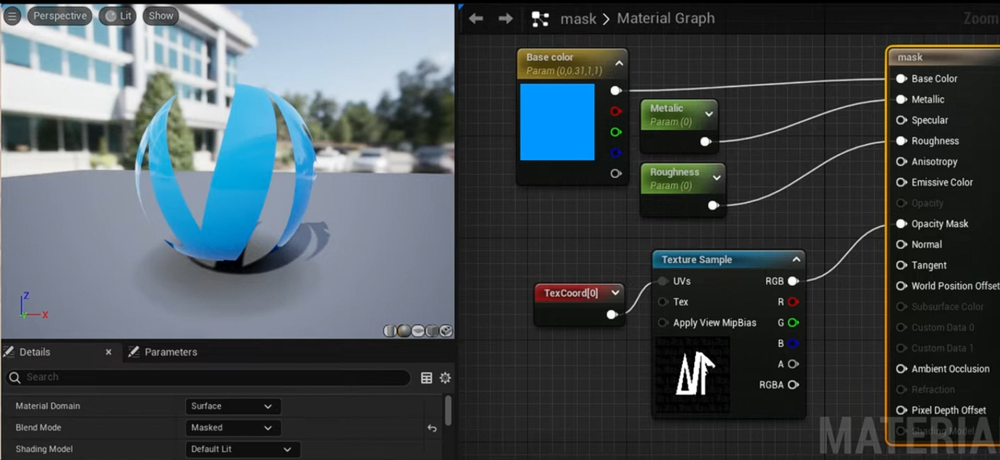
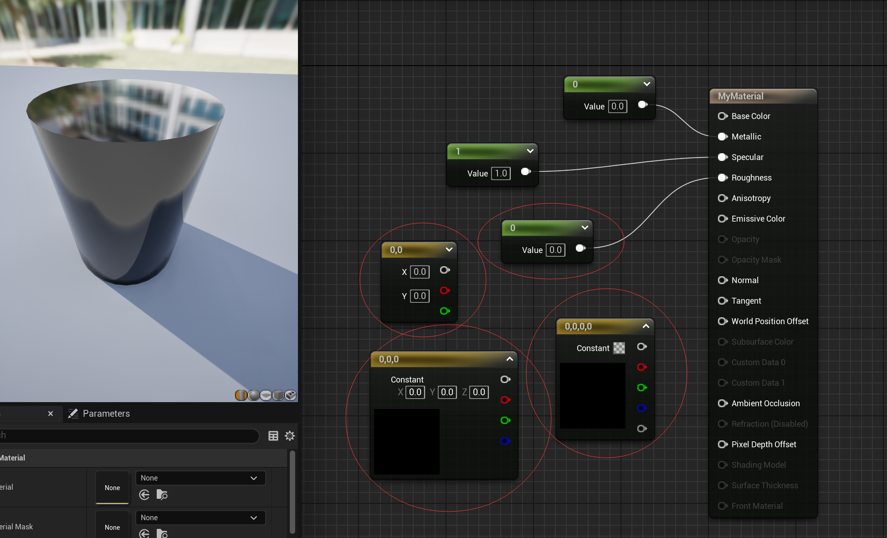
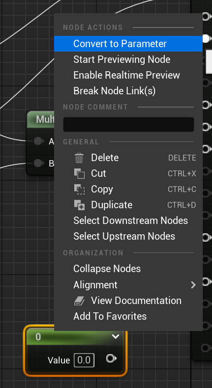
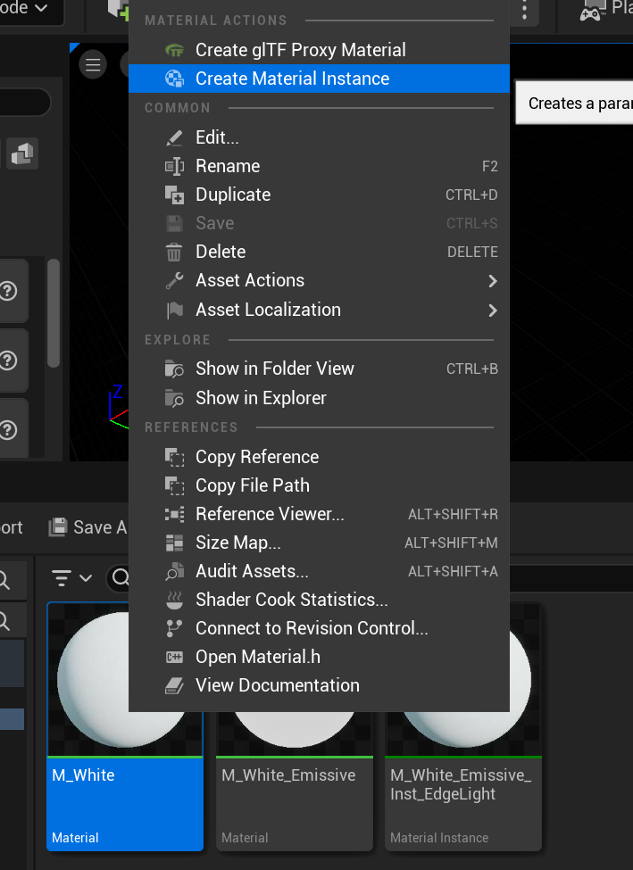

- [混合模式](#混合模式)
  - [Opaque](#opaque)
  - [Masked](#masked)
    - [Opacity Mask Clip Value](#opacity-mask-clip-value)
- [材质体系](#材质体系)
  - [基础材质](#基础材质)
  - [静态材质实例 MIC](#静态材质实例-mic)
  - [动态材质实例 MID](#动态材质实例-mid)
  - [为什么不能直接更改 MIC](#为什么不能直接更改-mic)
- [杂项](#杂项)
  - [命名](#命名)
  - [1234快捷键](#1234快捷键)
  - [将单变量转换为参数](#将单变量转换为参数)
  - [创建材质 Instance](#创建材质-instance)
  - [连线快捷键](#连线快捷键)

# 混合模式

决定了该物体与其背后像素的融合方式

## Opaque

不透明混合：一个光线无法穿透的表面

## Masked

遮罩：黑白图以控制显隐

### Opacity Mask Clip Value

0-1，超过的显示，不超过的隐藏

# 材质体系

## 基础材质

UMaterial：基础材质（母材质）

## 静态材质实例 MIC

UMaterialInstance：静态材质实例（Material Instance Constant MIC）

可以在编辑器里调参数，但运行时一般不改。

## 动态材质实例 MID

UMaterialInstanceDynamic：动态材质实例（Material Instance Dynamic）

运行时由代码创建的实例。可以在运行时用函数更改参数。

## 为什么不能直接更改 MIC

万一这个东西被其他地方用着呐，一更改就连带了。

标准做法是：
- MIC 当 “模板” 
- 运行时创建 MID 

# 杂项

## 命名

一般使用 M_ 开始

## 1234快捷键

按住数字1然后鼠标左键去创建一个单值节点  
按住数字2然后鼠标左键去创建一个双值节点   
以此类推

3 对应颜色  
4 对应带透明度的颜色

## 将单变量转换为参数

## 创建材质 Instance

## 连线快捷键

按住 alt 左键点击快速删除连线。

按住 Ctrl 键然后按住左键拖拽连线。

