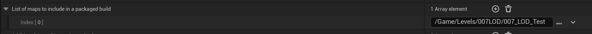
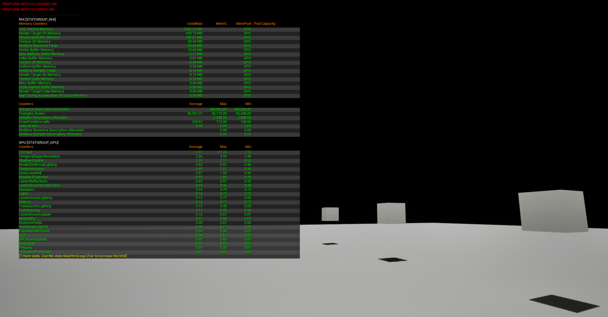
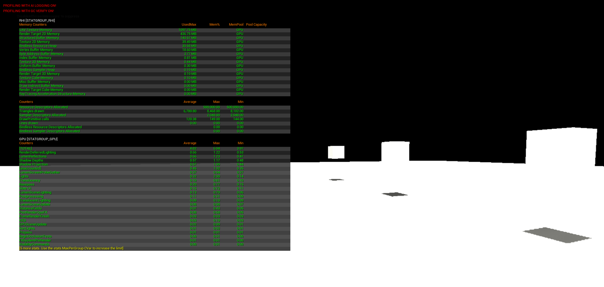

- [打包测试](#打包测试)
  - [报错：EOS](#报错eos)
  - [仅打包当前关卡](#仅打包当前关卡)
  - [性能分析工具](#性能分析工具)
- [空关卡优化](#空关卡优化)
  - [关闭后处理](#关闭后处理)

# 打包测试

## 报错：EOS

```Cpp
LogEOSSDK: Warning: LogHttp: Retry exhausted on https://api.epicgames.dev/sdk/v1/default?platformId=WIN
LogEOSSDK: Warning: LogEOS: Failed to connect to the backend. ServiceName=[SDKConfig], OperationName=[GetPlatformConfigRoute], Url=[<Redacted>]
LogEOSSDK: Warning: LogEOS: SDK Config Platform Update Request Failed, Result Code: EOS_NoConnection, Retrying after 12.939116 seconds
```

这个警告是因为打包后的程序默认集成了 Epic在线服务（EOS）SDK，它在启动时会自动尝试连接 Epic 的服务器。如果你的项目本身不需要多人联网、语音聊天或使用 Fab 商城的资产，这个错误可以直接忽略，它不会影响你的性能测试和单机游戏逻辑

直接禁用 EOS（纯单机项目推荐）

关闭插件：在 UE 编辑器中，点击 编辑 (Edit) -> 插件 (Plugins)，搜索 EOS，将 Online Subsystem EOS 和 EOS Shared 这两个插件的勾选去掉。

注意：如果 EOS Shared 提示是 Fab 或其它插件的依赖而无法禁用，可以先保留它。

我的测试中，EOS Shared 确实有勾选，取消勾选时出现了 Fab 依赖警告，我先确认取消，然后又取消了。这样一来 UnrealCPPStudy.uproject 中新添了代码

```Cpp
{
	"Name": "Fab",
	"Enabled": false
},
{
	"Name": "EOSShared",
	"Enabled": true
}
```

结果就是，这项报错消失了。

## 仅打包当前关卡

将 "游戏默认地图" 和 "编辑器默认地图" 都设为测试关卡。同时，确保 "打包时要包含的地图列表" 里只有这一个关卡

添加需要打包的地图，如果不指定的话，会把所有关卡打包的，如果指定了，只打包指定的。


检查"永远烘焙的目录"：在"项目设置 → 打包"里，有个 "要永远烘焙的额外资产目录( Additional directories to always cook )"。看看里面是不是指定了一些庞大的文件夹，如果有，把它们清空或移除

打包后，通过 窗口( Window ) → 开发者工具( Developer Tools ) → 资产审计( Asset Audit ) 查看包体构成。这里可以直观地看到每个资产占用了多少空间，帮你揪出体积大户

一个更彻底的方法是：右键点击你的小关卡，选择 "资产操作( Asset Actions )" → "迁移( Migrate… )"，把它迁移到一个全新的、空白的项目中。如果迁移后打包出来很小，就说明原项目里有顽固的隐藏引用

## 性能分析工具

- 打包你的项目：打包 Development 配置即可，它默认就支持 Insights 录制，无需额外配置。
- 启动并录制：运行打包后的游戏，按 ~ 打开控制台，输入以下命令：
  - 开始录制：Trace.Start cpu,gpu,rendering,bookmark,frame
  - 停止录制：Trace.Stop
- 找到文件：录制完成后，.utrace 文件会自动保存在你打包出来的项目的 Saved/Profiling/ 目录下。文件名就是时间戳，方便你管理。

- 启动工具：在你的 Epic Games 安装目录下，找到 Engine\Binaries\Win64\UnrealInsights.exe，双击打开它。
- 打开文件：在 Insights 窗口里，直接把上一步生成的 .utrace 文件拖进去，或者通过界面的 "Open" 按钮选择文件。
- 分析 GPU 时间线：文件加载后，双击打开 Timing Insights 面板。这里就是你分析的主战场

# 空关卡优化

直接创建一个 Empty Level，然后打包运行

~ 打开控制台，输入 stat rhi 和 stat gpu 查看渲染信息



可以看到空场景的三角形绘制都非常高！再一看渲染耗时，后处理、AO 等占了大头，这严重影响我们对性能测试的观测。我们可以粗暴地逐个关闭！顺带一提，可以逐个关键字搜索以了解各种效果。

目前 T 36718 DC 173

## 关闭后处理

showflag postprocessing 0



目前 T 8468 DC 149

所以可以在场景中 创建 (Create) > 视觉效果 (Visual Effects) > 后期处理体积 (Post Process Volume)

请注意这里的 8K 多，是包含了 UI 本身的。通过 stat unit 看 只有 1200 左右，这 1200 也是包含了 unit ui 本身的。

所以应该是 T 1200 DC 44 
