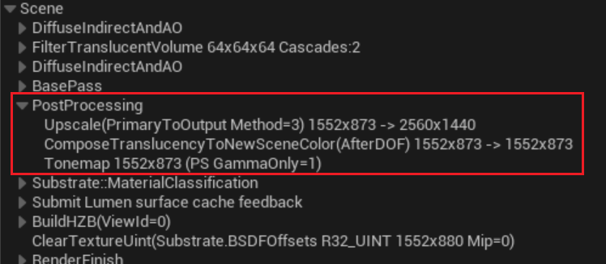
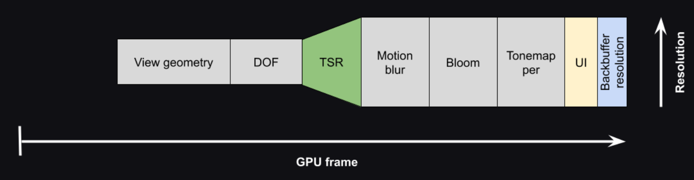

- [动态分辨率 和 TSR](#动态分辨率-和-tsr)
- [动态分辨率](#动态分辨率)
  - [Debug](#debug)
  - [支持动态分辨率的平台](#支持动态分辨率的平台)
- [Upscale 升采样 / 上采样器](#upscale-升采样--上采样器)
  - [为什么要用低分辨率渲染？](#为什么要用低分辨率渲染)
  - [上采样（Upscale）是如何 “无中生有” 的？](#上采样upscale是如何-无中生有-的)
  - [修改输入的分辨率](#修改输入的分辨率)
- [TSR](#tsr)

延续空场景测试，去学习后处理

# 动态分辨率 和 TSR

动态分辨率（Dynamic Resolution Scaling, DRS） 的核心思想是“弹性渲染”。它不再死守一个固定的渲染分辨率（如 1920x1080），而是允许引擎在运行时根据 GPU 的实时负载，在一个预设的范围内（例如 70% 到 100% 的屏幕分辨率）动态调整内部渲染缓冲区的尺寸。当场景复杂度突然激增，GPU 快要“忙不过来”导致帧率下降时，DRS 会自动降低渲染分辨率（比如降到 80%），以减轻 GPU 的负担，优先保证帧率的稳定。反之，当 GPU 游刃有余时，它又会将分辨率拉回甚至超过 100%，提供更清晰的画面。

然而，单纯地降低分辨率带来的模糊感非常影响体验。这时，时间超分辨率（Temporal Super Resolution, TSR） 就登场了。TSR 是 UE5 默认且强大的抗锯齿和上采样解决方案。它不仅仅处理锯齿，更是一项基于时间累积的重建技术。简单来说，TSR会利用当前帧以及之前数帧的历史信息，通过复杂的时空重投影算法 ，“猜测”出更高分辨率下的画面细节。这意味着，即使引擎内部是以较低的分辨率（如 80%）进行渲染，TSR 也能通过智能重建，输出一个视觉上接近甚至超越原生 100% 分辨率的图像质量。

# 动态分辨率

动态分辨率 可根据先前画面的 GPU 工作负载调节主要屏幕百分比。分辨率是基于启发法（按需要）调节的，例如，如果在屏幕上有太多 Object，或者有成本高昂的效果突然进入画面，GPU 渲染时间将会延长，此时为了维持目标帧率就会降低屏幕分辨率。

## Debug

- Stat Unit 用于查看总体帧时间，以及游戏线程、渲染线程和GPU时间。
- Stat UnitGraph 用于查看使用 Stat Unit 的数据制作的图。
- Stat Raw 使用 Stat UnitGraph 输出未经过滤的数据。

## 支持动态分辨率的平台

# Upscale 升采样 / 上采样器

这是一个图像处理技术。它负责把低分辨率的画面“放大”到屏幕的显示分辨率。UE5 默认的 TSR（Temporal Super Resolution） 不仅会放大画面，还会结合历史帧数据来抗锯齿并重建细节，让低分辨率画面看起来尽可能接近原生高分辨率的效果

Upscale (primary to output method) 1552x873 -> 2560x1440

它指引擎实际渲染 3D 场景时，只用了 1552x873 这个较低的分辨率，然后通过上采样（Upscale）技术，把画面放大并输出到 2560x1440（2K）的显示器上。

是用牺牲一小部分画质为代价，来大幅减轻显卡的负担，从而提升游戏的运行帧率

## 为什么要用低分辨率渲染？

把 1552x873 渲染成 2560x1440，显卡需要处理的像素数量减少了约 63%。这能显著降低 GPU 的负载，让你更容易获得流畅的帧率，或者留出性能空间去实现更复杂的光影特效。

## 上采样（Upscale）是如何 “无中生有” 的？

早期的简单放大（如双线性）会导致画面模糊。而如今虚幻引擎默认使用的是更高级的时序上采样（Temporal Upscaling） 技术，它能利用历史帧的数据，通过算法“猜”出更多细节，让低分辨率渲染的画面在经过放大后，依然能保持接近原生 2K 的清晰度。

这个技术主要包含以下几种，原理类似：

TAAU（时序抗锯齿上采样）：UE4 时期的默认方案。

TSR（时序超级分辨率）：UE5 自带的高质量上采样器，效果更好。

DLSS / FSR / XeSS：NVIDIA、AMD 或 Intel 提供的第三方方案，如果你开启了这些，这里的提示词也可能指代它们

## 修改输入的分辨率

r.ScreenPercentage 63  原本是大概 63%

r.ScreenPercentage 1 即表示以显示分辨率的 1% 进行渲染

但是渲染的三角形数量没有变

# TSR

时间超级分辨率 （TSR）是一个与平台无关的时间分辨率修改器，它使虚幻引擎能够渲染美丽的 4K 图像。由于将一些开销大的渲染计算分摊到了许多帧，图像的开销只占一小部分。TSR 的做法是渲染比虚幻引擎 4 中的时间抗锯齿上采样（TAAU）更低的内部分辨率。

