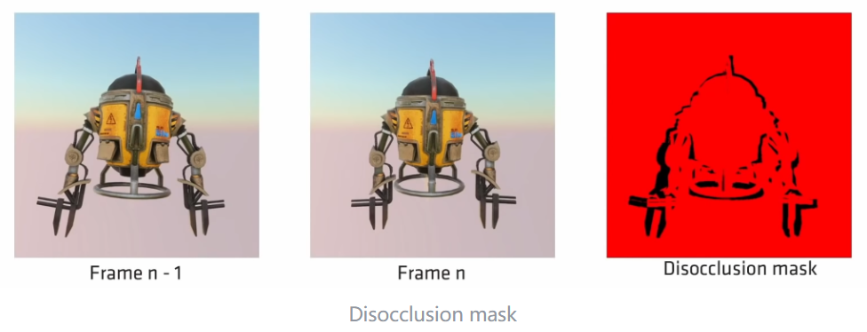

- [TAA](#taa)
- [DLSS](#dlss)
  - [DLSS 3](#dlss-3)
- [FSR](#fsr)
  - [FSR 2](#fsr-2)
- [TSR](#tsr)

# TAA

[^1]

# DLSS

## DLSS 3

DLSS 2 + MEMC（运动估计补偿）

MEMC 这个东西在视频上用的多，但是播放视频和游戏有个本质上的区别，解码的内容是有缓冲的，因此可以在 n 和 n+1 帧之间插值，而游戏哪来的 n+1 帧呢？做法也很简单粗暴，就是等 n+1 渲染完，去合成 n + 0.5，外加强制开启 NV 自家的 Reflex，尽可能降低帧渲染到显示的延迟，粗略来说延迟 DLSS 2 < DLSS 3 ≈ 原生分辨率。Reflex 在这里用于渲染指令的同步提交，有助于减少 CPU 和 GPU 之间的延迟。[^2]

# FSR

## FSR 2

AMD 最新开源的超分技术，可以媲美 DLSS 2。和 FSR 1 有一脉相承的东西，但是不多，比如 FSR 1 的 RCAS 锐化被用在了 upscale 上。[^3]

FSR 2 首先是需要区分哪些区域是有历史数据的，这和 TAA 是类似的，需要将上一帧的信息重投影（术语：reconstruction, reprojection or scatter ）到当前帧，与当前帧的深度做比对，获得 disocclusion mask。

对于 disocclusion mask 所排除的部分，即没有历史数据的部分，就将当前画面施加一个比较模糊的 RCAS 上采样，混合到最终画面里。

对于有历史数据的部分，FSR 2 采用了了两种方式：

1. 普通表面，使用 TAA 中的思想，将历史颜色 rectify 至 3x3 像素构成的 YCoCg 颜色 box 中，然后与 RCAS 上采样的颜色混合，并记录下已经混合的权重（权重有最大值，因此满足一定数量后历史颜色的比重会自然降低）。
2. 精细结构（尤其是 <1px 的细节区域），在 TAA 中也是最容易产生闪烁的部分，将这部分区域识别出来加一个 pixel lock，pixel lock 的失效时间和抖动序列的长度一致，这样在静态情况下正好可以覆盖一整个抖动序列的采样数量。其中的像素混合则不经过 clamping，可以获得较为精细的结果。

# TSR

作为前代技术的 TAAU，是 TAA 融合了 upscale，在合成步骤使用了上采样的方式，TAA 所带来的渲染闪烁（时空摩尔纹）以及精细结构的不稳定性，会被简单的上采样所放大。因此在 UE5 时代 TSR 应运而生，作为内置的超分功能，应用起来相当简单。

TSR 的第一步与 FSR 2 和 TAA 类似，也是通过重投影的深度差异计算 parallex rejection mask，剔除掉没有历史数据的部分。它还能额外的生成 static mask，将世界坐标和屏幕坐标都相对静止的像素提取出来。和 FSR 2 不同的是，TSR 通过这个 static mask 来区分有历史数据的像素，并在 moire detection 中区别对待：

1. 静态像素，因为欠采样会产生摩尔闪烁，需要根据其历史帧的明度闪烁程度（方差），为当前像素的 YCoCg clamping 增加一个 damping。实现方法是存储一定时间内低频亮度样本的均值、方差和权重，理论上可以存储无限长时间，但是会带来拖影问题，这里默认只保留 3 帧的数据，通过权重衰减历史值。
2. 动态像素，因为移动的物体不产生规律的闪烁，也容易产生拖影，因此不能对颜色裁剪施加额外的 damping，退化为原始的 TAA。

根据摩尔检测的结果的，TSR 还会调整 rejection 的值。在 parallex 和 moire 两步中被 reject 掉的像素采取简单的 FXAA 再混合。

[^1]: TAA https://www.elopezr.com/temporal-aa-and-the-quest-for-the-holy-trail/

[^2]: Nvidia DLSS 3 on RTX 4090 - Exclusive First Look - 4K 120FPS and Beyond https://www.youtube.com/watch?v=6pV93XhiC1Y

[^3]: FSR 2  https://github.com/GPUOpen-Effects/FidelityFX-FSR2 https://www.youtube.com/watch?v=97JIldpUGE4&

