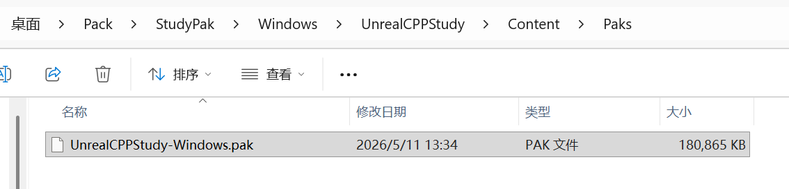

- [是一个虚拟文件系统](#是一个虚拟文件系统)
- [用来解决什么问题？](#用来解决什么问题)
- [Chunk](#chunk)
	- [打标记](#打标记)
	- [强引用](#强引用)
	- [静态挂载](#静态挂载)
- [UE5.3 使用指南](#ue53-使用指南)
	- [取消 “使用 IO 保存”（Use Iostore）](#取消-使用-io-保存use-iostore)
	- [取消 “共享材质着手器代码”（Share Material Shader Code）](#取消-共享材质着手器代码share-material-shader-code)
	- [烘焙](#烘焙)
	- [UnrealPak.exe](#unrealpakexe)
	- [挂载](#挂载)
- [实例](#实例)
	- [打包 pak](#打包-pak)

它就像一个游戏专用的“加密压缩大箱子”，它是一个虚拟文件系统。

# 是一个虚拟文件系统

游戏启动后，引擎会把 PAK 文件挂载成一个虚拟的硬盘分区，让你用虚拟路径来访问里面的内容。

- 对开发者透明：你不用关心“某个贴图在 3 号 PAK 包的 0x1A2B 偏移处”，只需用标准的 UE 路径 Game/Textures/Icon.png 就能加载到。
- 统一的目录树：引擎会把所有 PAK 包、Mod 和游戏本体 Content 目录合并成一颗统一的虚拟目录树。加载时，按挂载顺序从上往下找。
- 挂载点（Mount Point）：决定了这个“大箱子”里的内容会被“挂”在虚拟目录树的哪个分支上（如 /Game/DLC1/）。引擎主要靠它来整合和管理所有的 PAK 文件。

# 用来解决什么问题？

- 极致的加载性能：如果游戏有 10 万个零散文件，机械硬盘读写会极慢。打包成一个连续的 PAK 大文件，磁盘磁头不用频繁跳动，顺序读取极快。启动时只需先读一个“目录清单”，就能快速查找所有文件。
- 资源的封装与加密：将所有资源打包在一起，可以整体加密或签名。不像零散文件那样能被轻易修改或盗用。
- 灵活的模块化管理：游戏本体是 game.pak，DLC 可以用 dlc_1.pak、patch_1.pak……你可以独立制作、测试和分发这些内容，挂载即可用。当有补丁时，patch_1.pak 里同名的新文件会覆盖旧文件，轻松实现热修复。
- 跨平台分发便捷：最终交付只有一个大文件，极大简化了商店提交、下载和安装流程。

# Chunk

UE 打包时，所有没指定 Chunk ID 的资产默认都会进入 pakchunk0（也就是你的主包）；如果你给某个资产指定了一个非零的 Chunk ID（比如 1），它就会被单独打包进 pakchunk1

## 打标记

1. 在对应资源的文件夹里创建 Primary Asset Label：菜单中选择 Miscellaneous (杂项) -> Data Asset (数据资产)
2. 配置 Primary Asset Label：
   1. 分配 Chunk ID （-1 没分配进默认包， 0 默认包， 其他数字对应一个 包）
   2. Always Cook (始终烘焙) 还是 被引用了才烘焙
   3. 应用给整个文件夹。 勾选 Label Assets in My Directory (标记我的目录中的资产)。这样，这个文件夹里的所有资产，包括你的正方体蓝图，都会自动被打上 Chunk ID=X 的标签
   4. 手动指定资产。 找到 Explicit Assets (显式资产) 数组，点击 + 号，从列表里选择你的正方体蓝图

## 强引用

如果这个资源是被主包资源强引用了，比如主场景中有这个资源引用，那么这个资源一定会进入主包中，一定是建立起动态加载的弱引用资源才会真的隔绝

## 静态挂载

凡是在 Content/Paks/ 下的包都会被 UE 启动时全部挂载，所以如果想达到动态加载效果，还是将他们放到别的文件夹下，手动去挂载。

# UE5.3 使用指南

## 取消 “使用 IO 保存”（Use Iostore）

别用新的 Zen Loader（Zen 加载器）和 I/O Dispatcher（I/O 调度器）了，用回 UE4 时代那套 Event Driven Loader（EDL，事件驱动型加载器）

## 取消 “共享材质着手器代码”（Share Material Shader Code）

其实应该是要开启的，只不过关闭了会减少材质 pak，更清晰

## 烘焙

## UnrealPak.exe

使用 UE 引擎的 UnrealPak.exe 在这个文件所在路径下，使用命令行 .\unrealpak D:\Paks\test01.pak -create=E:\PAKTest\Saved\Cooked\Windows\PAKTest\Content\TestAssets

其中 D:\Paks\test01.pak 就是你要打包成的目标文件路径，E:\PAKTest\Saved\Cooked\Windows\PAKTest\Content\TestAssets 是你要打包的内容。

unrealpak D:\Paks\test01.pak -list

可以看到 pak 里面的内容，可以发现其实就是把烘焙的文件压缩存储在了 pak 中

pak 文件在运行时是只读的

## 挂载

- 将上一步生成的 Pak 挂载到我们的运行包中
- 挂载好对应的信息后，我们需要将那些对象具体的创建出来，这时才算加载成功。
- 完成之后，只需要打一个包就好啦

```Cpp
void UPakAssetLoadSystem::MountPaks(const FString& InPakPath, bool IsPluginContent)
// InPakPath 是上一步生成的 Pak 文件完整路径
// IsPluginContent 是为了区分是否是插件内容，因为处理会不一样
{
    // 保存当前物理文件系统
	IPlatformFile* OldPlatform = &FPlatformFileManager::Get().GetPlatformFile();
    // 从 UE 的文件系统链中查找并取出已注册的 Pak 文件系统接口
	FPakPlatformFile* PakPlatformFile = static_cast<FPakPlatformFile*>(FPlatformFileManager::Get().FindPlatformFile(FPakPlatformFile::GetTypeName()));

	if (!FPlatformFileManager::Get().GetPlatformFile().FileExists(*InPakPath))
	{
		UE_LOG(LogTemp, Warning, TEXT("Pak path not exists: %s"), *InPakPath);
		return;
	}

	// 用物理接口打开 Pak 文件，解析其索引结构（不加密） 第三个参数是表示 Pak 是否加密，加密流程跟 Pak 创建相关 这里都是不加密
    // 构造一个 FPakFile 对象 : 打开 .pak 文件 -> 读取 Pak 文件头，验证魔数 -> 加载 Pak 索引（文件目录树结构） -> 建立文件路径-偏移量 的映射表
	const TRefCountPtr<FPakFile> TmpPak = new FPakFile(OldPlatform, *InPakPath, false);
    // 从已打开的 Pak 文件中提取其挂载点路径 
    // 每个 Pak 文件在制作时会写入一个 MountPoint（通常是被打包内容的根目录路径，比如 "../../../MyGame/Content/"），用来在运行时把 Pak 内的文件路径映射到虚拟文件系统。
	const FString OldPakMountPath = TmpPak->GetMountPoint();
	int32 FindPos;
	if (IsPluginContent)
	{
		FindPos = OldPakMountPath.Find("Plugins/");
	}
	else
	{
		FindPos = OldPakMountPath.Find("Content/");
	}

	// 这一步是为了将不同来源的资产的目前前缀给去掉，生成新的当前项目下的挂载点
	FString NewMountPath = OldPakMountPath.RightChop(FindPos);
	NewMountPath = FPaths::Combine(FPaths::ProjectDir(), NewMountPath);
	// 把新挂载点写回 Pak 对象
	TmpPak->SetMountPoint(*NewMountPath);

#if WITH_EDITOR
// 编辑下不要执行 Mount 操作，不然大概率会跟你的现有资产冲突
#else
	// 挂载顺序（Mount Order），数字越小优先级越高
	if (PakPlatformFile->Mount(*InPakPath, 1, *NewMountPath))
	{
		// 列出 Pak 文件挂载点目录下的所有文件名（不含完整路径，只取文件名部分）
		// TmpPak->FindPrunedFilesAtPath(
		//     FoundFilenames,              // 输出：存放结果
		//     *TmpPak->GetMountPoint(),    // 要查找的目录路径
		//     true,                        // bRecurse = true，递归查找子目录
		//     false,                       // bIncludeDirectories = false，不包含目录名
		//     true                         // bIncludeFiles = true，包含文件名
		// );
 		TArray<FString> FoundFilenames;
		TmpPak->FindPrunedFilesAtPath(FoundFilenames, *TmpPak->GetMountPoint(), true, false, true);

		TArray<FString> ParsedLevels;
		for (const auto& FileName : FoundFilenames)
		{
			if (FileName.EndsWith(TEXT(".umap")))
			{
				FString NewFileName = ConvertPakFile(FileName, IsPluginContent);// 根据 UE 的规则，需要将原始路径转换下
				NewFileName.RemoveFromEnd(TEXT(".umap"));

				RegisterLevel(NewFileName);// 对于关卡资产，后面会讲如何对关卡进行流送加载，但首先需要将关卡加入到 World 中

				ParsedLevels.Add(NewFileName);
			}
		}
	}
#endif

	FPlatformFileManager::Get().SetPlatformFile(*OldPlatform);// 将 PlatformFile 换成默认的，防止其他加载出现问题
}

FString UPakAssetLoadSystem::ConvertPakFile(const FString& InFileName, bool IsPluginContent)
{
	FString NewFileName = InFileName;

	// 主要就是将原始目录变成平时进行资产引用的路径
	if (IsPluginContent)
	{
		const FString PluginsPath = FPaths::Combine(FPaths::ProjectDir(), TEXT("Plugins"));
		NewFileName.ReplaceInline(*PluginsPath, TEXT(""));
		NewFileName.ReplaceInline(TEXT("/Content"), TEXT(""));
	}
	else
	{
		const FString PathDir = FPaths::ProjectContentDir();
		NewFileName.ReplaceInline(*PathDir, TEXT("/Game/"));
	}

	return NewFileName;
}

void UPakAssetLoadSystem::RegisterLevel(const FString& LevelName) const
{
	FString LongPackageName;
	// 这一步比较关键，大部分时候是 LevelName 会有问题，后面会细讲
	const bool bOutSuccess = FPackageName::SearchForPackageOnDisk(LevelName, &LongPackageName);

	if (!bOutSuccess)
	{
		UE_LOG(LogTemp, Warning, TEXT("RegisterLevel SearchForPackageOnDisk failed: %s!"), *LevelName);

		return;
	}

	// 这里采用的是流送关卡的方式，
	const FString StreamLevelName = CreateStreamInstance(GetWorld(), LongPackageName);

	UE_LOG(LogTemp, Warning, TEXT("RegisterLevel success: %s!"), *StreamLevelName);
}

FString UPakAssetLoadSystem::CreateStreamInstance(UWorld* World, const FString& LongPackageName) const
{
	const FString ShortPackageName = FPackageName::GetShortName(LongPackageName);
	const FString PackagePath = FPackageName::GetLongPackagePath(LongPackageName);

	FString UniqueLevelPackageName = PackagePath + TEXT("/") + World->StreamingLevelsPrefix + ShortPackageName;

	const UClass* StreamingClass = ULevelStreamingDynamic::StaticClass();
	ULevelStreamingDynamic* StreamingLevel = NewObject<ULevelStreamingDynamic>(
		World, StreamingClass, NAME_None, RF_Transient, NULL);

	StreamingLevel->SetWorldAssetByPackageName(FName(*UniqueLevelPackageName));
	StreamingLevel->LevelColor = FColor::MakeRandomColor();

	StreamingLevel->LevelTransform = FTransform(FRotator::ZeroRotator, FVector::ZeroVector);

	StreamingLevel->PackageNameToLoad = FName(*LongPackageName);
	StreamingLevel->SetShouldBeLoaded(false);
	StreamingLevel->SetShouldBeVisible(false);
	StreamingLevel->bShouldBlockOnLoad = false;

	World->AddUniqueStreamingLevel(StreamingLevel);

	return UniqueLevelPackageName;
}
```

# 实例

## 打包 pak



我就一个空场景，但是项目里确实有很多其他资源，不过不知道有没有包含到这个 pak 里，反正目前打包出来就是一个 pak。

通过命令（UnrealPak.exe C:\Users\HP\Desktop\YourPak.pak -List > C:\Users\HP\Desktop\pak_contents.txt）查看其详细内容发现，大部分都是 engine 目录下的，属于引擎自身内容，还有小部分是其他资源，比如有一个 editor 插件居然被放到 pak 中

试试 Exclude Editor Content When Cooking 烘焙时排除编辑器内容

确实有减少，不过那个插件似乎并没有减少，之后再说吧。

新增一个正方体蓝图，将它作为一个单独的 pak 使用 chunk 功能