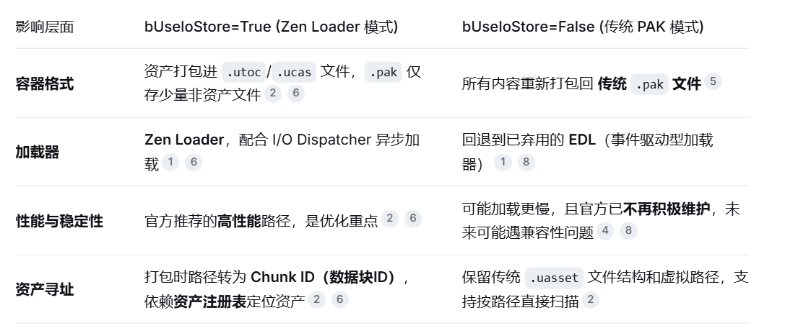

# 存储结构

- 传统 PAK：像个大木箱。内部保留了完整的虚拟文件路径，文件之间是离散存放的。
- IoStore：则分成了两个部分。.utoc 文件是“仓库的电子地图/目录”，记录了数据块大小、偏移量等元信息；.ucas 文件则是立体货架本身，所有资产数据被紧密地打包成一个个数据块（Chunks），不再暴露传统文件路径

# 寻址与依赖加载

- 传统 PAK （程序自己跟着地图找）：运行时，CPU 得先通过文件路径找到位置，再一层层去追踪并加载依赖项，这个过程很消耗 CPU 资源
- IoStore （仓库管理系统预先算好）：在打包（Cook）阶段，引擎就提前离线计算好了所有资产的依赖关系图。这意味着在加载时，CPU 根本不用费心去现场找依赖，直接根据 Chunk ID 高速拉取即可，加载效率得到巨大提升

# 加载机制

- 传统PAK：依赖事件驱动加载器（EDL），这个加载器在UE5中已经被标记为弃用（Deprecated）
- IoStore：采用全新的 I/O 调度器（I/O Dispatcher），能针对不同平台（如PS5、PC的DirectStorage）的硬件API进行专门优化，将数据直接高速加载到目标内存位置

# 关键认知：动态加载方式的彻底不同

- 资源不再有“文件路径”：Zen Loader模式下，资产不再以独立的.uasset文件存在，所以无法再用传统的文件路径去查找或挂载
- 强制使用资产注册表：你必须依赖资产注册表（Asset Registry） 来发现和管理新挂载的资产
- 挂载点（Mount Point）不再支持：传统PAK可以灵活修改挂载点，但在IoStore下，由于依赖关系在打包时已用绝对路径（/Game/...）硬编码好，无法再自定义挂载点。如果需要实现类似分离，通常建议在打包前就将内容做成插件（Plugin） 的形式

# “使用IO保存”（Use Iostore）

这是项目设置

使用 Zen Loader（Zen 加载器）和 I/O Dispatcher（I/O 调度器） 还是 Event Driven Loader（EDL，事件驱动型加载器）

