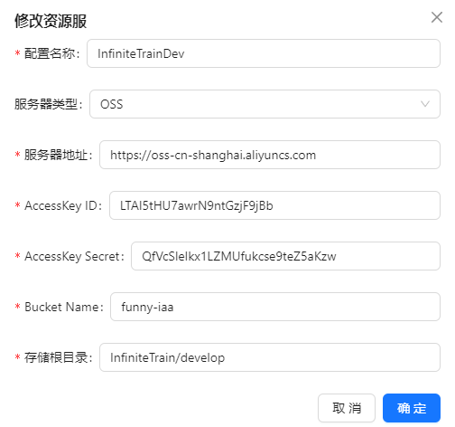

# asset package 文档

## 从示例开始学习

[webgl 示例](https://git.sofunny.io/engine/packages/com.sofunny.asset/-/blob/asset-for-webgl/Assets/com.sofunny.asset/README.md)

打包的示例可以拉下对应分支为 asset-for-webgl 的这个工程，本身就是一个unity 工程哈 

主要看 App.cs 这个文件。这个文件包含了 AssetDB 的具体使用流程。


- Mount 指定资源存放路径。指定之后，我们的资源路径 key 就是相对于这个路径下的子路径。使用 asset:// 代指。比如我们将 main.prefab 资源打包到了项目的 sandbox 下的 arts/ui/panels/sprites_bee2f4da6f7bfc59818f57eb5efed52d.bundle 这份 bundle 里。然后我们可以将 Mount 设置为 "/../sandbox" 。这样我们在使用 ab.load 时，就可以这样调用 "asset://arts/ui/panels/main.prefab" 。 

    ```Cpp
    db.Mount($"{Application.dataPath}/../sandbox");
    mainHandle = db.Load($"asset://arts/ui/panels/main.prefab");
    ```

    

- SetFilesUrl 资源清单。资源管理系统依据这个清单建立起 bundle 和实际资源的关系。之后我们使用 ab.load 加载就可以通过 url 找到对应资源

- SetSpecialDirectory 小游戏远程资源清单。

打包出微信小游戏，发现资源无法加载，这个时候，请确定你的微信没有缓存清单文件，如果微信缓存了清单文件，很可能这次找的资源是上次的，这样就不行了。

## 打包流程整理

### 建立 pkg

首先在需要打包进游戏的资源文件夹下建立 .pkg 文件。文件格式类似这样：  
```Cpp
[[bundle]]
patterns = [ "Battle.unity","Login.unity" ]
```
一般资源类型小游戏这边就只会用到两种 bundle 资源文件， file 配置文件。  
至于 patterns 可以使用正则匹配。
```Cpp
[[file]]
patterns = [ "**/*.toml" ]
```
要注意 pkg 路径中不要有空格，其实手动打包没有影响，但是目前自动打包会 G ，没有空格的路径也是个好习惯，所以还是遵守下。

### build

在对应的文件夹下，右键，使用 dev tool 中的 build 会针对 .pkg 执行打包。  

打包好的资源，默认放在与 Assets 同级的 Sandbox 下。

然后，使用 menu tool 的 dev tool 中的 GenerateFileListAndCopyToStreamingAssets ，转移到 Unity 的  StreamingAssets 下进行打包。

### cdn 相关代码更改

Remote Config 配置更改  


AssetDB 封装使用类的CDN相关更改
```Cpp
db.SetSpecialDirectory($"{remoteConfig.remoteUrl}/StreamingAssets");
db.SetFilesUrl($"{remoteConfig.remoteUrl}/StreamingAssets/files.txt");
db.Mount($"{remoteConfig.remoteUrl}/StreamingAssets");
```

## 一键打包

[技术中心 Unity Package 一键打包文档](https://docs.sofunny.io/pages/viewpage.action?pageId=135592829)  

- version mgit 加入 build-runtime 包
- 在 manifest.json 集成 "com.unity.platforms": "git@git.sofunny.io:engine/packages/com.unity.platforms.git#1.0.0-exp.6" 替换 Unity 官方包
- 创建 [rtmake](#rtmake) 文件，在 rtmake 指定路径下，创建 [BuildConfig toml](#buildconfigtoml) 文件。
- 逐个创建 BuildConfig toml 中 build 项的文件。
 
### rtmake

配置在项目目录下，用来定义配置文件的路径，记录 build configs 的目录，该文件需与 `Assets` 同级目录

```Cpp
build_config = "Assets/BuildConfigs"
```

### buildconfigtoml

toml 这个文件包含了打包所需的所有配置，日后接入自动打包时也依据指定的配置文件进行不同需求的打包（比如 dev 包和 release 包，就要两个不同的 toml）。命名格式如下：

```Cpp
app_{platform}_{dev/release}.toml
```

如果复制下述 WebGL 示例，请删除 // 后面的内容

```Cpp
[app]
appName = "InfiniteTrain-Dev"
company = "xmfunny"
frameRate = 60

[screen]
width = 750
height = 1334
allowedAutorotateToPortrait = true
allowedAutorotateToPortraitUpsideDown = false
allowedAutorotateToLandscapeRight = false
allowedAutorotateToLandscapeLeft = false

// 打包相关 见下文逐一解释
[build]
pipeline = "Assets/BuildConfigs/pipeline/webgl_dev.buildconfiguration"
mcs = "Assets/BuildConfigs/mcs/webgl_dev_mcs.rsp"
template = "Assets/BuildConfigs/template/webgl.toml"
 
[wechat]
remoteConfig = "Assets/Settings/RemoteConfig.asset"
appid = "wx57e96a0b5b1af965"
// CDN 资源地址
remoteUrl = "https://funny-iaa.funnyrpg.com/InfiniteTrain/0.0.3/"
// gamesetting 的远端地址
settingUrl = "https://funny-iaa.funnyrpg.com/InfiniteTrain/develop/setting/gamesetting"
memorySize = 256
 
bgImageSrc = "Assets/WX-WASM-SDK-V2/Runtime/wechat-default/images/background.jpg"
videoUrl = ""
assetLoadType = 0
// 首包压缩
compressDataPackage = true 
bundleExcludeExtensions = "json"
bundleHashLength = 32
preloadFiles = ""

useFriendRelation = false
useMiniGameChat = false
preloadWXFont = false
 
developBuild = false
autoProfile = false
scriptOnly = false
il2CppOptimizeSize = true
profilingFuncs = false
profilingMemory = false
webgl2 = true
enableIOSPerformancePlus = false
deleteStreamingAssets = true
cleanBuild = false
fbslim = false
showMonitorSuggestModal = false
enableProfileStats = false
 
[server]
port = 123
name = "name123"
host = "host"
```

### build 项文件

- pipeline buildncofiguration : 这个是 unity platform 包提供的便于构建的文件，一般会用到三项，分别是打包场景，打包平台，输出路径。

    

  这里注意，Output Build Directory 约定好要是 Builds/平台/项目名，不然自动打包不行！！！！！！

  你可以在这里更改打包时候的脚本后端设置和代码剔除粒度，平时项目可以设置后端为mono加快编译速度，增加内存占用，但是无所谓，打包时候读这份配置会自动设置为选择的项。

   

- mcs.rsp : 这个是宏定义文件，要注意，这个宏定义是出于打包流程偏后面的处理的，所以有关 runtime 一键打包包使用的宏，你要提前在项目里就预设好，比如 WECHAT。不然 runtime 一些代码就走错了。设置格式如下：  
    ```Cpp
    -define:DOTWEEN
    -define:WECHAT
    ```
注意这里是完全替换，打包出来的就只包含这几个。

- template : 这个是用来在 streamingasset 下生成运行时需要用的程序信息 json 的模板文件。其实我们小游戏用不到。这个是其他项目残留需求。

## 自动打包接入

[打包中心](https://build.sofunny.io/admin/projects)   
[自动打包文档](https://docs.sofunny.io/pages/viewpage.action?pageId=146064106)

在打包中心新建项目，这里以创建好的无限列车为例，介绍几个需要处理的点。  
- Version 仓库：一般我们都使用独立仓库，没有和主仓形成嵌套。这里需要注意的是这个 Token，这个 Token 应该是你的用户 Token，因为打包机其实需要访问 Version 仓库和主仓库，这里属于打包平台人员那边待优化的点，在这里容易让人误解为只是 Version 仓库的 Token.   
  


- 平台配置：这边一开始不会有下面的选项，只有选择平台，整体保存创建好项目之后才会出现下面的内容。

其中 WebGL 配置中，新增配置的密钥，其实是微信公众平台开发管理中的小程序代码上传密钥。  

  
同时注意下面的IP白名单，这里微信使用双重防护，即使你有密钥，也需要验证是否在白名单内，这里我们可以将打包机IP添加到白名单，当然也可以关闭白名单，这样就是一重防护。但也足够了。

- 引擎版本：这样填写。  


- Build Setting :  


- 构建配置：一般这样填写。  


- 资源服配置：  
  
这里的服务器地址指的是 EndPoint 地址，以阿里云为例，在如下位置：  
  

AccessKey ID 和 Secret 找相关负责人要。  
存储根目录一般用 项目名/打包类型名/


- 企业微信机器人通知：在企业微信中创建一个群聊。在群聊设置中，找到“群机器人”选项。添加一个新的群机器人，并获取 Webhook URL。这个 URL 是你将用来发送消息的地址。

### 构建

  
清除缓存相当于打整包，重新打包。打热更包，只会针对于更新的资源。

注意 asset-pipline.toml 目前符合了隐性规则，asset- 开头的默认走热更包。所以我们要在 version 仓库下创建 develop 等别的名字。

由于 toml 可以配置 git 分支节点等信息，所以通过更改这个配置文件选项，可以达到打不同需求的包的目的！

### 资源发布

构建完一次版本后，会自动将 game_setting 和资源上传到资源服务器，有了这个之后，才可以在资源发布中选择版本文件。

这个版本文件很关键，控制游戏的诸多配置表现。你需要在游戏一开始时就指定路径加载这个文件，然后解析其中内容并使用。下面是目前的一个示例结构。

  
```json
{
  "versionName": "0.1.0",
  "buildNum": 8,
  "resNum": 8,
  "runtimeNum": 8,
  "serverHost": "http://passport.lite-ulala.funnyrpg.com",
  "openDebugConsole": false,
  "openWhiteList": false,
  "whiteList": [],
  "gameMaintenanceUrl": "",
  "isWXSDKTokenLogin": true,
  "isOpenGravitySDK": true,
  "isOpenFunnyDBSDK": true,
  "isAndroidOpenPaySDK": true,
  "isIOSOpenPaySDK": true,
  "isPCOpenPaySDK": true,
  "envVersion": "develop"
}
```

## 打包平台小技巧

### 确认是否编译报错导致打包失败


## 遇到的问题

### 打ab包之后unity预览材质坏了

这是因为在 AB 环境下 我们是使用 window 的 API 去显示 WebGL 的 资源。

需要改一下渲染方式 -force-gles 以这个命令启动 unity


强行使用正确的方式显示资源。

### 

### 打出小游戏包之后请求下载的资源不对

这是因为微信会缓存文件，如果你使用 0.0.2 版本上传了一次资源，打了一次包，用这个包运行了一次，然后再使用 0.0.2 版本上传了一次不一样的资源，打了一次包，用这个包运行一次，此时如果我们的清单文件一直叫 files.txt 那么就会因为两次名称一样，导致微信使用缓存，而资源hash变化，名称变化，导致微信重新下载，此时。。微信会依据老清单找新资源，这就坏了。所以我们的清单文件需要带版本，这也是热更可行的原因，单更一个资源和清单文件，这样就完成了资源热更。

### conf 配置表资源里明明有数据，但是在转换成字典时，就是为空

还是因为缓存文件！又忘记了在名称不变的情况下，文件会被缓存，files.txt 名称一直没变，虽然配置表资源变了，但是找的时候还按照之前的找，之前的文件因为本地缓存过，所以就找到了，也就是找到了旧的。。。。

### 打包出来在开发者工具上无法正常显示，手机上可以正常显示

据搜索是 unity 2022.3.XXX 的 BUG。  
[wechat-miniprogram 710](https://github.com/wechat-miniprogram/minigame-unity-webgl-transform/issues/710)  
[wechat-miniprogram 623](https://github.com/wechat-miniprogram/minigame-unity-webgl-transform/issues/623)

### 打包机手动打包正常，自动打包打资源失败

最后是因为有个 pkg 处于带空格的路径下面，自动打包那边不支持，导致失败。  


### 微信小游戏有两三个同时存在的话 有可能有更新问题（一些代码还没有关系，跟配表相关的特性可能有问题了）


### 更换 CDN 流程


下面有个加速的，加速的用在toml游戏中使用，非加速的上传使用

注意微信平台也需要配置

然后就是打包平台打包机可能缓存了旧的CDN需要找胜孟修改
