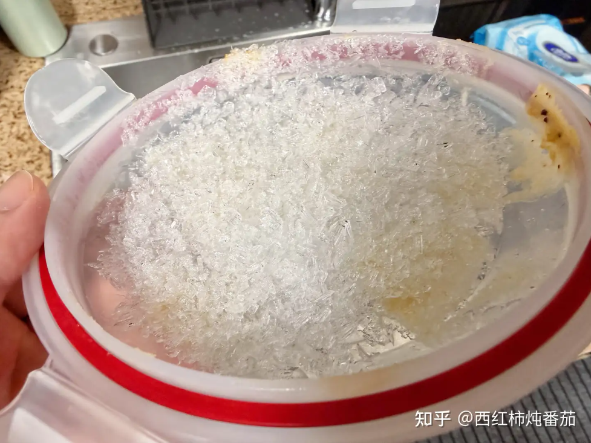

# 为什么有些冰箱冻过的肉会变得又干又柴？

冷冻肉变干变柴的核心原因是「升华-凝华」循环：食材中的冰直接升华成水蒸气，遇冷后凝华成冰晶附着在容器或表面，导致食材水分流失。（比如冻时间长的冰棍包装袋内侧会有冰晶）

解决方法是真空包装隔绝空气，阻断这一循环。

# 不是冻住了就不会坏吗？

也许冷冻室的温度，并没有想象中那样冷？它并不会一直保持在你设定的-18℃或者-20℃？甚至它可能间歇性回到0℃以上？

大多数冰箱都会有这个问题，时间一般以10小时为一个周期，冰箱会升温到 接近 0 度甚至零度以上

造成冷冻室回温的原因：冰箱和空调制冷原理类似，都是靠搬运热量，换热靠大面积金属表面，在制冷端就叫蒸发器，冰箱里的蒸发器容易结霜覆盖表面，需要定期加热才能除霜维持换热效率，回温就是这段时间造成的

优质的冰箱不会有这个问题：
如果你不是追求便宜，正常情况下买到的冰箱不会有上述问题。通过一些配置和设计，完全能避免。
- 在蒸发器加热化霜时，能够隔离冷冻仓
- 更强制冷能力下，更低的目标温度能力，比如现在-30℃以下的深冻能力；就算有回温，由于初始温度更低，回温也回不到0℃以上
- 更好的控制算法，更短的化霜时间，如前面所说的，有些低端型号，化霜时间较长也是解冻的一大原因

