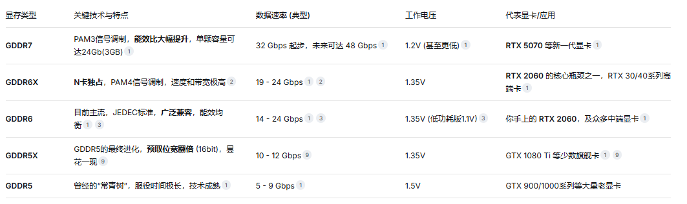

# GDDR

# HBM

HBM（高带宽内存）：你可以把它想象成把好几个 GDDR 显存芯片“叠”在一起，直接和 GPU 核心封装在一块基板上。这样一来，数据从显存到 GPU 的“距离”大大缩短，路也修得特别宽（1024-bit 位宽），所以能做到带宽极高、功耗还低。代价就是成本极高、制造难度巨大，目前基本只用在 AI 训练、科学计算这类对钱不敏感的专业领域

# LPDDR

LPDDR（低功耗内存）：你手上的手机、平板，甚至一些轻薄本和 Steam Deck 这样的游戏掌机，用的都是这种显存。它牺牲了极致的性能，换来了超低的功耗，是移动设备的理想选择