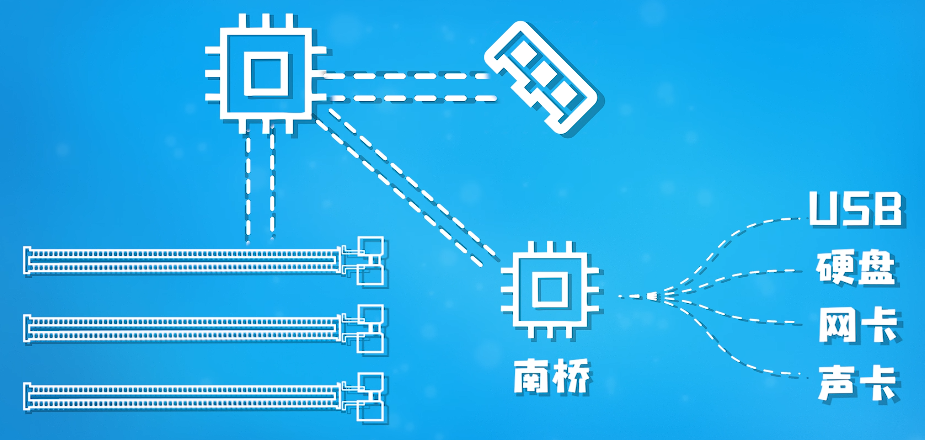

首先，芯片组有 AMD 和 Intel 两种，其次每家又有高端、中端、低端三种，每一代 CPU 都会推出一代芯片组，所以主板在选择时要选择适配 CPU 的芯片组系列

# 南桥芯片组

PCIE 作为一种超高速串行总线，为了达到飞快的速度，所以他的频率设置的异常的高，这种高频率的总线就对总线的线路设计要求非常的高，为了安排下这种高速总线，主板不得不做更多的层数来解决高频总线带来的种种需要。

南桥在电脑里的作用就是帮助 CPU 和外围设备交互数据的

由于内存太过重要，CPU 就亲自直接和他对接；而直连 PCIe 的话，数据交互的实时要求也很高，也由 CPU 直接去负责；而其余的设备，比如声卡，网卡，固态硬盘，机械硬盘，USB 这些对实时通讯要求不高的设备，就全部接入南桥，南桥收集好数据后再汇报给 CPU 就可以了

比如一个 CPU ，官方会说明它的直连 PCIE 通道数量，比如它直连 PCIE 16 通道，这时候，如果你有一个 16 通道的显卡，4 通道的 M.2 那是不是就不够用了？其实默认 M.2 会使用南桥芯片组的 非直连 PCIE 通道，这个规格也是 CPU 厂商指定的规格。 

还有的 Cpu 官方可能会单独说明，比如，直连 PCIE 20 通道，其中 16 通道给显卡，4 通道 给第一块 M.2 , 对应制作主板的就会单独说明，在主板指定位置的 m.2 是直连 pcie 的，另一个 m.2 是南桥芯片组的

cpu 和 南桥也是由 pcie 连接的，具体要看 cpu 厂家标注的速度是多少

所以如果 m.2 使用的速度超过了 cpu 和 南桥的速度是没有意义的。

你也许会问，cpu 和 南桥的速度那么慢，还要让南桥连接那么多设备，岂不是瓶颈很大？其实，大部分时间，同时抢占通道的概率很低，而且也不一定是满载，所以，只要设备满载速度不超过 cpu 和 南桥 的速度，可以认为，发挥了设备的 100% 性能。